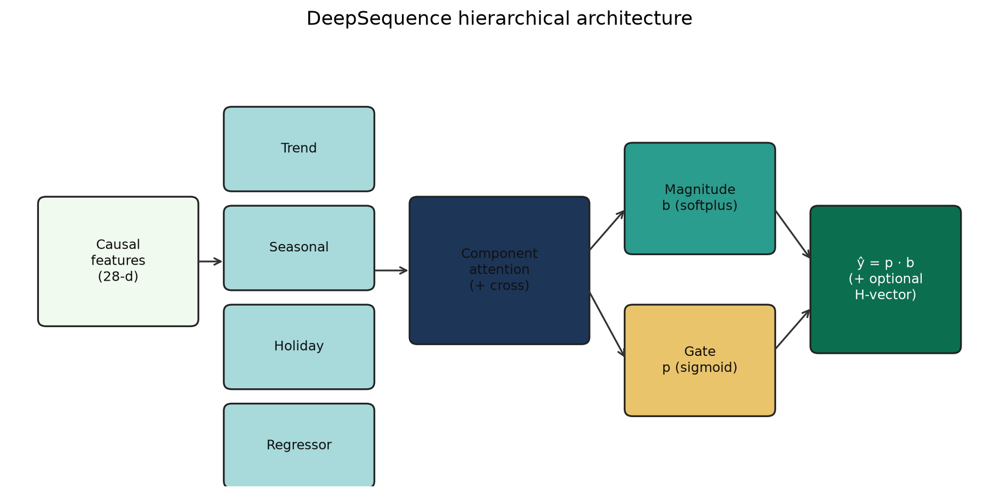
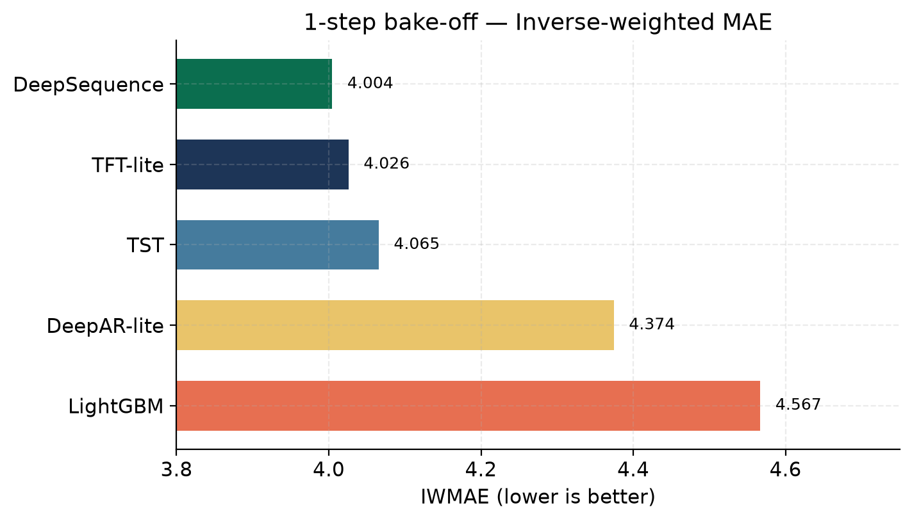
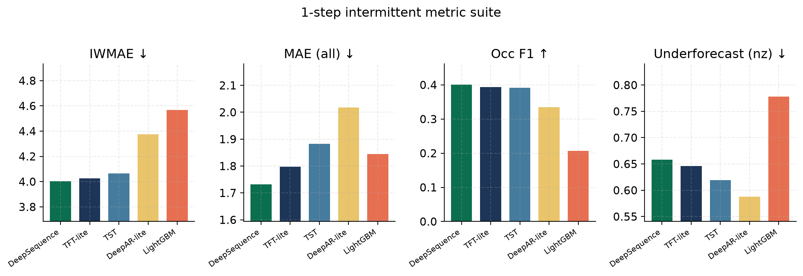
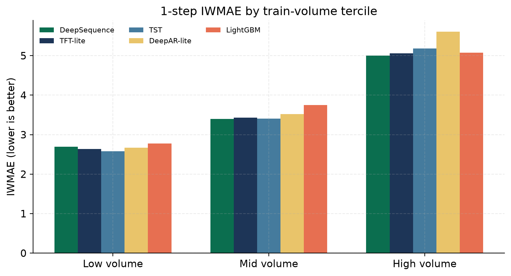
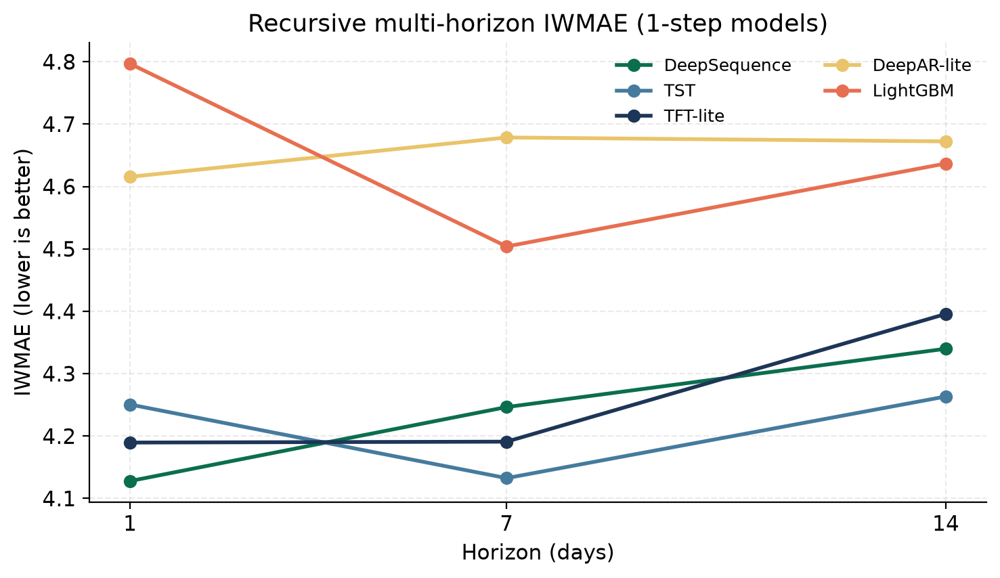
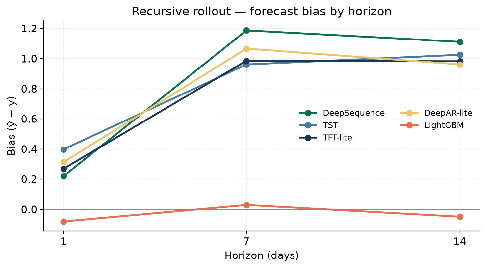
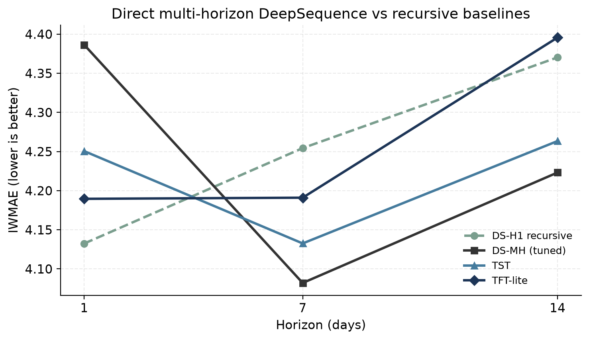
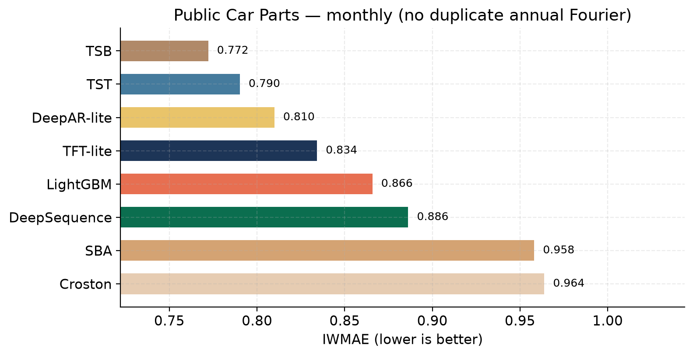

# DeepSequence: Hierarchical Attention for Intermittent Demand Forecasting

**Version:** 1.6 · **Software:** `deepsequence-hierarchical-attention` 1.6.0  
**Author:** Mritunjay Kumar  
**Date:** July 2026

---

## Abstract

Intermittent demand—long runs of zeros punctuated by sparse, variable sales—remains difficult for both classical inventory heuristics and modern deep forecasting models. We present **DeepSequence**, a lightweight hierarchical neural forecaster that separates *occurrence* from *magnitude* through a gated head \(\hat{y}=p\cdot b\), while allocating capacity across **trend**, **seasonal**, **holiday**, and **regressor** experts via **component-level attention** (feature/component reweighting, not day-level temporal self-attention). Causal lag and intermittent-state features are built strictly from past demand. On a proprietary enterprise *daily* panel (~90% zeros; 800 series; seed 42) under a locked **28-feature** contract (v1.6), DeepSequence achieves the best **1-step IWMAE** (**4.00**) versus LightGBM, TFT-lite, a temporal transformer (TST), and DeepAR-lite trained on the *same* features. Under recursive multi-horizon rollout, 1-step DeepSequence remains best at **h=1**; a **direct multi-horizon** head (**DS-MH**) recovers the best IWMAE at **h=7/14**. For public validation we evaluate the same protocol on the **Monash Car Parts** intermittent monthly benchmark (800 series), adding classical **Croston / SBA / TSB** baselines: **TSB** leads on this short monthly spare-parts set, while DeepSequence beats Croston/SBA and remains competitive with LightGBM—highlighting that hierarchical gated models shine when daily covariates and longer histories are available, whereas classical intermittent methods remain strong defaults on short monthly panels. We release code, public-data adapters, synthetic demo, and evaluation methodology; the enterprise panel cannot be published.

---

## 1. Introduction

Retail and distribution forecasting often faces **intermittent** series: most days have zero demand, and the rare non-zero days carry inventory risk. Errors on quiet days and sale days have different operational costs. Models that only minimize unconditional MAE tend to collapse toward zero; models that chase sale-day magnitude often inflate quiet-day predictions and create excess stock.

DeepSequence targets this setting with three design choices:

1. **Hierarchical experts** for trend, seasonality, holidays, and history-based regressors, mixed by SKU-conditioned soft weights.
2. **A gated intermittent head** that predicts occurrence probability \(p\) and magnitude \(b\) separately, with \(\hat{y}=p\cdot b\).
3. **A three-term training loss** that jointly supervises occurrence (BCE), gated timing (inverse-weighted MAE on \(\hat{y}\)), and sale-day size (masked MAE on \(b\)).

We emphasize a fair comparison protocol: all neural and tree baselines consume the **same causal feature matrix**. Sequence models additionally receive lookback windows of demand plus that matrix. Hierarchical attention in DeepSequence means **reweighting components/features**, not multi-horizon temporal self-attention over days.

**Contributions.**

- A production-oriented intermittent architecture with explicit occurrence–magnitude factorization.
- A causal feature contract (v1.6) for intermittent panels, including distance-only holiday features.
- An empirical bake-off against LightGBM, DeepAR-lite, temporal transformer, and TFT-lite under identical features.
- A **direct multi-horizon** extension of the hierarchical head for planning horizons.
- **Public validation** on Monash Car Parts with classical Croston/SBA/TSB baselines.
- An open implementation with synthetic and public-data reproducibility artifacts.

---

## 2. Related work

**Classical intermittent methods** (Croston, 1972; Syntetos–Boylan approximation / SBA; Teunter–Syntetos–Babai / TSB) decompose demand size and inter-demand intervals. They remain strong on short, sparse monthly spare-parts series and are required baselines for intermittent papers.

**Probabilistic deep models** such as DeepAR use autoregressive RNNs with likelihoods suited to counts or continuous demand. **Temporal transformers** and the **Temporal Fusion Transformer (TFT)** add attention over history and variable selection. Recent comparative work on sparse demand also studies **PatchTST**, **TiDE**, and model routing over Favorita/M5-style panels; shallow global models often compete with heavy transformers on intermittent series.

**Gradient-boosted trees** (e.g. LightGBM) remain strong tabular baselines when engineered features are available; on intermittent panels they may under-forecast sale days when optimized for L1.

**Positioning.** DeepSequence targets *covariate-rich daily intermittent retail/distribution* panels: hierarchical experts + gated occurrence–magnitude + intermittent metrics (IWMAE). It is complementary to Croston-family methods (strong on short monthly series without rich calendars) and to long-horizon dense TS models (PatchTST/Chronos on ETT/Weather), which address a different problem class.

| Family | Example | Strength | Weakness for intermittent inventory |
|--------|---------|----------|-------------------------------------|
| Classical intermittent | Croston, SBA, TSB | Strong on short sparse series | Weak use of rich covariates / SKU pooling |
| Trees | LightGBM | Fast tabular | MAE bias toward zeros |
| Autoregressive DL | DeepAR | Likelihoods, global pooling | Needs adapted head/loss for zeros |
| Temporal attention | TFT, TST, PatchTST | History / covariates | Heavier; not always best under IWMAE |
| **This work** | **DeepSequence** | Gate + component experts + IWMAE | Needs enough history / covariates |

DeepSequence sits between structured decomposition and modern deep learning: expert components mirror classical time-series structure, while the gate and loss are tailored to intermittency.

---

## 3. Method

### 3.1 Problem setup

For each series \(i\) and day \(t\), observe demand \(y_{i,t}\ge 0\). Let \(z_{i,t}=\mathbf{1}[y_{i,t}>0]\). Features \(x_{i,t}\) are constructed **causally** (no same-day leakage from \(y_{i,t}\) into lags or intermittent state). The model predicts \(\hat{y}_{i,t}\) for inventory decisions; we also report a rounded forecast \(\mathrm{round}(\hat{y}_{i,t})\) for discrete stock units.

### 3.2 Causal feature contract (v1.6)

Total dimensionality: **28**.

| Block | Dim | Contents |
|-------|----:|----------|
| Trend | 1 | Normalized time index |
| Seasonal | 6 | Day-of-week, month, and year Fourier (sin/cos) |
| Lags | 3 | \(y\) at lags 1, 2, 7 (strictly past) |
| Intermittent state | 3 | Days since last sale, last sale quantity, lifetime cumsum (strictly past) |
| Holiday distance | 15 | Days from generic public holidays (distance only; binary holiday indicators removed as redundant with distance \(=0\)) |

Lags and intermittent features use only history with timestamp \(< t\). An online state machine supports inference-time updates without replaying the full panel.

### 3.3 Hierarchical DeepSequence backbone



*Figure 1. DeepSequence architecture: causal features → four experts → component attention (+ optional cross-layer) → gated intermittent head \(\hat{y}=p\cdot b\). For multi-horizon mode the head emits length-\(H\) vectors.*

Inputs are split by block and fed to four experts:

- **Trend:** piecewise / changepoint-style temporal basis.
- **Seasonal:** Fourier features with within-block attention.
- **Holiday:** distance features with within-block attention.
- **Regressor:** lags + intermittent state.

Each expert produces a scalar contribution. A **SKU embedding** drives soft mixture weights over experts. Optional cross-layers allow limited interaction across components. The combined magnitude is passed through softplus to yield

\[
b_{i,t}=\mathrm{softplus}(\mathrm{mix}(\mathrm{experts}(x_{i,t}), e_i)).
\]

An intermittent gate produces

\[
p_{i,t}=\sigma(g(x_{i,t}, e_i))\in(0,1),
\]

and the final forecast is

\[
\hat{y}_{i,t}=p_{i,t}\cdot b_{i,t}.
\]

**Interpretation.** \(p\) answers “will there be a sale?”; \(b\) answers “how large if there is demand structure?”; the product is the expected demand under a soft Bernoulli–magnitude factorization. Hierarchical attention redistributes emphasis among structural drivers per SKU—not attention over a day window.

### 3.4 Direct multi-horizon head

The default model is **1-step** (\(\hat{y}_{i,t}\in\mathbb{R}\)). For planning horizons \(H>1\), recursive rollout of a 1-step model compounds gate and magnitude error through lag/intermittent state. We therefore extend the terminal heads to emit **direct** multi-horizon outputs

\[
b_{i,t}\in\mathbb{R}^{H}_{+},\quad
p_{i,t}\in(0,1)^{H},\quad
\hat{y}_{i,t}=p_{i,t}\odot b_{i,t},
\]

while keeping the hierarchical backbone unchanged. Training uses sliding targets \((y_{i,t},\ldots,y_{i,t+H-1})\) with the same three-term loss, optionally down-weighting farther steps by a horizon decay \(\gamma^{h}\) (\(\gamma=0.95\) in experiments). At inference, features at the first forecast day (history through the origin) produce all \(H\) steps in one forward pass. A multiplicative bias scale is calibrated on validation origins to minimize IWMAE.

### 3.5 Training objective

With zero rate \(\pi_0\approx P(y=0)\), the default **three-term** recipe is:

\[
\begin{aligned}
\mathcal{L}
&= \alpha\,\mathrm{BCE}_{w_+}(z, p)
+ w_g\,\mathrm{MAE}_{\mathrm{inv}}(y, \hat{y})
+ w_m\,\mathrm{MAE}_{\mathrm{nz}}(y, b),
\end{aligned}
\]

where \(\mathrm{BCE}_{w_+}\) upweights positives, \(\mathrm{MAE}_{\mathrm{inv}}\) is all-day MAE with inverse class weights (timing on quiet and sale days), and \(\mathrm{MAE}_{\mathrm{nz}}\) is MAE on sale days only (magnitude). Typical 1-step weights: \(\alpha=0.2\), \(w_g=w_m=1\). For the tuned multi-horizon variant we use \(\alpha=0.35\), \(w_m=1.25\).

### 3.6 Optional residual transformer

After DeepSequence, a causal residual transformer may predict a magnitude residual \(\delta\) while **preserving** \(p\):

\[
\hat{y}^{\mathrm{res}}=\mathrm{relu}(b+\delta)\cdot p.
\]

On the v1.6 panel this head did not beat plain DeepSequence; it remains available for panels where residual sequence correction helps.

### 3.7 Inference post-process

For discrete inventory, forecasts may be rounded with a non-negativity floor. Metrics below report both raw and rounded MAE; primary rankings use **IWMAE** on rounded forecasts unless noted.

---

## 4. Experimental setup

### 4.1 Dataset availability

The experiments were conducted using proprietary enterprise demand data that cannot be publicly released due to confidentiality agreements. To support reproducibility, the repository includes:

* complete model implementation,
* preprocessing pipeline,
* synthetic example dataset,
* training configuration,
* evaluation methodology.

No company names, product names, customer IDs, or series identifiers are published with results.

### 4.2 Protocol

| Item | Value |
|------|--------|
| Series | 800 (seed 42) |
| Train zero rate | ≈ 0.899 |
| Volume strata | Train-volume terciles (low / mid / high) |
| Feature matrix | Identical v1.6 columns for all models |
| Sequence lookback | 14 (DeepAR, TST, TFT); channels = demand + 28 features |
| Epochs (neural) | 10 with early stopping |
| Multi-horizon | \(H=14\); ≤8 test origins per series → **6339** origins |
| Metrics | IWMAE (primary), nonzero MAE, MASE (\(s=7\)), occurrence F1, underforecast rate on sales, AUROC/AUCPR on \(p\), bias |

**Why not pure MAE.** High zero rates make all-day MAE favor near-zero predictors. Primary ranking uses inverse-frequency weighted MAE (IWMAE); nonzero MAE and underforecast rate on sale days capture magnitude and stockout risk.

**Baselines.**

- **LightGBM:** L1 regression on tabular features + series id code.
- **DeepAR-lite:** LSTM encoder on lookback windows; same gated head and three-term loss.
- **Temporal transformer (TST):** multi-head self-attention encoder; same head/loss.
- **TFT-lite:** variable selection + GRN + LSTM + causal attention; same head/loss.

This isolates architecture effects under a locked feature contract.

---

## 5. Results

### 5.1 One-step bake-off (primary: IWMAE)



*Figure 2. One-step IWMAE on the locked v1.6 feature contract (lower is better). DeepSequence ranks first.*

| Rank | Model | IWMAE | MAE (all, round) | MAE (nz) | Occ F1 | Under (nz) | AUROC | Bias |
|-----:|-------|------:|-----------------:|---------:|-------:|-----------:|------:|-----:|
| 1 | **DeepSequence** | **4.004** | **1.732** | 6.943 | **0.401** | 0.658 | 0.826 | +0.35 |
| 2 | TFT-lite | 4.026 | 1.798 | 6.910 | 0.394 | 0.646 | 0.825 | +0.42 |
| 3 | Temporal transformer | 4.065 | 1.882 | **6.892** | 0.392 | 0.619 | **0.835** | +0.55 |
| 4 | DeepAR-lite | 4.374 | 2.018 | 7.431 | 0.334 | **0.588** | 0.806 | +0.56 |
| 5 | LightGBM | 4.567 | 1.845 | 8.026 | 0.207 | 0.778 | 0.766 | +0.06 |

DeepSequence wins on IWMAE, MASE, and occurrence F1. LightGBM’s competitive all-day MAE / near-zero bias collapses under intermittent metrics (worst IWMAE and occurrence F1).



*Figure 3. One-step intermittent suite: IWMAE, all-day MAE, occurrence F1, and sale-day underforecast rate.*

### 5.2 Volume strata



*Figure 4. One-step IWMAE by train-volume tercile.*

| Band | Best IWMAE | Notes (all-day MAE) |
|------|------------|---------------------|
| Low | TST 2.58 (DS 2.69) | **DS best all-day MAE** (0.235) |
| Mid | **DS 3.40** | **DS best all-day MAE** (0.843) |
| High | **DS 5.00** | LGBM best all-day MAE (2.74) via **negative bias** (−0.90) |

LightGBM’s high-band all-day MAE win coincides with systematic under-forecasting on sale days (nonzero MAE ≈ 8.98). Among neural models, DeepSequence has the lowest high-band over-forecast bias (+1.03 vs TFT +1.13, TST/DeepAR +1.37).

### 5.3 Recursive multi-horizon (1-step models)

Standing after day \(t\), we forecast \(y_{t+1},\ldots,y_{t+H}\) (\(H=14\)) by feeding predictions into causal lag/intermittent state while using known-future calendar and holiday distances. Same 1-step models; 6339 test origins.



*Figure 5. Recursive multi-horizon IWMAE for 1-step models.*

| Horizon | DeepSequence | TST | TFT | DeepAR | LightGBM |
|--------:|-------------:|----:|----:|-------:|---------:|
| **h=1** | **4.128** | 4.251 | 4.190 | 4.615 | 4.797 |
| **h=7** | 4.246 | **4.133** | 4.191 | 4.679 | 4.504 |
| **h=14** | 4.340 | **4.263** | 4.396 | 4.672 | 4.637 |
| **mean 1..14** | 4.352 | **4.267** | 4.319 | 4.737 | 4.672 |

| Horizon | Best Occ F1 | Best Under (nz) ↓ | Bias trend |
|--------:|-------------|-------------------|------------|
| h=1 | DS 0.425 | DeepAR 0.630 | All near 0–0.4 |
| h=7 | TFT 0.338 | TFT 0.605 | DS bias → **+1.19** |
| h=14 | TFT 0.337 | TFT 0.632 | DS bias → **+1.11** |



*Figure 6. Forecast bias under recursive rollout. DeepSequence accumulates positive bias at longer horizons—motivation for a direct multi-horizon head.*

LightGBM never wins IWMAE despite leading all-day MAE at h≥7; it has the worst occurrence F1 (≈0.22) and highest underforecast rate on sale days.

### 5.4 Direct multi-horizon DeepSequence

We compare (i) classic 1-step DS evaluated recursively, (ii) direct Dense-\(H\) DS, and (iii) tuned DS-MH (\(\alpha=0.35\), \(w_m=1.25\), \(\gamma=0.95\)) with validation bias calibration.



*Figure 7. Direct multi-horizon DeepSequence (tuned) versus recursive DS-H1, TST, and TFT. DS-MH leads at h=7 and h=14.*

**Table. IWMAE — DS multi-horizon improvement vs recursive baselines.**

| Horizon | DS-H1 recursive | DS-MH | **DS-MH tuned** | TST (recursive) | TFT (recursive) |
|--------:|----------------:|------:|----------------:|----------------:|----------------:|
| h=1 | **4.132** | 4.341 | 4.386 | 4.251 | 4.190 |
| h=7 | 4.254 | 4.113 | **4.082** | 4.133 | 4.191 |
| h=14 | 4.370 | 4.256 | **4.223** | 4.263 | 4.396 |
| mean | 4.362 | 4.247 | **4.234** | 4.267 | 4.319 |

**Table. Bias and occurrence (selected).**

| Model @ mean 1..14 | Bias | Occ F1 |
|--------------------|-----:|-------:|
| DS-H1 recursive | +1.12 | 0.291 |
| **DS-MH tuned** | **+0.38** | 0.331 |
| TST recursive | +0.84 | 0.332 |
| TFT recursive | +0.85 | 0.353 |

**Reading.** Direct multi-horizon training closes **≈0.13–0.15 IWMAE** at h=7/14 versus recursive DS-H1 and **beats TST/TFT** at those horizons. Bias stays ≤+0.54 after a 0.78× validation scale (vs ≈+1.2 for recursive DS). The trade-off is slightly weaker h=1 IWMAE, because the head is trained jointly over \(H=14\).

### 5.5 Public validation: Monash Car Parts

To address reproducibility beyond the confidential daily panel, we evaluate the intermittent suite on the **Monash Car Parts** dataset (Zenodo 4656021): 2,674 intermittent *monthly* series (Jan 1998–Mar 2002; missing→0). We keep series with ≥2 train non-zeros, sample **800** (seed 42), split last 6 months test / prior 6 val / remainder train (train zero rate ≈ **0.74**). Baselines include classical **Croston, SBA, and TSB** (\(\alpha=0.1\)).

**Monthly feature contract (v1.6-monthly)** — not the daily v1.6 matrix:

| Block | Spec |
|-------|------|
| Trend | Month index (\(year\times 12 + month\)) |
| Seasonal (Fourier) | Period **3** (quarter) + **calendar-month** phase (annual); duplicate `annual_*` from month_index removed (identical to calendar-month harmonics) |
| Regressor | Lags **1, 3**; `months_since_last_sale`, last sale qty, lifetime cumsum |
| Holiday | **`month_has_{Holiday}`** — 1 if that holiday falls in the observation month (which holidays belong to which month); not day-distance |

Annual shape is left to Fourier (no `lag_12`). Sequence lookback = 12 months; MASE season = 12.



*Figure 8. Public Monash Car Parts 1-step IWMAE under the monthly feature contract (800 series).*

| Rank | Model | IWMAE | MAE (all) | MAE (nz) | Occ F1 | Under (nz) | Bias |
|-----:|-------|------:|----------:|---------:|-------:|-----------:|-----:|
| 1 | **TSB** | **0.772** | 0.487 | **1.243** | **0.474** | 0.897 | +0.07 |
| 2 | Temporal transformer | 0.790 | 0.526 | 1.299 | 0.453 | 0.982 | +0.05 |
| 3 | DeepAR-lite | 0.810 | 0.531 | 1.364 | 0.440 | 0.995 | +0.02 |
| 4 | TFT-lite | 0.834 | 0.611 | 1.278 | 0.410 | 0.958 | +0.12 |
| 5 | LightGBM | 0.866 | **0.422** | 1.465 | 0.366 | 0.977 | −0.05 |
| 6 | DeepSequence | 0.886 | 0.545 | 1.415 | 0.374 | 0.919 | +0.06 |
| 7 | SBA | 0.958 | 0.627 | 1.461 | 0.303 | 0.933 | +0.11 |
| 8 | Croston | 0.964 | 0.647 | 1.443 | 0.301 | 0.919 | +0.13 |

**Reading.** On this *short monthly spare-parts* benchmark, **TSB remains best**—as expected for Croston-family methods. With a proper monthly contract, DeepSequence **beats Croston/SBA**, improves occurrence F1 / underforecast vs a naive daily-feature transfer, and stays near LightGBM on IWMAE, but does not overtake TSB or the strongest sequence baselines. We treat this as a **domain mismatch** vs the proprietary *daily* covariate-rich panel (where DS leads), not a contradiction: Car Parts has ~39 train months and no retail calendar. The proprietary study remains primary evidence for daily intermittent retail; Car Parts is the public sanity check and classical baseline anchor.

---

## 6. Discussion

**Why hierarchical gating helps (daily panels).** Extreme zero inflation rewards an explicit occurrence head. Coupling \(p\) with inverse-weighted all-day MAE keeps quiet-day timing, while masked magnitude loss prevents the base from collapsing.

**Why trees look strong on all-day MAE.** L1 on sparse targets favors near-zero predictions. That reduces average absolute error when most days are zero, but harms service level when sales occur—undesirable for inventory. Under IWMAE, occurrence F1, and underforecast rate, LightGBM ranks last on the proprietary panel.

**Classical vs deep on public monthly data.** TSB’s win on Car Parts underscores that intermittent papers must include Croston-family baselines. Deep models add value when series are longer and covariates are informative; they are not universal replacements for TSB on short spare-parts histories.

**TFT / TST vs DeepSequence.** Temporal attention is competitive for longer recursive horizons and on Car Parts; under the proprietary daily contract **component experts + gate** win 1-step IWMAE and h=1 recursive IWMAE. Adding a **direct multi-horizon head** restores DeepSequence leadership at h≥7 on the enterprise panel.

**Deployment recommendation.**

| Use case | Recommended model |
|----------|-------------------|
| Next-day / daily intermittent with rich features | DeepSequence 1-step |
| Multi-day planning (\(H\ge 7\)) on daily panels | DeepSequence multi-horizon (tuned) |
| Short monthly spare-parts / no covariates | **TSB** (then SBA/Croston) |
| Ranking protocol | Prefer IWMAE + Occ F1 + underforecast; do not rank on all-day MAE alone |

**Limitations.** Proprietary results are panel-specific. Sequence baselines are lite adaptations with a shared gated head. Car Parts is monthly and short; a larger public *daily* intermittent suite (e.g. M5 intermittent subset) is natural future work. Known-future calendar beyond the origin day is not yet injected into the Dense-\(H\) head. Hierarchical reconciliation across product trees is out of scope for v1.6.

---

## 7. Conclusion

DeepSequence combines hierarchical component experts, causal intermittent features, and a gated occurrence–magnitude head trained with a three-term loss. Under a locked v1.6 feature contract on a highly intermittent *daily* enterprise panel:

1. **1-step DeepSequence is best on IWMAE** among LightGBM, TFT-lite, TST, and DeepAR-lite.
2. A **direct multi-horizon hierarchical head** recovers long-horizon leadership (**best IWMAE at h=7 and h=14**).
3. On public **Monash Car Parts**, **TSB** leads; DeepSequence beats Croston/SBA and stays competitive with trees—supporting a *conditional* recommendation: deep hierarchical gating for covariate-rich daily intermittency, classical intermittent methods for short monthly spare-parts.

We recommend ranking intermittent models with IWMAE / occurrence / underforecast metrics rather than all-day MAE alone.

---

## 8. Software and reproducibility

| Artifact | Location |
|----------|----------|
| Package | `deepsequence_hierarchical_attention/` (`pip install -e .`) |
| Feature SSOT | `feature_config.yaml` |
| Synthetic demo | `examples/v16_deepsequence_example.ipynb` |
| Training config | `examples/training_config.sample.json` |
| 1-step bake-off | `examples/eval_same_features_compare.py` |
| Recursive multi-horizon | `examples/eval_multihorizon_compare.py` |
| Direct MH improvement | `examples/eval_ds_multihorizon_improve.py` |
| Public Car Parts prep | `examples/public_data/prepare_carparts.py` |
| Public bake-off (+ Croston/SBA/TSB) | `examples/eval_public_carparts.py` |
| Classical baselines | `examples/classical_intermittent.py` |
| Figures | `paper_figures/` |
| Proprietary metrics JSON | `eval_results_same_features_v16_distance_holidays.json` |
| Public metrics JSON | `eval_results_public_carparts_v16.json` |
| Engineering report | `REPORT_v1.6.md` |

Repository: [https://github.com/mkuma93/DeepSequence](https://github.com/mkuma93/DeepSequence)

---

## References

1. Croston, J. D. (1972). Forecasting and stock control for intermittent demands. *Operational Research Quarterly*.
2. Syntetos, A. A., & Boylan, J. E. (2005). The accuracy of intermittent demand estimates. *International Journal of Forecasting*.
3. Teunter, R. H., Syntetos, A. A., & Babai, M. Z. (2011). Intermittent demand: Linking forecasting to inventory obsolescence. *European Journal of Operational Research*.
4. Salinas, D., et al. (2020). DeepAR: Probabilistic forecasting with autoregressive recurrent networks. *International Journal of Forecasting*.
5. Lim, B., et al. (2021). Temporal Fusion Transformers for interpretable multi-horizon time series forecasting. *International Journal of Forecasting*.
6. Ke, G., et al. (2017). LightGBM: A highly efficient gradient boosting decision tree. *NeurIPS*.
7. Godahewa, R., et al. (2021). Monash Time Series Forecasting Archive. *NeurIPS Datasets and Benchmarks*. (Car Parts: Zenodo 4656021.)
8. Nie, Y., et al. (2023). A time series is worth 64 words: Long-term forecasting with transformers (PatchTST). *ICLR*.
9. Kendall, A., Gal, Y., & Cipolla, R. (2018). Multi-task learning using uncertainty to weigh losses. *CVPR*.

---

## Appendix A. Notation summary

| Symbol | Meaning |
|--------|---------|
| \(y\) | Demand |
| \(z=\mathbf{1}[y>0]\) | Occurrence |
| \(b\) | Base / magnitude (`base_forecast`) |
| \(p\) | Occurrence probability (`non_zero_probability`) |
| \(\hat{y}=p\cdot b\) | Final forecast (`final_forecast`) |
| \(e_i\) | Series embedding |
| \(H\) | Multi-horizon length (direct or recursive) |
| \(\gamma\) | Horizon decay in multi-horizon loss |

## Appendix B. Bake-off commands (local panel)

```bash
pip install -e ".[dev]"
export DEEPSEQUENCE_DATA_DIR=/path/to/local/panel

# 1-step proprietary
python examples/eval_same_features_compare.py \
  --data_dir "$DEEPSEQUENCE_DATA_DIR" \
  --max_skus 800 --epochs 10 --seed 42

# Recursive multi-horizon
python examples/eval_multihorizon_compare.py \
  --data_dir "$DEEPSEQUENCE_DATA_DIR" \
  --max_skus 800 --epochs 10 --seed 42 --horizon 14

# Direct multi-horizon DeepSequence improvement
python examples/eval_ds_multihorizon_improve.py \
  --data_dir "$DEEPSEQUENCE_DATA_DIR" \
  --max_skus 800 --epochs 10 --seed 42 --horizon 14

# Public Monash Car Parts
python examples/public_data/prepare_carparts.py
python examples/eval_public_carparts.py --max_skus 800 --epochs 10 --seed 42
```

Models: `deepsequence`, `lightgbm`, `deepar_lite`, `temporal_transformer`, `tft_lite`, `croston`, `sba`, `tsb`.

## Appendix C. Figure index

| File | Caption |
|------|---------|
| `paper_figures/fig0_architecture.png` | Hierarchical architecture |
| `paper_figures/fig1_1step_iwmae.png` | 1-step IWMAE ranking |
| `paper_figures/fig2_1step_metric_suite.png` | Intermittent metric suite |
| `paper_figures/fig3_recursive_mh_iwmae.png` | Recursive IWMAE by horizon |
| `paper_figures/fig4_ds_mh_vs_baselines.png` | DS-MH vs TST/TFT |
| `paper_figures/fig5_recursive_bias.png` | Recursive bias accumulation |
| `paper_figures/fig6_strata_iwmae.png` | IWMAE by volume tercile |
| `paper_figures/fig7_public_carparts_iwmae.png` | Public Car Parts IWMAE |
