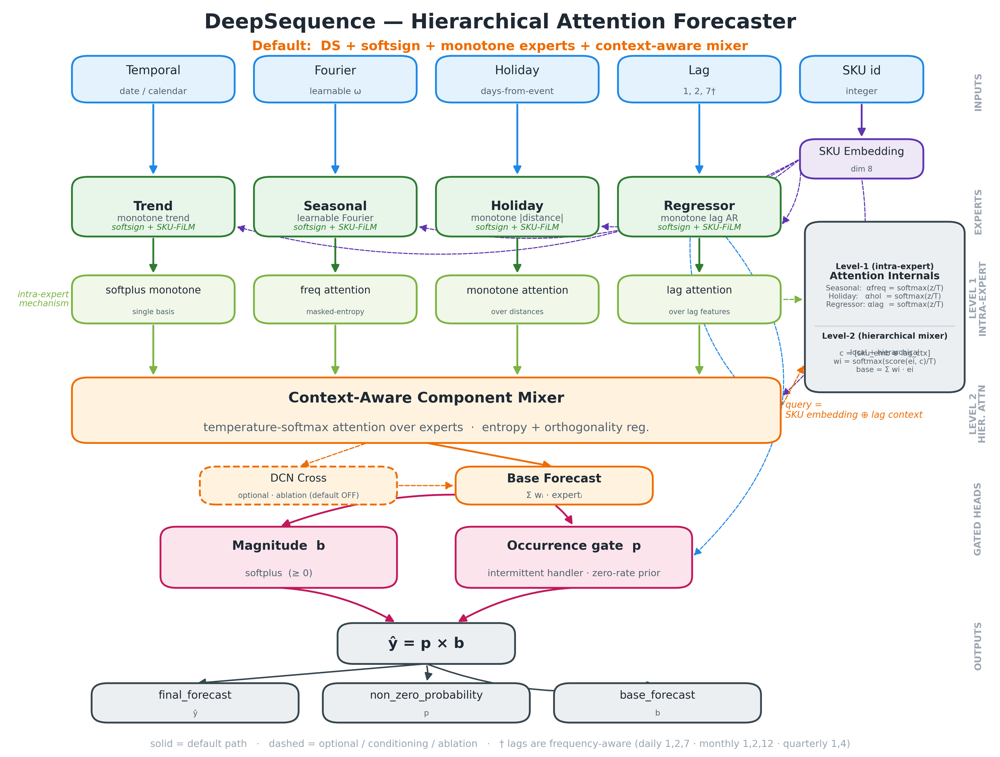
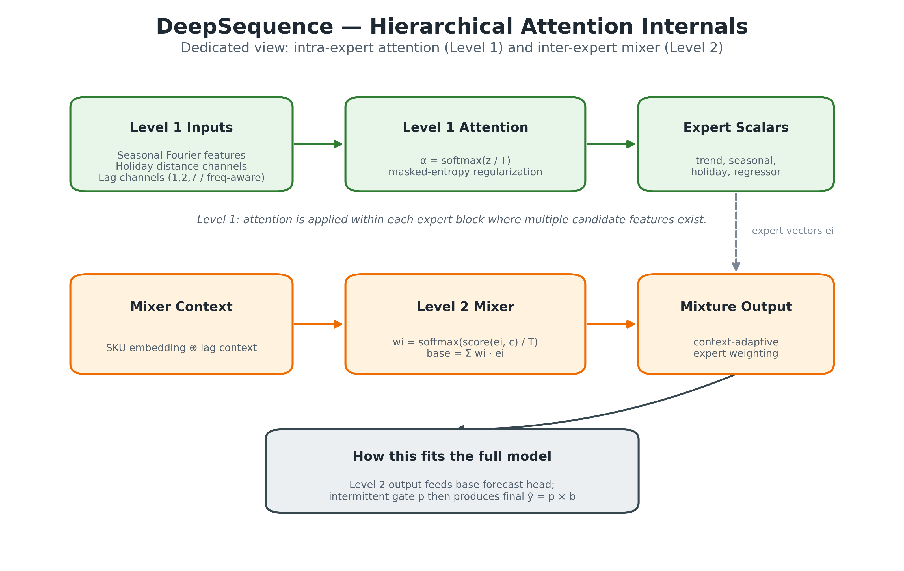
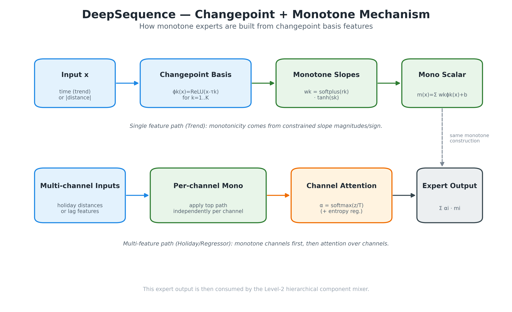
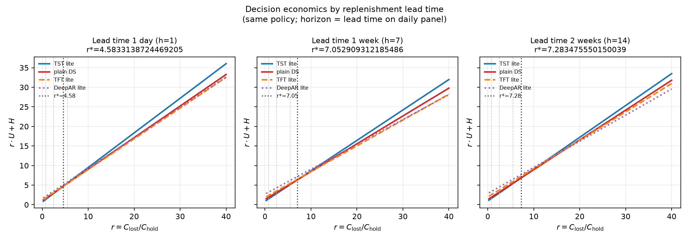
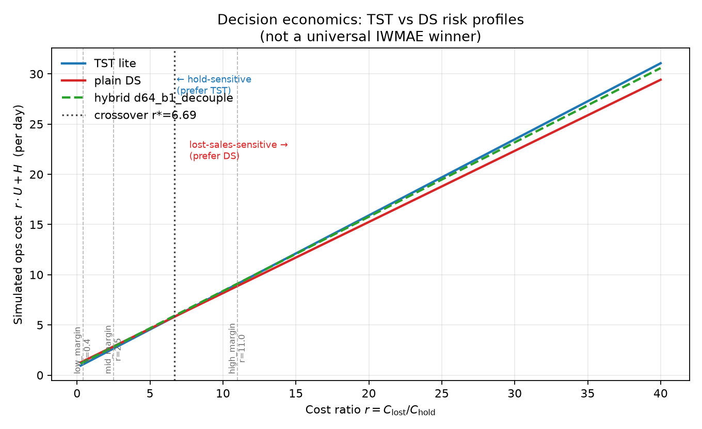

# DeepSequence: Hierarchical Attention for Multi-Series Intermittent Demand

**Version:** 1.7 (paper draft) · **Software:** `deepsequence-hierarchical-attention`  
**Author:** Mritunjay Kumar  
**Date:** August 2026

---

## Abstract

Prophet-style structural forecasting—additive **trend**, **seasonality**, **holiday**, and **regressor** effects—is widely used for single-series demand, but does not, out of the box, scale to a **shared multi-series / panel** neural model for intermittent retail and distribution demand. We present **DeepSequence**, a lightweight architecture that *extends that decomposition to panels*: shared expert trunks with optional SKU personalization, plus four architectural ingredients tailored to intermittency and interpretability.

**(i) Hierarchical attention.** Level-1 (intra-expert): seasonal masked-entropy over Fourier frequencies; holiday and regressor **selection attention** over monotone-mapped distances and lags; trend uses a softplus-monotone changepoint basis with **no** within-expert attention. Level-2 (inter-expert): a component mixer over the four Prophet-like experts. **(ii) Context-aware component mixing** conditions Level-2 weights on lag / intermittent **regime** features (not SKU identity alone), so the same calendar can reweight experts by demand state. **(iii) An occurrence–magnitude gate** \(\hat{y}=p\cdot b\) with softplus magnitude. **(iv) Monotone softplus maps** on trend, holiday distances, and regressor channels as Prophet-like inductive bias. Softsign expert outputs and DCN cross-layers **off** by default are secondary design choices supported by ablations.

Empirically, under a locked Level-1 / cross-off stack on an enterprise *daily* intermittent panel (800 series; SKU panel locked at `data_seed=42`; train seeds \(42\)–\(46\)), DeepSequence is **not** universally best on short-horizon IWMAE—temporal transformers often lead at \(h\le 14\)—but shows a stable **long-horizon** advantage at \(h=28/60\) (DS beats TST IWMAE in \(5/5\) seeds). Decision-economics scenarios with a loyalty / switching cost \(C_{\mathrm{loyalty}}=0.25\) reverse the “under-forecast looks cheap” ranking of LightGBM: short lead times favor TST, long lead times favor DeepSequence (\(5/5\) mid-π at \(h=28/60\)). On public **Monash Car Parts** (monthly; domain mismatch), TSB remains strong at short horizons; DeepSequence leads IWMAE at \(h=6\) across five train seeds (\(0.769\pm0.004\) vs TSB \(0.787\)), while mid-π still favors TSB (\(0/5\) DS wins at \(h=6\)). We argue for a **portfolio** view—structural multi-series Prophet for long-horizon intermittent panels—rather than a universal IWMAE claim.

---

## 1. Introduction

Retail and distribution panels are often **intermittent**: long runs of zeros punctuated by sparse, variable sales. Errors on quiet days and sale days have different operational costs. Classical intermittent methods (Croston, SBA, TSB) remain strong on short sparse series. Gradient-boosted trees are competitive tabular baselines but, under L1, tend to under-forecast sale days. Temporal transformers and TFT-style models add history attention, yet rarely encode an explicit **structural** decomposition that practitioners already trust from Prophet.

**Prophet** [Taylor & Letham, 2018] popularized additive trend + seasonality + holiday + regressors for *single-series* forecasting with interpretable components. The open problem we target is not “beat every baseline on 1-step IWMAE,” but:

> How do we carry Prophet-style structural forecasting into a **shared multi-series neural model** for intermittent panels—preserving component semantics, adding intermittency handling, and personalizing across SKUs?

DeepSequence answers with a hierarchical expert backbone that *mirrors* Prophet’s blocks, then adds panel-scale sharing, intermittency factorization, and two levels of attention that are **component/feature selection**, not day-level temporal self-attention.

**Contributions** (architectural novelty first; quotable for review):

1. **Hierarchical attention for Prophet-like experts.**  
   - *Level-1 (intra-expert):* seasonal **masked-entropy attention** over Fourier frequencies; holiday / regressor **selection attention** over softplus-monotone channel maps; trend is a **softplus-monotone** changepoint basis with **no** Level-1 attention (single temporal basis).  
   - *Level-2 (inter-expert):* entropy-regularized **component mixer** over \(\{\mathrm{trend},\mathrm{seasonal},\mathrm{holiday},\mathrm{regressor}\}\).

2. **Context-aware component mixer.** Level-2 mixing is conditioned on lag / intermittent **context** (demand regime), optionally concatenated with a SKU embedding—not SKU-only soft weights—so the same holiday calendar can emphasize different experts after a recent sale vs. a long zero run.

3. **Occurrence–magnitude gate** \(\hat{y}=p\cdot b\) for intermittency, with softplus magnitude head and (by default) softsign-bounded expert scalars.

4. **Monotone softplus structural maps** on trend time, holiday distances, and regressor channels—neuralized Prophet-like inductive bias rather than unconstrained dense maps.

5. **Empirical portfolio evidence** (locked Level-1, `use_cross_layers=False`; multi-seed \(42\)–\(46\)): long-horizon IWMAE advantage on daily \(h=28/60\) (\(5/5\) vs TST) and monthly car-parts \(h=6\); short horizons often favor TST (daily) or TSB (monthly); loyalty-aware decision economics (\(C_{\mathrm{loyalty}}=0.25\)) favor DeepSequence at long daily lead times and TST at short ones—while car-parts mid-π remains TSB. We do **not** claim universal IWMAE leadership.

Secondary design choices (ablations in §5.4): softsign expert outputs; cross-layers **off** by default; optional per-SKU zero-rate gate priors.

---

## 2. Related work

**Structural / Prophet-style models.** Prophet decomposes a univariate series into trend, seasonality, and holiday effects with interpretable additive structure. DeepSequence keeps that *block vocabulary* but trains a **shared** neural trunk across many intermittent series, with attention *inside* and *across* blocks.

**Classical intermittent methods** (Croston, 1972; SBA; TSB) separate demand size and inter-demand intervals. They remain required baselines—especially on short monthly spare-parts panels—and often win short-horizon accuracy when covariates are weak.

**Deep forecasting.** DeepAR, temporal transformers, and TFT provide global sequence models with likelihoods or variable selection. Comparative work on sparse retail demand often finds that shallow global models compete with heavy transformers. DeepSequence is complementary: lighter than full temporal self-attention stacks, denser in **structural** inductive bias.

**Positioning.**

| Family | Example | Fit for intermittent multi-series panels |
|--------|---------|------------------------------------------|
| Single-series structural | Prophet | Interpretable; not shared-panel by default |
| Classical intermittent | Croston, SBA, TSB | Strong short / sparse; weak rich covariates |
| Trees | LightGBM | Fast; L1 bias toward zeros / under-forecast |
| Temporal DL | DeepAR, TST, TFT | Strong history models; less Prophet-like structure |
| **This work** | **DeepSequence** | Multi-series Prophet-like experts + hierarchical attention + gate |

---

## 3. Method

### 3.1 Problem setup

For series \(i\) and time \(t\), observe demand \(y_{i,t}\ge 0\) and occurrence \(z_{i,t}=\mathbf{1}[y_{i,t}>0]\). Features \(x_{i,t}\) are **causal** (no same-day leakage from \(y_{i,t}\) into lags or intermittent state). The model predicts \(\hat{y}_{i,t}\) for inventory decisions; metrics also use \(\mathrm{round}(\hat{y}_{i,t})\) for discrete units.

### 3.2 Causal feature contract

**Daily (enterprise; v1.6, 28 dims).** Trend time index; day/month/year Fourier; lags \(1,2,7\); days since last sale, last sale quantity, lifetime cumsum; holiday **distances** only.

**Monthly (Car Parts).** Month index; quarter + calendar-month Fourier; lags \(1,3\); months-since-last-sale state; month-has-holiday indicators (not day-distance).

Lags and intermittent features use only history with timestamp \(< t\).

### 3.3 Hierarchical experts (Prophet blocks, neuralized)



*Figure 1. Causal features → four Prophet-like experts with Level-1 attention (except trend) → Level-2 context-aware mixer → gated head \(\hat{y}=p\cdot b\). Optional DCN cross-layers default **off**.*

Inputs are routed to four experts:

| Expert | Role (Prophet analogue) | Level-1 mechanism |
|--------|-------------------------|-------------------|
| **Trend** | Piecewise / changepoint trend | Softplus-monotone PWL in time; **no** attention (single basis) |
| **Seasonal** | Fourier seasonality | **Masked-entropy attention** over frequency channels |
| **Holiday** | Holiday effects | Softplus-monotone map per distance → **selection attention** |
| **Regressor** | History regressors | Softplus-monotone map per lag/state → **selection attention** |

Each expert emits a scalar contribution (default **softsign** output activation to bound signed impact). Optional SKU FiLM can personalize expert scalars; calendar FiLM on seasonal/holiday defaults **off**.



*Figure 2. Level-1 intra-expert attention (seasonal / holiday / regressor) and Level-2 inter-expert mixer. Trend: monotone map only.*



*Figure 3. Softplus-monotone changepoint trend (structural constraint).*

### 3.4 Hierarchical attention (contribution 1)

**Level-1 — intra-expert.**

- *Seasonal:* MaskedEntropyAttention over Fourier (or learnable-frequency) channels, with entropy regularization toward sparse frequency use.
- *Holiday / regressor:* each channel is first mapped by a **softplus magnitude × learned sign** (monotone in distance or lag), then aggregated by **TemperatureSoftmax selection attention** over channels.
- *Trend:* deliberately **without** Level-1 attention—one monotone temporal basis, avoiding competing trend “heads.”

**Level-2 — inter-expert.** Stacked expert scalars are mixed by entropy-regularized attention. This is *component* reweighting, not temporal self-attention over a lookback window.

### 3.5 Context-aware component mixer (contribution 2)

When `context_aware_component_mixer=True` (default), the Level-2 query is

\[
q = [\underbrace{e_i}_{\text{optional SKU embedding}};\; \underbrace{\mathrm{Dense}(c_{i,t})}_{\text{lag / intermittent context}}],
\]

where \(c_{i,t}\) are regressor-block regime signals (lags, days/months since last sale, etc.)—**not** calendar/Fourier/holiday distances (those remain inside their experts). Thus the same holiday feature vector can receive different expert weights after a stockout-prone zero run vs. after recent sales. Ablating the mixer (SKU-only or stack-only) is a paper-protocol comparison; locked runs keep the context mixer on.

### 3.6 Occurrence–magnitude gate (contribution 3)

\[
b_{i,t}=\mathrm{softplus}(\mathrm{mix}(\mathrm{experts}(x_{i,t}), q_{i,t})),\quad
p_{i,t}=\sigma(g(x_{i,t}, e_i)),\quad
\hat{y}_{i,t}=p_{i,t}\cdot b_{i,t}.
\]

Interpretation: \(p\) = “will demand occur?”; \(b\) = “how large given structural drivers?”; product = soft Bernoulli–magnitude expectation. Optional **per-SKU zero-rate priors** can bias gate logits from historical zero rates (secondary).

### 3.7 Monotone softplus maps (contribution 4)

For trend time, holiday \(|\mathrm{days\_from}_*|\) (or monthly holiday indicators’ monotone path), and each regressor channel, hinge slopes use

\[
\mathrm{slope} = \mathrm{softplus}(\cdot)\times \mathrm{sign\_param},
\]

so expert response is monotone in the structured input—Prophet-like shape constraints inside a neural panel model.

### 3.8 Defaults that match code (secondary)

Locked / recommended stack (`build_lightweight_model`):

| Flag | Default | Role |
|------|---------|------|
| `output_activation` | `'softsign'` | Bound signed expert scalars |
| `trend_monotonic` / `holiday_monotonic` / `regressor_monotonic` | `True` | Softplus mono maps |
| `context_aware_component_mixer` | `True` | Regime-conditioned Level-2 |
| `use_cross_layers` | **`False`** | Opt-in DCN cross; locked A/Bs prefer off |
| `context_film_seasonal_holiday` | `False` | Extra calendar FiLM off |
| `use_sku` | `True` (daily); often `False` on Car Parts ablations | SKU embedding / FiLM |

### 3.9 Training objective

With zero rate \(\pi_0\approx P(y=0)\), the default three-term loss is

\[
\mathcal{L}
= \alpha\,\mathrm{BCE}_{w_+}(z, p)
+ w_g\,\mathrm{MAE}_{\mathrm{inv}}(y, \hat{y})
+ w_m\,\mathrm{MAE}_{\mathrm{nz}}(y, b),
\]

where \(\mathrm{MAE}_{\mathrm{inv}}\) is inverse-class-weighted all-day MAE (timing) and \(\mathrm{MAE}_{\mathrm{nz}}\) is sale-day magnitude MAE. Typical weights: \(\alpha=0.2\), \(w_g=w_m=1\).

### 3.10 Multi-horizon evaluation

Primary locked tables use **1-step models with recursive rollout** to horizons of interest (daily \(H=60\), report \(h\in\{1,7,14,28,60\}\); monthly \(h\in\{1,2,6\}\)). A direct multi-horizon head (\(H>1\) outputs) exists in code for planning; it is **not** the primary claim of this draft (prior DS-MH \(h=7/14\) wins belonged to an older protocol—see Appendix D).

---

## 4. Experimental setup

### 4.1 Datasets

| Panel | Grain | Series | Zeros | Role |
|-------|-------|-------:|------:|------|
| Proprietary enterprise | Daily | 800 (SKU list locked, `data_seed=42`) | ≈90% train | Primary daily evidence |
| Monash Car Parts | Monthly | 800 (same lock convention) | ≈74% train | Public **domain-mismatch** sanity check |

The enterprise panel cannot be released; code, feature contracts, synthetic demo, and public Car Parts adapters are in the repository.

### 4.2 Protocol (locked)

| Item | Value |
|------|--------|
| DS stack | softsign + mono Level-1 + context mixer; FiLM off; **`use_cross_layers=False`** |
| Features | Identical causal matrix for trees and neural models |
| Sequence lookback | 14 (daily) / 12 (monthly) for DeepAR, TST, TFT |
| Seeds | SKU panels locked at `data_seed=42`. Seed-42 full-baseline tables in §5.1–5.3; **multi-seed means ±std over train seeds \(42\)–\(46\)** (DS/TST/LGBM daily; DS/TSB/LGBM car-parts) |
| Metrics | IWMAE (primary accuracy), occurrence F1, underforecast on sales, bias; decision π with loyalty scenarios (\(C_{\mathrm{loyalty}}=0.25\), \(C_{\mathrm{hold}}=0.10\)) |
| Baselines | LightGBM; DeepAR-lite; temporal transformer (TST); TFT-lite; + Croston/SBA/TSB on Car Parts; **Prophet (per-series)** |

**Why not all-day MAE alone.** High zero rates reward near-zero predictors. IWMAE and sale-day underforecast better reflect intermittent inventory risk.

### 4.3 Prophet baseline (required structural control)

If DeepSequence is framed as a **multi-series extension of Prophet-style decomposition**, experiments must include Prophet itself:

| Item | Spec |
|------|------|
| Implementation | `prophet` 1.3 + `cmdstanpy` (`.venv-test`) |
| Protocol | **One Prophet model per series** (no SKU pooling) |
| Fit window | train + val history; forecast test origins |
| Car Parts | 800 locked SKUs; fixed origin → \(h\in\{1,2,6\}\) |
| Daily | 150-SKU evenly spaced subset of the locked list; ≤4 origins/SKU; \(h\in\{1,28,60\}\) (full 800×Prophet deferred under concurrent training load) |
| Features | Calendar seasonality only (yearly; weekly on daily). Holiday distances / intermittent lags **not** injected as Prophet regressors |
| Honest limit | Prophet = local structural baseline; DS / LGBM / TSB = global or classical intermittent |

Artifacts: `ab_runs/reclaim/prophet_carparts/carparts_mh_1_2_6.json`, `ab_runs/reclaim/prophet_daily/daily_subset150_h1_28_60.json`.

### 4.4 Novelty ablations (isolate each claim)

Locked daily panel, seed **42**, softsign Level-1 stack base; vary **one** factor:

| Arm | Setting |
|-----|---------|
| Full | Level-1 selection attn on, mono on, context mixer on, gate on, cross **off** |
| −context mixer | `context_aware_component_mixer=False` |
| −Level-1 selection attn | `level1_selection_attention=False` (uniform \(1/n\) over mono channels) |
| −mono | `*_monotonic=False` (legacy unconstrained experts) |
| −gate | `use_intermittent=False` (magnitude-only head; H=1) |
| +cross | `use_cross_layers=True` |

Primary: daily **H=1** tabular DS-only + recursive MH \(h\in\{1,28,60\}\) DS-only. Ablations are **single-seed** (do not duplicate the multi-seed loyalty orchestrator).

Artifacts: `ab_runs/reclaim/ablate_novelty/`.

**Decision economics (scenario analysis).**  
\[
\pi \approx \mathrm{revenue\_proxy} - \underbrace{(m\cdot \mathrm{price}+C_{\mathrm{loyalty}})\,U + C_{\mathrm{hold}}\,H}_{\mathrm{inv\_loss}} - C_{\mathrm{model}},
\]
with \(C_{\mathrm{hold}}=0.1\), margins \(m\in\{0.08,0.25,0.55\}\), and loyalty costs \(C_{\mathrm{loyalty}}\in\{0,0.25,0.5\}\). Default reporting uses \(C_{\mathrm{loyalty}}=0.25\) (modest switching penalty) alongside the legacy \(C_{\mathrm{loyalty}}=0\) case. \(U/H\) are forecast-error underage / holding *proxies*, not a full pipeline inventory simulator; \(C_{\mathrm{loyalty}}\) is **not** fit from churn data.

Artifacts: `ab_runs/reclaim/daily_mh_1_60_level1_cross_off_all_models.json`, `.../daily_decision_economics_level1_cross_off_loyalty.json`, `.../carparts_mh_1_2_6_level1_cross_off_lgbm.json`, `.../carparts_decision_economics_level1_cross_off_loyalty.json`, `.../multiseed/daily_multiseed_long_loyalty_summary.json`, `.../multiseed/carparts_multiseed_long_loyalty_summary.json`.

---

## 5. Results

### 5.1 Daily multi-horizon IWMAE (locked Level-1, cross off; seed 42)

Recursive rollout after origin \(t\); known-future calendar/holidays; demand predictions fed into lags/intermittent state. \(n=5538\) origins, 800 SKUs.

| Horizon | DeepSequence | TST | TFT | DeepAR | LightGBM | Best |
|--------:|-------------:|----:|----:|-------:|---------:|:-----|
| \(h=1\) | 4.035 | **3.860** | 4.010 | 4.154 | 4.451 | TST |
| \(h=7\) | 4.381 | **4.323** | 4.566 | 5.169 | 4.688 | TST |
| \(h=14\) | 4.211 | **4.177** | 4.589 | 5.006 | 4.615 | TST |
| \(h=28\) | **6.417** | 6.877 | 6.891 | 7.212 | 6.866 | **DS** |
| \(h=60\) | **3.891** | 4.495 | 4.308 | 4.696 | 4.375 | **DS** |
| mean \(1..60\) | **4.374** | 4.666 | 4.736 | 5.103 | 4.790 | **DS** |

**Multi-seed IWMAE (seeds \(42\)–\(46\); locked SKU panel; DS / TST / LGBM):**

| Horizon | DeepSequence | TST | LightGBM |
|--------:|-------------:|----:|---------:|
| \(h=1\) | \(4.023\pm0.257\) | \(\mathbf{3.912\pm0.273}\) | \(4.483\pm0.324\) |
| \(h=7\) | \(4.299\pm0.500\) | \(\mathbf{4.139\pm0.523}\) | \(4.549\pm0.531\) |
| \(h=14\) | \(5.494\pm0.935\) | \(\mathbf{5.454\pm0.890}\) | \(5.828\pm0.883\) |
| \(h=28\) | \(\mathbf{4.823\pm0.970}\) | \(5.290\pm0.991\) | \(5.194\pm1.031\) |
| \(h=60\) | \(\mathbf{4.345\pm0.619}\) | \(5.055\pm0.417\) | \(4.710\pm0.550\) |

**Reading.** Short horizons favor **TST**; DeepSequence leads at **long horizons** (\(h=28/60\)) on both the seed-42 full bake-off and the five-seed mean. DS beats TST IWMAE at \(h=28\) and \(h=60\) in **\(5/5\)** seeds. This is the opposite of a “DS wins 1-step IWMAE everywhere” claim.

### 5.2 Decision economics with loyalty (daily; seed 42)

Without loyalty (\(C_{\mathrm{loyalty}}=0\)), **LightGBM** often wins **low-margin** π: under-forecasting reduces holding \(H\) and looks cheap when lost-sales are under-weighted. With the recommended scenario \(C_{\mathrm{loyalty}}=0.25\), that ranking flips.

**π winners by lead time (proxy = forecast horizon) and loyalty** — from `pi_winner_matrix` (seed 42):

| Lead time | \(C_{\mathrm{loyalty}}=0\) (low / mid / high margin) | \(C_{\mathrm{loyalty}}=0.25\) |
|-----------|------------------------------------------------------|-------------------------------|
| 7 days | LGBM / TST / TST | **TST / TST / TST** |
| 14 days | LGBM / DS / TST | DS / TST / TST |
| 28 days | LGBM / DS / DS | **DS / DS / DS** |
| 60 days | LGBM / DS / DS | **DS / DS / DS** |

**Multi-seed mid-π @ \(C_{\mathrm{loyalty}}=0.25\) (seeds \(42\)–\(46\); higher is better):**

| Horizon | DeepSequence | TST | LightGBM | Mid-π winner |
|--------:|-------------:|----:|---------:|:-------------|
| \(h=7\) | \(-0.243\pm0.022\) | \(\mathbf{-0.218\pm0.024}\) | \(-0.262\pm0.023\) | TST \(4/5\) |
| \(h=14\) | \(-0.291\pm0.046\) | \(-0.291\pm0.040\) | \(-0.313\pm0.034\) | TST \(3/5\), DS \(2/5\) |
| \(h=28\) | \(\mathbf{-0.273\pm0.045}\) | \(-0.353\pm0.068\) | \(-0.308\pm0.051\) | **DS \(5/5\)** |
| \(h=60\) | \(\mathbf{-0.255\pm0.042}\) | \(-0.373\pm0.046\) | \(-0.301\pm0.031\) | **DS \(5/5\)** |

Loyalty collapses LightGBM’s low-margin win-rate (\(h=7/14\): \(5/5\to0/5\); \(h=28\): \(5/5\to2/5\); \(h=60\): \(5/5\to1/5\)).



*Figure 4. Lead-time decision economics (illustrative). Locked loyalty tables above are authoritative for the Level-1 cross-off stack; older economics figures without loyalty should be read as prior / partial protocol.*



*Figure 5. Inventory-proxy cost vs effective critical ratio (scenario curves). Use with the loyalty caveats in §4.2.*

**Portfolio takeaway.** Short replenishment → TST; long replenishment → DeepSequence—once loyalty / switching cost prevents “always under-forecast” from winning on paper. The multi-seed mid-π pattern matches the seed-42 matrix.

### 5.3 Public Car Parts (monthly; domain mismatch)

**All-model, seed 42 (locked Level-1, cross off) + per-series Prophet:**

| Horizon | TSB | DeepSequence | Prophet | TST | LightGBM | Best |
|--------:|----:|-------------:|--------:|----:|---------:|:-----|
| \(h=1\) | **0.850** | 0.882 | 0.916 | 0.887 | 0.889 | TSB |
| \(h=2\) | **0.767** | 0.778 | 0.836 | 0.789 | 0.832 | TSB |
| \(h=6\) | 0.834 | 0.834 | **0.827** | 0.866 | 0.890 | Prophet (≈DS/TSB) |

Numbers from locked reclaim MH (`carparts_mh_1_2_6_level1_cross_off.json`) and Prophet (`prophet_carparts/carparts_mh_1_2_6.json`; 800/800 series ok)—**raw** `iwmae` in those artifacts. Prophet is competitive at \(h=6\) but loses short horizons to TSB and DS—as expected for a local additive model on short intermittent monthly history without shared pooling.

**Multi-seed IWMAE (seeds \(42\)–\(46\); DS / TSB / LGBM):**

| Horizon | DeepSequence | TSB | LightGBM |
|--------:|-------------:|----:|---------:|
| \(h=1\) | \(0.842\pm0.012\) | \(\mathbf{0.815\pm0}\) | \(0.874\pm0.005\) |
| \(h=2\) | \(0.733\pm0.009\) | \(\mathbf{0.703\pm0}\) | \(0.838\pm0.005\) |
| \(h=6\) | \(\mathbf{0.769\pm0.004}\) | \(0.787\pm0\) | \(0.877\pm0.012\) |

**Protocol note.** The seed-42 bake-off above (DS/TSB \(h=6\) ≈ 0.834) and this multi-seed table (DS \(0.769\pm0.004\) vs TSB 0.787) are **different reporting conventions / artifact fields** (raw `iwmae` vs primary `iwmae_rounded` in the multi-seed orchestrator)—not a single reconciled number. Rankings within each table are self-consistent; do not mix levels across tables.

TSB is seed-invariant (classical). DeepSequence’s **long-horizon (\(h=6\))** IWMAE edge over TSB is stable across seeds on the multi-seed (rounded) table, but mid-margin π with \(C_{\mathrm{loyalty}}=0.25\) still favors **TSB** on all horizons (\(0/5\) DS mid-π wins at \(h=6\))—reinforcing domain mismatch vs covariate-rich daily retail. Prefer TSB (then SBA/Croston) as the short-horizon monthly default; treat DS as a structural long-horizon IWMAE competitor when a neural panel model is required. Prophet confirms the structural baseline is present but does not overturn TSB on this panel.


*Figure 6. Earlier 1-step Car Parts bake-off figure (prior protocol). Prefer the locked \(h=1/2/6\) Level-1 tables above for current claims.*

### 5.3b Daily Prophet subset (protocol note)

On a **150-SKU** evenly spaced subset of the locked daily list (≤4 origins/SKU), per-series Prophet reports IWMAE \(h=1/28/60\) = **2.68 / 4.90 / 3.34**. These are **not** comparable to the 800-SKU global DS table (different panel slice and origin density). The run documents that a tractable daily Prophet protocol is available; a full 800-SKU daily Prophet bake-off remains future work under quieter compute.

### 5.4 Novelty ablations (what each piece buys)

**Daily H=1 (tabular DS-only; seed 42).** Gate is the dominant intermittent novelty; other factors sit inside single-seed noise at one step:

| Arm | IWMAE | Δ vs Full |
|-----|------:|----------:|
| Full (Level-1 + mixer + mono + gate; cross off) | 4.156 | — |
| −context mixer | 4.081 | −0.075 |
| −Level-1 selection attn | 4.113 | −0.043 |
| −mono | 4.191 | +0.036 |
| −gate | **4.578** | **+0.422** |
| +cross | 4.097 | −0.059 |

**Reading (H=1).** Removing the occurrence gate hurts severely. Mixer / Level-1 / cross flips at H=1 are small and **not** directional claims under one seed (locked recursive \(h=1\) Full ≈ 4.088 is a better global reference).

**Daily recursive MH (DS-only; \(h\in\{1,28,60\}\); seed 42).** Long horizons isolate the claimed novelties; Full wins \(h=28/60\):

| Arm | \(h=1\) | \(h=28\) | \(h=60\) |
|-----|--------:|---------:|---------:|
| **Full** | 4.088 | **6.451** | **3.930** |
| −context mixer | **4.012** | 6.556 | 4.014 |
| −Level-1 selection attn | 4.142 | 6.657 | 4.113 |
| −mono | 4.046 | 6.535 | 3.999 |
| +cross | 4.049 | 6.642 | 4.137 |

**What each novelty buys (long \(h\))**

| Novelty | Evidence |
|---------|----------|
| Level-1 selection attn | −attn raises \(h=28/60\) by ≈0.21 / 0.18 |
| Context mixer | −mixer raises \(h=28/60\) by ≈0.11 / 0.08 (helps long; short \(h=1\) can look better without it) |
| Softplus mono maps | −mono raises \(h=28/60\) by ≈0.08 / 0.07 |
| Occurrence gate | H=1 Δ ≈ +0.42 IWMAE when removed |
| Cross layers | +cross hurts long \(h\) (known); keep **off** |

Artifacts: `ab_runs/reclaim/ablate_novelty/daily_h1_*.json`, `daily_mh60_*.json`.

---

## 6. Discussion

**Measured idea.** DeepSequence is a **multi-series extension of Prophet-style decomposition** for intermittent panels, with hierarchical attention, regime-aware mixing, gating, and monotone maps as the architectural payload—not a claim that DS is #1 IWMAE at every horizon. The per-series Prophet control (§5.3) makes that framing falsifiable.

**When to use what (portfolio).**

| Setting | Prefer |
|---------|--------|
| Daily, short lead time / short \(h\) | TST (accuracy); check loyalty π |
| Daily, long lead time (\(h\gtrsim 28\)) | **DeepSequence** (IWMAE + loyalty π) |
| Monthly short spare-parts, weak covariates | **TSB** (then SBA/Croston); Prophet alone is not enough |
| Monthly longer horizon (\(h=6\)) accuracy | DeepSequence competitive / best IWMAE; π may still favor TSB |
| Ranking protocol | IWMAE + underforecast + loyalty-aware π; do not rank on all-day MAE alone |

**Why loyalty matters.** LGBM’s low \(H\) from under-forecasting wins low-margin π when \(C_{\mathrm{loyalty}}=0\). A modest switching cost restores the cost of missed demand; long-LT daily π then aligns with DS’s long-horizon accuracy—stable across five train seeds on the daily panel. On Car Parts, loyalty does not overturn TSB’s mid-π dominance.

**Limitations.** Enterprise results are panel-specific. Novelty ablations are single-seed. Daily Prophet is a 150-SKU subset (not locked-800). Sequence baselines are lite adaptations sharing the gated head where applicable. Car Parts is short monthly history without a rich retail calendar. Economics use error proxies, not full inventory simulation. Hierarchical product-tree reconciliation is out of scope. Prophet vs DS also differs in protocol (local fit vs global multi-series).

---

## 7. Conclusion

We reframed intermittent neural forecasting as **Prophet-style structure at panel scale**. DeepSequence’s first-class architectural contributions are:

1. **Hierarchical attention** — Level-1 masked-entropy / selection attention inside seasonal, holiday, and regressor experts; Level-2 inter-expert mixing; monotone trend **without** Level-1 attention.  
2. **Context-aware component mixer** — lag/intermittent regime reweights experts beyond SKU-only soft weights.  
3. **Occurrence–magnitude gate** \(\hat{y}=p\cdot b\).  
4. **Monotone softplus maps** as neuralized structural constraints.

Empirically, under locked Level-1 / cross-off defaults and five train seeds on a locked SKU panel, DeepSequence shows a **stable long-horizon** accuracy role (daily \(h=28/60\); Car Parts \(h=6\) IWMAE) and a **loyalty-aware** decision role at long daily lead times, while short horizons often favor TST or TSB—and Car Parts mid-π remains TSB. Softsign experts and cross-layers off are supporting defaults, not the headline claim. We recommend a **portfolio** deployment story—and intermittent metrics that do not let under-forecasting win by default.

---

## 8. Software and reproducibility

| Artifact | Location |
|----------|----------|
| Package | `deepsequence_hierarchical_attention/` |
| Feature SSOT | `feature_config.yaml` |
| Synthetic demo | `examples/v16_deepsequence_example.ipynb` |
| Training config | `examples/training_config.sample.json` |
| Locked daily MH (all models) | `ab_runs/reclaim/daily_mh_1_60_level1_cross_off_all_models.json` |
| Prophet Car Parts (monthly) | `ab_runs/reclaim/prophet_carparts/carparts_mh_1_2_6.json` |
| Prophet daily subset | `ab_runs/reclaim/prophet_daily/daily_subset150_h1_28_60.json` |
| Novelty ablations | `ab_runs/reclaim/ablate_novelty/` |
| Daily loyalty economics | `ab_runs/reclaim/daily_decision_economics_level1_cross_off_loyalty.json` |
| Car Parts MH (+ LGBM) | `ab_runs/reclaim/carparts_mh_1_2_6_level1_cross_off_lgbm.json` |
| Car Parts loyalty economics | `ab_runs/reclaim/carparts_decision_economics_level1_cross_off_loyalty.json` |
| Daily multi-seed summary | `ab_runs/reclaim/multiseed/daily_multiseed_long_loyalty_summary.json` |
| Car Parts multi-seed summary | `ab_runs/reclaim/multiseed/carparts_multiseed_long_loyalty_summary.json` |
| Figures | `paper_figures/` |
| Engineering notes | `REPORT_v1.6.md` |

Repository: [https://github.com/mkuma93/DeepSequence](https://github.com/mkuma93/DeepSequence)

---

## References

1. Taylor, S. J., & Letham, B. (2018). Forecasting at scale. *The American Statistician*. (Prophet.)
2. Croston, J. D. (1972). Forecasting and stock control for intermittent demands. *Operational Research Quarterly*.
3. Syntetos, A. A., & Boylan, J. E. (2005). The accuracy of intermittent demand estimates. *International Journal of Forecasting*.
4. Teunter, R. H., Syntetos, A. A., & Babai, M. Z. (2011). Intermittent demand: Linking forecasting to inventory obsolescence. *European Journal of Operational Research*.
5. Salinas, D., et al. (2020). DeepAR: Probabilistic forecasting with autoregressive recurrent networks. *International Journal of Forecasting*.
6. Lim, B., et al. (2021). Temporal Fusion Transformers for interpretable multi-horizon time series forecasting. *International Journal of Forecasting*.
7. Ke, G., et al. (2017). LightGBM: A highly efficient gradient boosting decision tree. *NeurIPS*.
8. Godahewa, R., et al. (2021). Monash Time Series Forecasting Archive. *NeurIPS Datasets and Benchmarks*. (Car Parts: Zenodo 4656021.)
9. Nie, Y., et al. (2023). A time series is worth 64 words: Long-term forecasting with transformers (PatchTST). *ICLR*.
10. Kendall, A., Gal, Y., & Cipolla, R. (2018). Multi-task learning using uncertainty to weigh losses. *CVPR*.

---

## Appendix A. Notation

| Symbol | Meaning |
|--------|---------|
| \(y\) | Demand |
| \(z=\mathbf{1}[y>0]\) | Occurrence |
| \(b\) | Magnitude (`base_forecast`, softplus) |
| \(p\) | Occurrence probability (`non_zero_probability`) |
| \(\hat{y}=p\cdot b\) | Final forecast |
| \(e_i\) | SKU embedding (optional) |
| \(c_{i,t}\) | Lag / intermittent context for Level-2 mixer |
| \(U, H\) | Underage / holding proxies in π |
| \(C_{\mathrm{loyalty}}\) | Scenario switching / loyalty cost |

## Appendix B. Commands (sketch)

```bash
pip install -e ".[dev]"
export DEEPSEQUENCE_DATA_DIR=/path/to/local/panel

# Locked daily recursive MH (Level-1, cross off)
python examples/eval_multihorizon_compare.py \
  --data_dir "$DEEPSEQUENCE_DATA_DIR" \
  --max_skus 800 --epochs 10 --seed 42 --horizon 60

# Public Car Parts
python examples/public_data/prepare_carparts.py
python examples/eval_public_carparts_mh_all.py --max_skus 800 --epochs 10 --seed 42
```

Exact reclaim flags (softsign, mono, mixer, `--use_cross_layers false`) match `ab_runs/reclaim/` logs and `ds_stack` fields in the JSON artifacts.

## Appendix C. Figure index

| File | Status in this draft |
|------|----------------------|
| `paper_figures/fig_architecture_ds.png` | Primary architecture |
| `paper_figures/fig_hierarchical_attention_internals.png` | Hierarchical attention |
| `paper_figures/fig_changepoint_monotone.png` | Monotone trend |
| `paper_figures/fig_decision_economics_by_lead_time.png` | Economics by LT (pair with §5.2 text) |
| `paper_figures/fig_decision_economics_cost_vs_r.png` | Economics vs \(r\) (pair with §5.2 text) |
| `paper_figures/fig7_public_carparts_iwmae.png` | Prior 1-step Car Parts figure |
| `paper_figures/fig0_architecture.png` … `fig6_*.png` | **Prior-protocol** 1-step / recursive / DS-MH figures (Appendix D) |

## Appendix D. Prior protocol (not primary claims)

Earlier drafts emphasized **1-step DS IWMAE ≈ 4.004 (#1)** and **tuned DS-MH best at \(h=7/14\)** under a previous feature/model protocol. Those results remain in repository JSONs and older `paper_figures/fig1`–`fig6` plots but are **not** the primary claims of this rewrite. The locked Level-1 / cross-off recursive tables in §5 supersede them for the multi-series Prophet + portfolio narrative.
