# DeepSequence: Structured Multi-Series Planning Rates for Lead-Time Intermittent Demand

**Author:** Mritunjay Kumar  
**Correspondence:** see repository  
**Status:** Methods preprint (arXiv-oriented); shaped for eventual submission to the *International Journal of Forecasting*  
**Date:** August 2026

---

> **Figures not showing in Cursor preview?** Relative image embeds often fail for Google Drive–backed workspaces (`My Drive` path with spaces). Use one of:
> 1. Open [`paper_figures/VIEW.html`](paper_figures/VIEW.html) in a browser (File → Open), or run `open paper_figures/VIEW.html` from the repo root.
> 2. Click the **Open PNG** links under each figure (or browse [`paper_figures/`](paper_figures/)).
> 3. View on GitHub: [PAPER.md](https://github.com/mkuma93/DeepSequence/blob/main/PAPER.md) · [figure gallery](https://github.com/mkuma93/DeepSequence/tree/main/paper_figures) · dedicated list in [`PAPER_figures.md`](PAPER_figures.md).


## Abstract

Replenishment on intermittent panels depends on **lead-time demand**—cumulative demand over a replenishment horizon \(H\)—more than on hitting every sparse sale spike. We introduce **DeepSequence**, a **structured multi-series planning-rate** model for that setting: Prophet-like expert trunks (trend, seasonal, holiday, regressor), an occurrence–magnitude gate \(\hat{y}=p\cdot b\), and a context-aware component mixer conditioned on lag and intermittent regime—plus supporting hierarchical Level-1 selection attention and softplus-monotone maps. Scope is lead-time planning on multi-series intermittent demand, not a universal intermittent solver or spike-timing model; promo / price / traffic covariates are largely absent from current panels, so day-level spike capture remains out of scope.

**Positioning in one pass.** Versus classical intermittent methods (Croston / SBA / TSB), DeepSequence shares strength across series, uses structured experts, and targets long-\(H\) Direct multi-horizon (Direct-MH) planning rather than local occurrence/size smoothing alone. Versus Prophet, it is a shared panel model with intermittent \(p\cdot b\) factorization, hierarchical selection, and regime-aware mixing—not per-series additive fits. Versus modern deep time-series models (TFT / DeepAR / PatchTST-class), the claim is Prophet-like inductive bias plus an explicit planning-rate gate and interpretable experts, not generic sequence SOTA.

**All primary results use Direct-MH**—one multi-step head per model, not recursive one-step rollout. Weekly vs daily compares grain under the **same Direct-MH protocol**. On a locked enterprise panel (800 series), lead-time **IWMAE**, **CumMAE** (error on \(\sum_{h=1}^{H} y\)), and train-zone strata show DeepSequence leading daily IWMAE and CumMAE at \(h\ge 7\) (TSB edges \(h=1\)) and weekly IWMAE and CumMAE at \(h=1/4/8\); a like-for-like daily↔weekly Direct-MH comparison confirms the within-grain pattern. Wins concentrate at longer leads and mid/high weekly / smoother zones—not spike hitting. Zone strata under Direct-MH favor DeepSequence at longer leads across mid/high train mean-demand bands; sparse one-step cells often still favor TSB. On public Monash Car Parts (monthly; domain mismatch), TSB remains strong at short horizons and on mid-margin \(\pi\); DeepSequence leads IWMAE at \(h=6\) across five seeds. Recursive rollout is appendix-only. We recommend structured multi-series planning rates for replenishment lead times, not a universal spike-capture claim.

**Keywords:** intermittent demand; lead-time demand; planning rates; multi-series forecasting; Prophet; decision economics; inventory planning

---

## 1. Introduction

Retail and wholesale distribution panels are often **intermittent**: most days (or months) record zero demand, with occasional positive sales of variable size. Inventory replenishment is governed by a **lead time** \(H\): the planner needs cumulative demand over \(1..H\) and a usable **planning-rate** trajectory for that window—not a guarantee of hitting every spike day. Forecast errors on quiet periods and on missed demand have different operational costs (holding versus lost sales / loyalty). Classical intermittent methods (Croston, SBA, TSB) remain strong defaults on short, sparse series. Global sequence models (DeepAR, temporal transformers, TFT) add history attention and covariates, yet rarely encode the structural decomposition practitioners already trust from Prophet.

**Claim and scope.** DeepSequence is a **structured planning-rate model for multi-series intermittent demand**—aimed at lead-time planning—not a universal intermittent solver and not a spike-timing model. The primary question is:

> Given replenishment lead time \(H\), how well can Prophet-style structure be carried into a **shared multi-series** model that supports intermittent **lead-time demand planning**—cumulative demand over \(1..H\), long-horizon planning rates \(\hat{y}=p\cdot b\), and decision economics \(\pi\)—while preserving component semantics?

**Novelty (three-way contrast).**

- **vs classical intermittent (Croston / SBA / TSB):** shared multi-series learning, structured Prophet-like experts, and long-\(H\) Direct-MH planning paths—not only local occurrence/size smoothing.
- **vs Prophet:** multi-series parameter sharing with intermittent \(p\cdot b\) factorization, hierarchical selection attention, and a context-aware component mixer—not per-series additive Prophet.
- **vs modern deep time series (TFT / DeepAR / PatchTST-class):** Prophet-like inductive bias, an explicit planning-rate gate, and interpretable experts—not a chase for generic sequence SOTA.

**DeepSequence** implements that claim with four Prophet-like expert trunks, optional SKU personalization, a context-aware Level-2 mixer, and gate \(\hat{y}=p\cdot b\); hierarchical Level-1 selection and softplus-monotone maps support the structural stack (Figure 5). The **regressor** expert is the natural home for promo / price / traffic; without those covariates here, unmatched spikes are an expected scope limit (Section 6.1).

**Empirical bridge (why / when / why lead-time metrics).** The architecture is built for planning rates, so evaluation emphasizes Direct-MH paths and **CumMAE** (error on lead-time demand \(\sum_{h=1}^{H} y\)) alongside IWMAE. Empirically, DeepSequence’s wins appear at **longer leads** and in **mid/high weekly / smoother** train-demand zones—not as day-level spike hitting. Weekly vs daily compares grain under the **same Direct-MH protocol** (like-for-like Direct↔Direct); recursive one-step rollout is appendix-only.

**Contributions.**

1. **Structured multi-series planning-rate forecasting.** A panel model that carries Prophet’s block vocabulary (trend, seasonal, holiday, regressor) into shared multi-series intermittent demand for replenishment lead times, with gate \(\hat{y}=p\cdot b\) as the planning-rate factorization.

2. **Main novelty: Prophet-like experts + gating + context-aware mixing.** Interpretable expert trunks; occurrence–magnitude separation; Level-2 weights conditioned on lag / intermittent **regime** (optionally with SKU embedding)—so the same calendar can reweight after a recent sale versus a long zero run. Hierarchical Level-1 selection attention and monotone softplus maps are supporting structural machinery (Figure 5), not the sole claim.

3. **Lead-time planning evidence under Direct-MH** (locked architecture): (i) daily Direct-MH IWMAE+CumMAE leadership at \(h\ge 7\) (seed 42; TSB at \(h=1\)); (ii) weekly Direct-MH where DeepSequence leads IWMAE+CumMAE at \(h=1/4/8\), compared to daily under the same Direct-MH protocol; (iii) CumMAE as a first-class lead-time metric; (iv) train-zone strata favoring DeepSequence at longer leads in mid/high bands, with TSB still competitive on sparse one-step cells. Short monthly / Car Parts lead times often favor TSB. We do **not** claim universal day-level accuracy or spike capture.

Ablations (gate, mixer, Level-1, mono, cross) support the locked stack and appear in Section 5.5 / Appendix E; they do not dominate the framing. Softsign expert outputs and DCN-style cross-layers off are secondary defaults.

---

## 2. Related work

### 2.1 Classical intermittent demand forecasting

Croston (1972) separated intermittent demand into inter-demand intervals and demand sizes, updating each with exponential smoothing. Syntetos and Boylan (2001, 2005) analyzed bias in Croston’s estimator and proposed the Syntetos–Boylan approximation (SBA). Teunter, Syntetos, and Babai (2011) introduced TSB, which updates the probability of demand occurrence and is better suited to obsolescence and intermittent series with changing occurrence rates. These methods remain required baselines on spare-parts and other short intermittent panels (Syntetos et al., 2015; Boylan and Syntetos, 2021). Reviews of intermittent demand emphasize that accuracy metrics and inventory costs can disagree, and that zero-heavy series reward near-zero predictors under all-day MAE (Wallström and Segerstedt, 2010; Prestwich et al., 2014).

### 2.2 Metrics and lead-time / decision-aware evaluation

Standard MAE and RMSE are poorly aligned with intermittent inventory risk because high zero rates dominate the loss. Intermittent-aware and scaled metrics (e.g., mean absolute scaled error variants, period-weighted errors) and inventory-oriented evaluation have been discussed extensively in the intermittent-demand literature (Syntetos and Boylan, 2005; Hyndman and Koehler, 2006; Kolassa, 2016). For **lead-time planning** we report two accuracy families side by side: **IWMAE** (intermittent weighted MAE on the point forecast path) and **CumMAE** (mean absolute error on cumulative lead-time demand \(\sum_{h=1}^{H} y_{t+h}\)). Decision economics enter via a transparent **proxy** \(\pi\) that combines underage and holding cost proxies with an optional loyalty / switching penalty—planning economics for a replenishment lead time, not a fitted churn model or full inventory simulator (Section 4.5).

### 2.3 Structural and Prophet-style models

Prophet (Taylor and Letham, 2018) decomposes a univariate series into piecewise trend, Fourier seasonality, and holiday effects with interpretable additive structure and Bayesian / Stan-backed estimation. Related structural time-series approaches include Bayesian structural time series (Scott and Varian, 2014) and classical unobserved-components models. DeepSequence keeps Prophet’s *block vocabulary* (trend, seasonal, holiday, regressor) but trains a **shared** neural trunk across many intermittent series, with attention *inside* and *across* blocks rather than per-series local fits.

### 2.4 Global and deep forecasting

Global forecasting—pooling strength across related series—has become standard in retail and competition settings (Januschowski et al., 2020; Montero-Manso and Hyndman, 2021). DeepAR (Salinas et al., 2020) trains an autoregressive RNN likelihood across many series. N-BEATS (Oreshkin et al., 2020) and N-HiTS (Challu et al., 2023) use deep residual stacks of fully connected blocks for univariate multi-horizon forecasting. Temporal Fusion Transformers (Lim et al., 2021) combine variable selection, gated residual networks, and multi-head attention for interpretable multi-horizon forecasting with static and known-future covariates. PatchTST and related temporal transformers (Nie et al., 2023) show that channel-independent patch attention is competitive for long-term forecasting. Comparative work on sparse retail demand often finds that shallow global models compete with heavy transformers (Makridakis et al., 2022). DeepSequence is complementary: Prophet-like inductive bias and an explicit planning-rate gate, not a chase for generic sequence SOTA.

### 2.5 Neural approaches to intermittent and sparse demand

Neural intermittent forecasting has explored zero-inflated and hurdle-style heads, separate occurrence and size models, and inventory-aware losses (Kourentzes, 2013; Turkmen et al., 2021); book-length treatment of intermittent methods and applications is given by Boylan and Syntetos (2021). Soft gating of the form \(\hat{y}=p\cdot b\) is closely related to classical occurrence–size factorization and to zero-inflated continuous heads. Our contribution is not intermittency gating alone, but gating combined with Prophet-like experts, hierarchical selection attention, and regime-conditioned mixing in a multi-series setting.

### 2.6 Tree ensembles and tabular baselines

LightGBM (Ke et al., 2017) and related gradient-boosted trees remain strong tabular baselines when rich covariates are available. Under L1 / MAE objectives on intermittent targets, trees often predict near zero on quiet days and under-forecast sale magnitudes—an effect that can look advantageous under holding-heavy cost proxies unless lost-sales or loyalty costs are counted (Section 6.2).

### 2.7 Positioning

| Family | Example | Contrast to DeepSequence |
|--------|---------|--------------------------|
| Classical intermittent | Croston, SBA, TSB | Local occurrence/size smoothing; DeepSequence adds shared multi-series + structured experts + long-\(H\) Direct-MH planning |
| Single-series structural | Prophet | Per-series additive fits; DeepSequence is multi-series with \(p\cdot b\), hierarchical selection, and context mixer |
| Trees | LightGBM | Fast tabular; L1 bias toward zeros / under-forecast |
| Temporal DL | DeepAR, TST, TFT, PatchTST-class | Strong history models; DeepSequence prioritizes Prophet-like bias + planning-rate gate over generic sequence SOTA |
| **This work** | **DeepSequence** | Structured multi-series planning rates for lead-time intermittent demand (IWMAE + CumMAE / \(\pi\)); not a universal spike solver |

---

## 3. Method

### 3.1 Problem setup

For series \(i\) and time \(t\), observe demand \(y_{i,t}\ge 0\) and occurrence \(z_{i,t}=\mathbf{1}[y_{i,t}>0]\). Features \(x_{i,t}\) are **causal**: no same-day leakage from \(y_{i,t}\) into lags or intermittent state. The model predicts a planning-rate path \(\hat{y}_{i,t}\) for inventory decisions over a replenishment lead time \(H\); discrete-unit reporting uses \(\mathrm{round}(\hat{y}_{i,t})\) where noted. Lead-time demand is \(\sum_{h=1}^{H} y_{i,t+h}\).

### 3.2 Causal feature contract

**Daily enterprise panel.** Trend time index; day/month/year Fourier terms; lags \(1,2,7\); days since last sale, last sale quantity, lifetime cumulative sales; holiday **distances** only (no same-day holiday indicator leakage beyond known calendar).

**Monthly Car Parts.** Month index; quarter and calendar-month Fourier; lags \(1,2,12\) (monthly frequency preset / `feature_config_monthly.yaml`); months-since-last-sale state; month-has-holiday indicators (not day-distance).

Lags and intermittent features use only history with timestamp strictly less than \(t\).

### 3.3 Hierarchical experts

Inputs are routed to four experts:

| Expert | Role (Prophet analogue) | Level-1 mechanism |
|--------|-------------------------|-------------------|
| **Trend** | Piecewise / changepoint trend | Softplus-monotone piecewise-linear map in time; **no** attention (single temporal basis) |
| **Seasonal** | Fourier seasonality | Masked-entropy attention over frequency channels |
| **Holiday** | Holiday effects | Softplus-monotone map per distance channel → selection attention |
| **Regressor** | History regressors | Softplus-monotone map per lag / state channel → selection attention |

Each expert emits a scalar contribution. By default, a **softsign** output activation bounds signed expert impact. Optional SKU FiLM personalizes expert scalars; calendar FiLM on seasonal and holiday experts defaults off. Figures 1–5 walk the mechanism stack in implementation order.

### 3.4 Changepoint selection (Trend)

Trend uses `ChangepointReLU`: learnable deltas \(\delta\in\mathbb{R}^{K}\) (\(K{=}10\) default; locked runs often use \(K{=}15\)) are mapped to **ordered** locations via \(\delta^{+}=\mathrm{softplus}(\delta)\), \(\mathrm{cp}=\mathrm{cumsum}(\delta^{+})\), then rescaled into \([t_{\min},t_{\max}]\). Hinge features are \(\phi_k(t)=\mathrm{ReLU}(t-\mathrm{cp}_k)\). Locations are continuous parameters—not a discrete subset selection. Under the locked monotone path there is **no** Level-1 attention over changepoints (the legacy unconstrained path that attended over hinges is disabled).

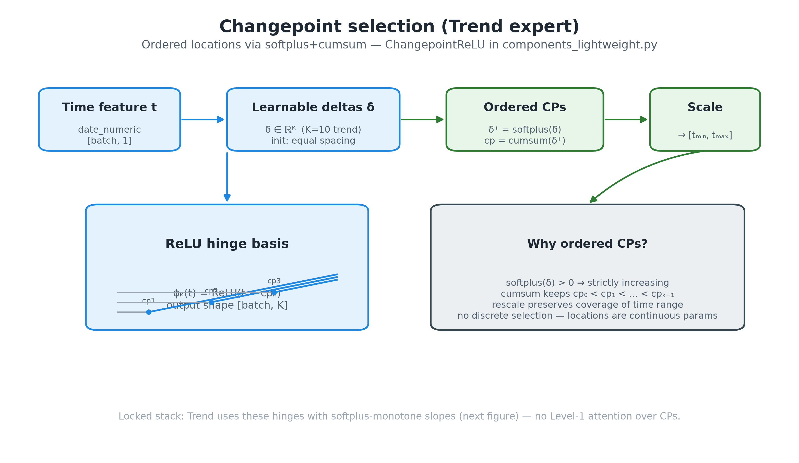

[Open PNG](paper_figures/fig_m1_changepoint_selection.png) · [GitHub](https://github.com/mkuma93/DeepSequence/blob/main/paper_figures/fig_m1_changepoint_selection.png)

*Figure 1. Ordered changepoint parameterization: softplus deltas → cumsum → scale → ReLU hinges (matches `ChangepointReLU`).*

### 3.5 Monotone softplus–PWL maps

For trend time, holiday absolute distances, and each regressor channel, hinge slopes use

\[
m = \mathrm{softplus}(s)\times \tanh(\sigma),
\]

so magnitude is nonnegative and direction is a learned sign (not a hyperparameter). Trend shares one sign across hinges; holiday and regressor learn a sign per channel. SKU FiLM uses a softplus scale so per-SKU affine personalization preserves monotonicity in the structured input for a fixed SKU.

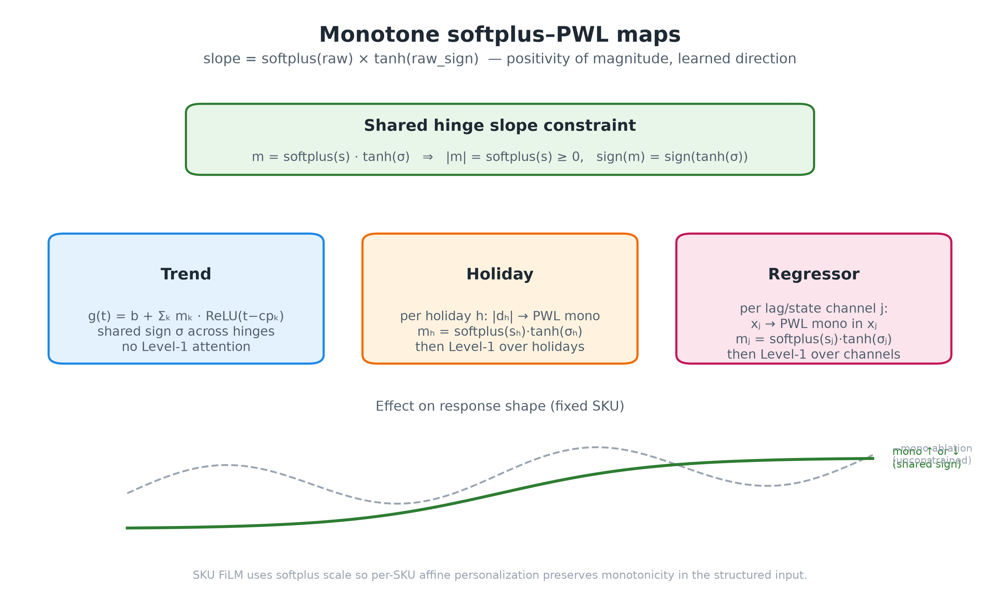

[Open PNG](paper_figures/fig_m2_monotone_softplus.png) · [GitHub](https://github.com/mkuma93/DeepSequence/blob/main/paper_figures/fig_m2_monotone_softplus.png)

*Figure 2. Softplus×tanh slope constraint on trend / holiday / regressor hinge maps.*

### 3.6 Level-1 selection attention

**Level-1 — intra-expert.**

- *Seasonal:* masked-entropy attention over Fourier (or learnable-frequency) channels, with entropy regularization toward sparse frequency use.
- *Holiday / regressor:* each channel is first mapped by the softplus-PWL monotone map, then aggregated by temperature-softmax **selection attention** (`MaskedEntropyAttention`) over channels. Ablating Level-1 replaces learned weights with uniform \(1/n\).
- *Trend:* deliberately without Level-1 attention—one monotone temporal basis, avoiding competing trend heads.

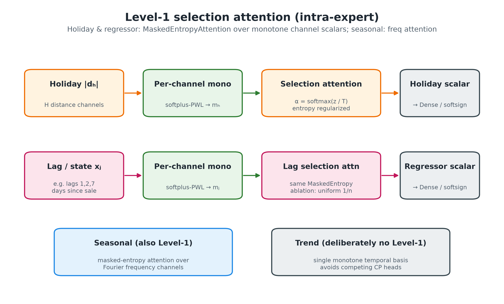

[Open PNG](paper_figures/fig_m3_level1_attention.png) · [GitHub](https://github.com/mkuma93/DeepSequence/blob/main/paper_figures/fig_m3_level1_attention.png)

*Figure 3. Intra-expert selection attention over monotone holiday and lag channels; seasonal freq attention; trend has no Level-1.*

### 3.7 Context-aware component mixer (Level-2)

The Level-2 query is

\[
q_{i,t} = \bigl[\, e_i \,;\; \mathrm{Dense}(c_{i,t}) \,\bigr],
\]

where \(e_i\) is an optional SKU embedding and \(c_{i,t}\) are regressor-block regime signals (lags, days/months since last sale, and related intermittent state)—**not** calendar, Fourier, or holiday distances, which remain inside their experts. Temperature-softmax weights over stacked expert scalars (entropy + orthogonality regularization) yield the mixed base. By default the Level-2 combine is **additive** \(\sum_k \alpha_k e_k\) (locked bake-off). An opt-in Prophet-like **multiplicative** path is available via ``component_combine='multiplicative'``:

\[
b_{\mathrm{pre}}
=
\mathrm{softplus}(e_T)
\prod_{k\in\{S,H,R\}}
\max\bigl(\varepsilon,\ 1+\alpha_k e_k\bigr),
\]

with softsign experts in \((-1,1)\) and \(\varepsilon=10^{-3}\) for stability; magnitude Dense(softplus) and gate \(\hat{y}=p\cdot b\) are unchanged. This is a qualitative / ablation option—not a claimed bake-off win. This is *component* reweighting, not temporal self-attention over a lookback window. Ablating the mixer (SKU-only or stack-only Level-2) is a protocol comparison; locked runs keep the context mixer on.

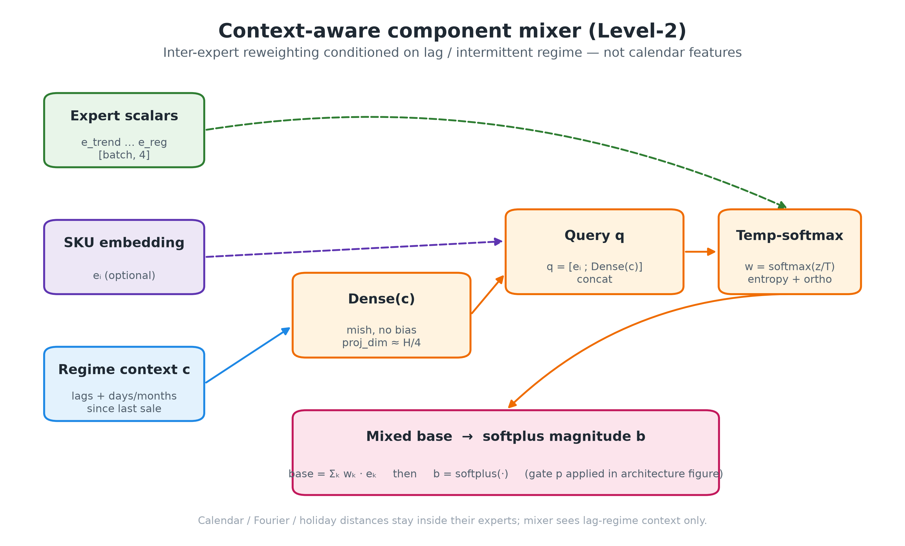

[Open PNG](paper_figures/fig_m4_context_mixer.png) · [GitHub](https://github.com/mkuma93/DeepSequence/blob/main/paper_figures/fig_m4_context_mixer.png)

*Figure 4. Level-2 mixer: query from SKU embedding ⊕ lag/intermittent context; softmax over expert scalars.*

### 3.8 Occurrence–magnitude gate and full stack

\[
b_{i,t}=\mathrm{softplus}\bigl(\mathrm{mix}(\mathrm{experts}(x_{i,t}), q_{i,t})\bigr),\quad
p_{i,t}=\sigma\bigl(g(x_{i,t}, e_i)\bigr),\quad
\hat{y}_{i,t}=p_{i,t}\cdot b_{i,t}.
\]

Interpretation: \(p\) is the predicted probability that demand occurs; \(b\) is the predicted magnitude given structural drivers; the product is a soft Bernoulli–magnitude expectation. Optional per-SKU zero-rate priors can bias gate logits from historical zero rates (secondary). DCN-style cross-network layers default **OFF** (optional ablation path in Figure 5).

**Interpretable component readouts.** The software exposes a probe API (`build_component_readout_model` / `predict_with_components`) that returns, per forward pass, the four expert scalars \(e_T,e_S,e_H,e_R\) **after** Level-1 selection / softsign / SKU FiLM (the values mixed by Level-2), the Level-2 weights \(\alpha_k\), mixed contributions \(\alpha_k e_k\), and the gate heads \(p\), \(b\), \(\hat{y}=p\cdot b\). A Direct-MH head exposes \(p/b/\hat{y}\) shaped \([B,H]\) (primary protocol) but keeps shared one-step expert scalars—callers should document that limitation. Optional recursive multi-horizon evaluation can also record readouts at each one-step rollout call (Appendix E). Sample dumps: `deepsequence_hierarchical_attention.eval.dump_component_readout` → `ab_runs/reclaim/component_readout_sample.json`.

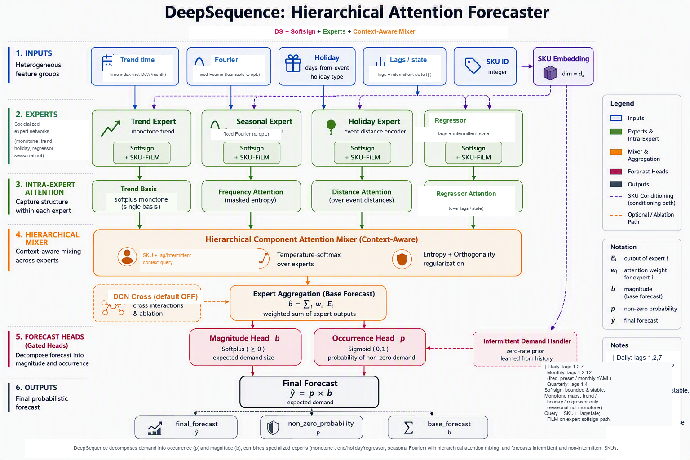

[Open PNG](paper_figures/fig_m5_architecture.png) · [GitHub](https://github.com/mkuma93/DeepSequence/blob/main/paper_figures/fig_m5_architecture.png)

*Figure 5. End-to-end architecture: trend time index; fixed Fourier (default; learnable \(\omega\) optional); holiday distances; lag/intermittent state → four experts (Trend, Seasonal, Holiday, Regressor with lags+state) with Softsign + SKU FiLM → Level-1 intra-expert attention → context mixer with \(q=\mathrm{SKU}\oplus\mathrm{Dense}(\mathrm{context})\) → occurrence–magnitude gate \(\hat{y}=p\cdot b\). Shared SKU embedding \(e_i\) (purple) conditions FiLM, mixer, and gate; DCN cross defaults OFF.*

### 3.9 Training objective

With empirical zero rate \(\pi_0\approx P(y=0)\), the default three-term loss is

\[
\mathcal{L}
= \alpha\,\mathrm{BCE}_{w_+}(z, p)
+ w_g\,\mathrm{MAE}_{\mathrm{inv}}(y, \hat{y})
+ w_m\,\mathrm{MAE}_{\mathrm{nz}}(y, b),
\]

where \(\mathrm{MAE}_{\mathrm{inv}}\) is inverse-class-weighted all-day MAE (timing) and \(\mathrm{MAE}_{\mathrm{nz}}\) is sale-day magnitude MAE against the magnitude head. Typical weights: \(\alpha=0.2\), \(w_g=w_m=1\).

An opt-in **spike-aware** recipe (``loss_recipe='spike_aware'``; Section 5.8) replaces the light BCE with a heavier positive-class weight (default \(2\,\pi_0/(1-\pi_0)\), optional focal \(\gamma\)) and trains magnitude primarily on \(y>0\) against \(b\), with a small optional zero-day magnitude weight to keep \(b\) calibrated. The gated product \(\hat{y}=p\cdot b\) is unchanged; the locked bake-off remains ``three_term``.

### 3.10 Multi-horizon and lead-time evaluation

**Primary protocol (Direct-MH).** All primary results in this preprint use **Direct multi-horizon** forecasts: DeepSequence and LightGBM emit an \(H\)-step path from a multi-output head (TSB remains classical recursive by method). Daily Direct-MH uses maximum horizon \(H=60\) and reports \(h\in\{1,7,14,28,56,60\}\); weekly Direct-MH uses \(H=8\) and reports \(h\in\{1,4,8\}\); monthly Car Parts reports \(h\in\{1,2,6\}\). Recursive one-step rollout is an **optional** evaluation protocol only (Appendix E), including the five-seed IWMAE / loyalty-\(\pi\) stability checks run under that protocol. Earlier drafts that mixed recursive headlines with a different Direct-MH feature/model protocol are relegated to Appendix D and are not restated as primary evidence.

**Lead-time CumMAE (first-class planning metric).** Alongside pointwise IWMAE on the forecast path, multi-horizon eval reports lead-time **cumulative MAE**—error on the planning sum that inventory cares about:

\[
\mathrm{CumMAE}(H)=\mathrm{mean}\Bigl|\sum_{h=1}^{H}\hat{y}_{t+h}-\sum_{h=1}^{H}y_{t+h}\Bigr|,
\]

plus CumIWMAE on the same cumulative series (inverse-frequency weights by whether the \(H\)-step cumulative actual is nonzero). We treat **IWMAE and CumMAE as co-primary accuracy metrics** for lead-time planning. Decision \(\pi\) is available primarily under the recursive appendix protocol (Appendix E); Direct-MH primary tables emphasize IWMAE, CumMAE, and zone strata. Pointwise `iwmae_rounded` remains the locked ranking key in JSON artifacts for continuity with prior runs. JSON keys: `by_horizon_cum` / `comparison_cum` in `deepsequence_hierarchical_attention.eval.multihorizon_compare`, `weekly_mh`, and `deepsequence_hierarchical_attention.eval.public_carparts_mh_all`.

**Weekly grain + like-for-like Direct-MH.** Section 5.2 reports weekly Direct-MH and a matching **daily Direct-MH** bake-off on the same locked 800 SKUs (seed 42). Weekly vs daily compares grain under the **same Direct-MH protocol** (Direct↔Direct)—not recursive vs Direct. Absolute IWMAE / CumMAE are still not cross-grain comparable (different demand scale).

---

## 4. Experimental design

### 4.1 Datasets

| Panel | Grain | Series | Approx. train zeros | Role |
|-------|-------|-------:|--------------------:|------|
| Proprietary enterprise | Daily | 800 (SKU list locked) | ≈90% | Primary daily evidence |
| Monash Car Parts (Godahewa et al., 2021) | Monthly | 800 (same lock convention) | ≈74% | Public domain-mismatch sanity check |

The enterprise panel cannot be released. Code, feature contracts, a synthetic demo, and public Car Parts adapters are in the accompanying repository (Appendix A).

### 4.2 Locked protocol

**Forecasting protocol.** All primary results use Direct multi-horizon (Direct-MH) forecasts (Section 3.10). Recursive one-step rollout appears only in Appendix E.

| Item | Specification |
|------|----------------|
| MH protocol (primary) | **Direct-MH** for DeepSequence / LightGBM; TSB classical recursive by method |
| Architecture stack | Softsign expert outputs; monotone Level-1 maps; context-aware mixer; calendar FiLM off; cross-network layers **off** |
| Features | Identical causal feature matrix for trees and neural models |
| Sequence lookback | 14 (daily) / 12 (monthly) for DeepAR, temporal transformer, and TFT baselines (appendix recursive bake-offs) |
| Seeds | SKU panels locked once. Seed-42 Direct-MH tables in Section 5; multi-seed means \(\pm\) standard deviation over training seeds \(\{42,\ldots,46\}\) for Car Parts and for **recursive** appendix tables |
| Metrics | IWMAE + CumMAE (co-primary lead-time accuracy); occurrence F1; underforecast on sales; bias; zone strata; decision \(\pi\) with loyalty scenarios (appendix recursive / Car Parts) |
| Baselines | LightGBM; DeepAR-lite; temporal transformer (TST); TFT-lite; Croston / SBA / TSB on Car Parts; **Prophet (per-series)** |

**Why not all-day MAE alone.** High zero rates reward near-zero predictors. IWMAE, CumMAE (lead-time demand), and sale-day underforecast better reflect intermittent planning risk.

### 4.3 Prophet baseline

If DeepSequence is framed as a multi-series extension of Prophet-style decomposition, experiments must include Prophet itself:

| Item | Specification |
|------|----------------|
| Protocol | One Prophet model **per series** (no SKU pooling) |
| Fit window | Train + validation history; forecast test origins |
| Car Parts | 800 locked SKUs; fixed origin → \(h\in\{1,2,6\}\) |
| Daily | 150-SKU evenly spaced subset of the locked list; at most four origins per SKU; \(h\in\{1,28,60\}\) |
| Features | Calendar seasonality only (yearly; weekly on daily). Holiday distances and intermittent lags are **not** injected as Prophet regressors |
| Honest limit | Prophet = local structural baseline; DeepSequence / LightGBM / TSB = global or classical intermittent |

A full 800-SKU daily Prophet bake-off remains future work (Section 8). Daily Prophet numbers are therefore **not** comparable to the locked 800-SKU global tables.

### 4.4 Novelty ablations

On the locked daily panel, training seed 42, vary one factor at a time from the full stack (Level-1 selection attention on, monotone maps on, context mixer on, gate on, cross-layers off):

| Arm | Change |
|-----|--------|
| Full | All novelty ingredients on; cross-layers off |
| −context mixer | Level-2 without regime context |
| −Level-1 selection attn | Uniform \(1/n\) aggregation over monotone channels |
| −mono | Unconstrained (non-monotone) expert maps |
| −gate | Magnitude-only head (no occurrence factor) |
| +cross | Cross-network layers on |

Ablations are **single-seed** and do not duplicate the multi-seed loyalty orchestrator.

### 4.5 Decision economics (scenario analysis)

\[
\pi \approx \mathrm{revenue\_proxy}
- \underbrace{(m\cdot \mathrm{price}+C_{\mathrm{loyalty}})\,U + C_{\mathrm{hold}}\,H}_{\mathrm{inventory\ loss\ proxy}}
- C_{\mathrm{model}},
\]

with holding cost \(C_{\mathrm{hold}}=0.1\), margins \(m\in\{0.08,0.25,0.55\}\), and loyalty / switching costs \(C_{\mathrm{loyalty}}\in\{0,0.25,0.5\}\). Default reporting uses \(C_{\mathrm{loyalty}}=0.25\) alongside the legacy \(C_{\mathrm{loyalty}}=0\) case. Here \(U\) and \(H\) are forecast-error underage and holding *proxies*, not outputs of a full inventory pipeline; \(C_{\mathrm{loyalty}}\) is **not** estimated from churn data.

---

## 5. Results

**Protocol reminder.** All primary tables below use **Direct multi-horizon (Direct-MH)** forecasts (Section 3.10), including **train-zone strata** (Tables D-S1, W-S1/W-S2). Recursive daily DS/TST bake-offs, multi-seed IWMAE / \(\pi\), and recursive volume zones are in Appendix E only.

### 5.1 Daily Direct-MH lead-time accuracy (IWMAE + CumMAE)

Locked 800 SKUs, seed 42; \(H=60\); 696 origins with \(\ge 60\) test days. Horizons are read as **replenishment lead times**. Artifact: `ab_runs/weekly/daily_direct_mh60_locked800_s42.json`. Runner: `python -m deepsequence_hierarchical_attention.eval.weekly_mh --dataset daily_direct_mh`.

**Table 1.** Daily **Direct-MH** bake-off, seed 42 (locked stack). Bold = best IWMAE in row among DeepSequence / TSB / LightGBM.

| Horizon | DeepSequence IWMAE | TSB | LightGBM | Best IWMAE | DS CumMAE | TSB CumMAE | LGBM CumMAE |
|--------:|-------------------:|----:|---------:|:-----------|----------:|-----------:|------------:|
| \(h=1\) | 5.60 | **5.32** | 5.85 | TSB | 2.35 | **1.66** | 2.84 |
| \(h=7\) | **3.26** | 4.49 | 4.37 | DeepSequence | **10.86** | 17.42 | 15.92 |
| \(h=14\) | **3.71** | 5.30 | 5.33 | DeepSequence | **19.91** | 43.94 | 34.99 |
| \(h=28\) | **3.87** | 5.36 | 6.22 | DeepSequence | **38.34** | 99.62 | 75.53 |
| \(h=56\) | **9.09** | 10.83 | 10.29 | DeepSequence | **76.86** | 210.89 | 142.50 |
| \(h=60\) | **2.51** | 4.24 | 3.71 | DeepSequence | **81.74** | 226.36 | 148.83 |

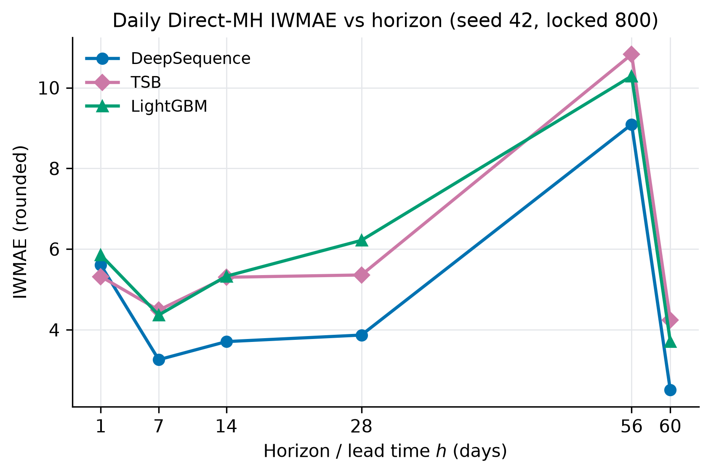

[Open PNG](paper_figures/fig_daily_direct_iwmae_horizon.png) · [GitHub](https://github.com/mkuma93/DeepSequence/blob/main/paper_figures/fig_daily_direct_iwmae_horizon.png)

*Figure D1. Daily **Direct-MH** IWMAE vs lead time \(h\) (seed 42, locked 800). Primary Results figure for Table 1—not the recursive multi-seed Appendix E plot.*

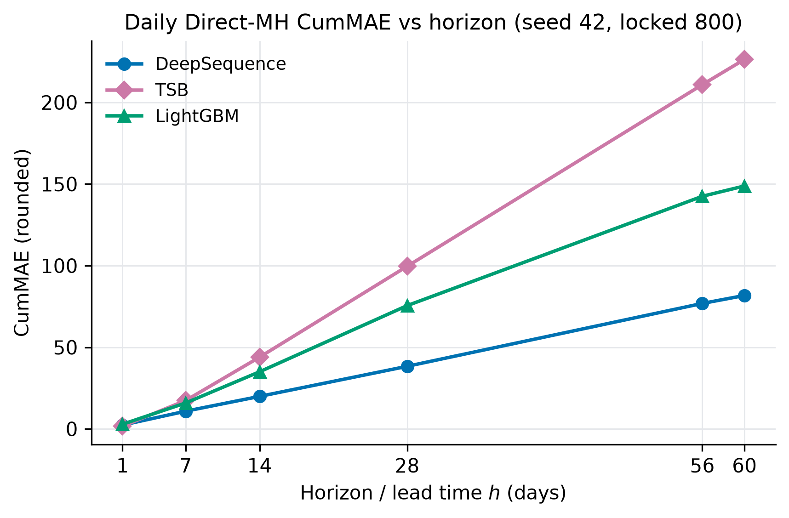

[Open PNG](paper_figures/fig_daily_direct_cummae_horizon.png) · [GitHub](https://github.com/mkuma93/DeepSequence/blob/main/paper_figures/fig_daily_direct_cummae_horizon.png)

*Figure D2. Daily Direct-MH CumMAE at the same horizons (lead-time cumulative demand error).*

**Reading (lead-time planning).** Under daily Direct-MH, TSB edges one-step (\(h=1\)); DeepSequence leads **IWMAE and CumMAE** at every reported lead time \(h\ge 7\). This is a Direct-MH planning-rate result on the locked panel—not a recursive DS-vs-TST headline. Recursive daily all-model bake-offs (including TST/TFT/DeepAR) and five-seed stability are Appendix E.

**Daily strata (train mean-demand terciles).** Same locked 800 / seed-42 Direct-MH run as Table 1, scored by SKU bands from **train** only (no test leakage). Primary bands: terciles of train **mean** demand (low / mid / high). Artifact: `ab_runs/weekly/daily_direct_mh60_locked800_s42.json` (`strata_mean_demand`); summary `ab_runs/weekly/strata_daily_direct_s42.json`.

**Table D-S1.** Daily Direct-MH IWMAE by train mean-demand zone (seed 42).

| Horizon | Zone | DeepSequence | TSB | LightGBM | Best |
|--------:|:-----|-------------:|----:|---------:|:-----|
| \(h=1\) | Low | **1.202** | 1.238 | 1.282 | **DS** |
| \(h=1\) | Mid | 3.501 | **3.305** | 3.668 | TSB |
| \(h=1\) | High | 7.797 | **6.780** | 8.598 | TSB |
| \(h=7\) | Low | 5.160 | 5.047 | **4.828** | LightGBM |
| \(h=7\) | Mid | **2.055** | 3.463 | 2.410 | **DS** |
| \(h=7\) | High | **4.706** | 6.866 | 7.380 | **DS** |
| \(h=14\) | Low | **0.978** | 1.359 | 1.035 | **DS** |
| \(h=14\) | Mid | 4.008 | 4.761 | **3.992** | LightGBM |
| \(h=14\) | High | **4.969** | 8.100 | 8.501 | **DS** |
| \(h=28\) | Low | **1.276** | 1.784 | 1.326 | **DS** |
| \(h=28\) | Mid | **5.144** | 5.756 | 6.386 | **DS** |
| \(h=28\) | High | **4.686** | 8.071 | 9.273 | **DS** |
| \(h=56\) | Low | **2.087** | 2.425 | 3.554 | **DS** |
| \(h=56\) | Mid | **1.460** | 2.611 | 2.069 | **DS** |
| \(h=56\) | High | **14.774** | 18.037 | 16.314 | **DS** |
| \(h=60\) | Low | **1.089** | 1.578 | 1.491 | **DS** |
| \(h=60\) | Mid | **2.124** | 3.179 | 2.938 | **DS** |
| \(h=60\) | High | **3.907** | 7.361 | 5.329 | **DS** |

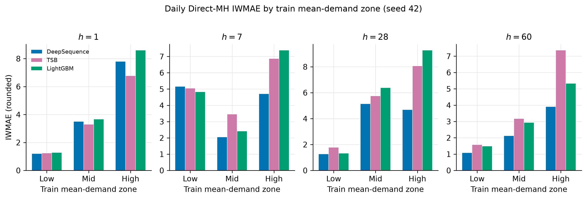

[Open PNG](paper_figures/fig_daily_direct_strata_iwmae.png) · [GitHub](https://github.com/mkuma93/DeepSequence/blob/main/paper_figures/fig_daily_direct_strata_iwmae.png)

*Figure D3. Daily Direct-MH IWMAE by train mean-demand zone at \(h=1/7/28/60\) (seed 42).*

**Reading (daily Direct zones).** Under Direct-MH, the zone story is **not** the recursive Appendix E pattern (where high-volume cells often favor LightGBM). At \(h=1\), TSB still edges mid/high volume while DeepSequence wins sparse low volume. From \(h=7\) onward DeepSequence dominates **mid and high** mean-demand bands; by \(h\ge 28\) it wins **all three** volume terciles. Short-lead low-volume cells remain contested (LightGBM at \(h=7\); LightGBM briefly edges mid at \(h=14\)). Takeaway: DeepSequence’s daily Direct-MH lead is a **mid/high-volume, longer-lead** planning-rate win—aligned with the overall Table 1 headline—while sparse one-step cells stay classical-friendly.

**Year-scope holiday audit (seed 42, full 800).** Locked jubilant `holiday_features_{train,val,test}.csv` were rebuilt with US `days_from_*` and `distance_scope='year'` (same 15-key set as `feature_config.yaml`) under `ab_runs/reclaim/year_scope_800/`. Max abs vs locked CSVs is **0** on all splits (values identical; CSV bytes may differ by float formatting). Explicit `nearest` differs (sample max abs ≈ 365–385). Re-running DeepSequence / TST / LightGBM on the year-scope data dir with the locked stack under the **recursive** protocol reproduces Appendix E Table E1 DeepSequence and LightGBM IWMAE **exactly** (\(\Delta=0\)); TST moves by at most ≈0.07 IWMAE (TF train noise). Multi-seed \(43\)–\(46\) was **not** re-run (locked assets already year-scoped). Monthly Car Parts stays holiday-off.

### 5.2 Weekly Direct-MH and like-for-like grain comparison

**Motivation.** Daily intermittency on this panel is extreme (\(\approx 90\%\) zeros). Aggregating to ISO Monday-start weeks (sum `Quantity` by SKU-week) tests lead-time planning under milder zero rates—closer to a usable planning-rate grain. Panel builder: `deepsequence_hierarchical_attention.data.prepare_weekly_panel`; features: `feature_config_weekly.yaml` (lags \(\{1,2,4\}\), `gap_unit: weeks`). Primary daily evidence remains daily Direct-MH (Table 1).

**Protocol.** Weekly vs daily compares grain under the **same Direct-MH protocol**: weekly DeepSequence / LightGBM use **direct** multi-horizon, matched to daily Direct-MH (TSB remains classical recursive by method). Matched leads for grain discussion: weekly \(h=1/4/8\) \(\approx\) daily \(h=7/28/56\). Absolute IWMAE / CumMAE are **not** cross-grain comparable (weekly targets are week-sums). Runner: `python -m deepsequence_hierarchical_attention.eval.weekly_mh`.

**Table Z.** Zero rate and mean demand, locked 800 SKUs (all splits pooled). Artifact: `ab_runs/weekly/zero_rate_daily_vs_weekly_locked800.json`.

| Grain | \(n\) rows | Zero rate | Mean demand | Mean \(\mid y>0\) | SKU mean zero rate |
|-------|----------:|----------:|------------:|------------------:|-------------------:|
| Daily | 594{,}556 | 0.896 | 1.04 | 10.01 | 0.894 |
| Weekly | 85{,}339 | **0.650** | 7.27 | 20.78 | 0.649 |

Aggregation cuts zero rate by \(\approx 25\) percentage points overall; UK (563 SKUs) drops \(0.869\to 0.587\). Country detail is in the JSON artifact.

**Table W.** Weekly **Direct-MH** bake-off, seed 42, locked 800 (793 origins with \(\ge 8\) test weeks). Artifact: `ab_runs/weekly/weekly_mh8_locked800_s42.json`.

| Horizon | DeepSequence IWMAE | TSB | LightGBM | Best IWMAE | DS CumMAE | TSB CumMAE | LGBM CumMAE |
|--------:|-------------------:|----:|---------:|:-----------|----------:|-----------:|------------:|
| \(h=1\) | **9.95** | 10.21 | 10.78 | DeepSequence | **6.41** | 7.41 | 8.50 |
| \(h=4\) | **8.83** | 10.01 | 10.02 | DeepSequence | **18.93** | 20.75 | 21.77 |
| \(h=8\) | **7.78** | 10.37 | 13.47 | DeepSequence | **42.78** | 43.28 | 49.84 |

**Table L.** Like-for-like **Direct-MH↔Direct-MH** at matched leads (weekly weeks vs daily days). Within each grain, DeepSequence leads IWMAE at the matched horizons shown (except daily \(h=1\), where TSB edges DS; Table 1). Absolute levels remain grain-specific.

| Lead | Weekly \(h\) | Daily \(h\) | DS weekly IWMAE | DS daily IWMAE | DS weekly CumMAE | DS daily CumMAE |
|------|------------:|-----------:|----------------:|---------------:|-----------------:|----------------:|
| ≈1 week | 1 | 7 | **9.95** | **3.26** | **6.41** | **10.86** |
| ≈4 weeks | 4 | 28 | **8.83** | **3.87** | **18.93** | **38.34** |
| ≈8 weeks | 8 | 56 | **7.78** | **9.09** | **42.78** | **76.86** |

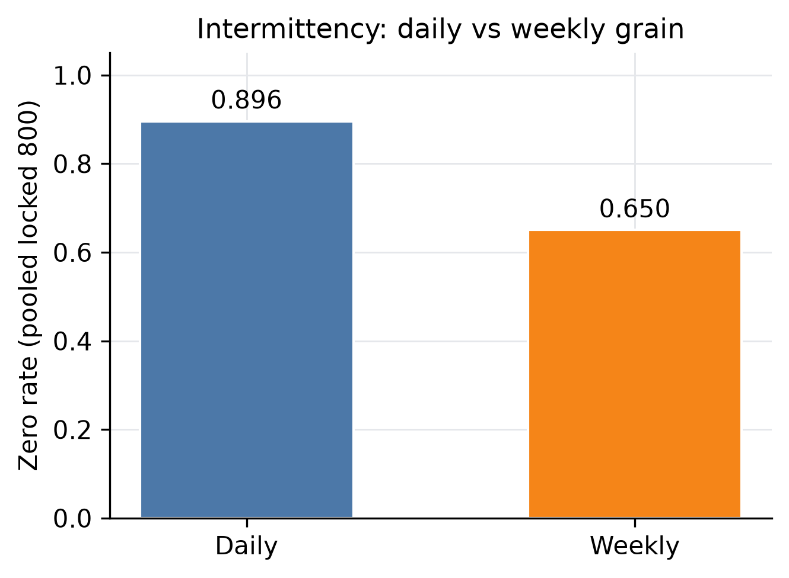

[Open PNG](paper_figures/fig_zero_rate_daily_vs_weekly.png) · [GitHub](https://github.com/mkuma93/DeepSequence/blob/main/paper_figures/fig_zero_rate_daily_vs_weekly.png)

*Figure W1. Pooled zero rate on the locked 800 SKUs: daily 0.896 → weekly 0.650.*

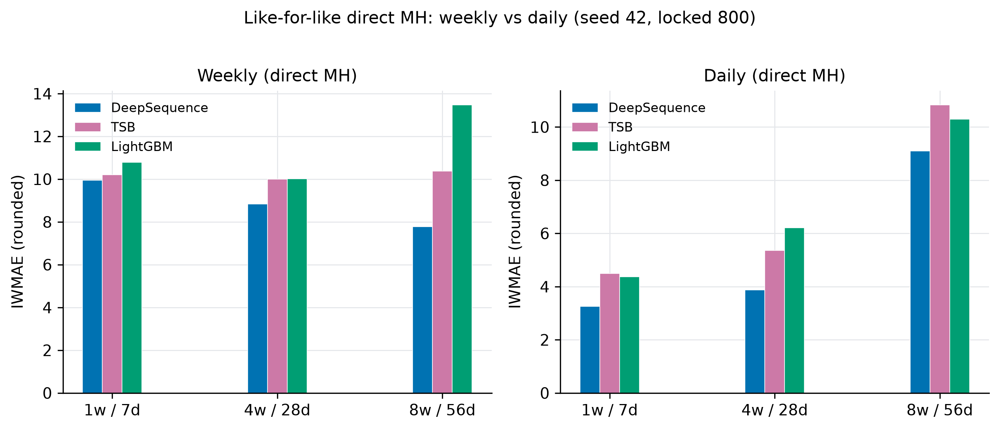

[Open PNG](paper_figures/fig_weekly_daily_direct_iwmae.png) · [GitHub](https://github.com/mkuma93/DeepSequence/blob/main/paper_figures/fig_weekly_daily_direct_iwmae.png)

*Figure W2. Direct-MH IWMAE (seed 42): weekly \(h=1/4/8\) vs daily \(h=7/28/56\). Scales differ by grain; compare within-panel rankings. Primary protocol for both grains.*

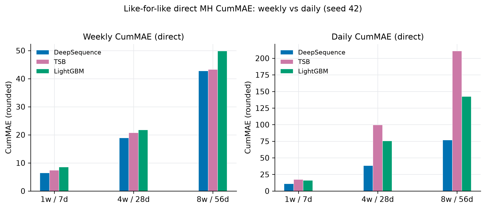

[Open PNG](paper_figures/fig_weekly_daily_direct_cummae.png) · [GitHub](https://github.com/mkuma93/DeepSequence/blob/main/paper_figures/fig_weekly_daily_direct_cummae.png)

*Figure W3. Direct-MH CumMAE at the same matched leads.*

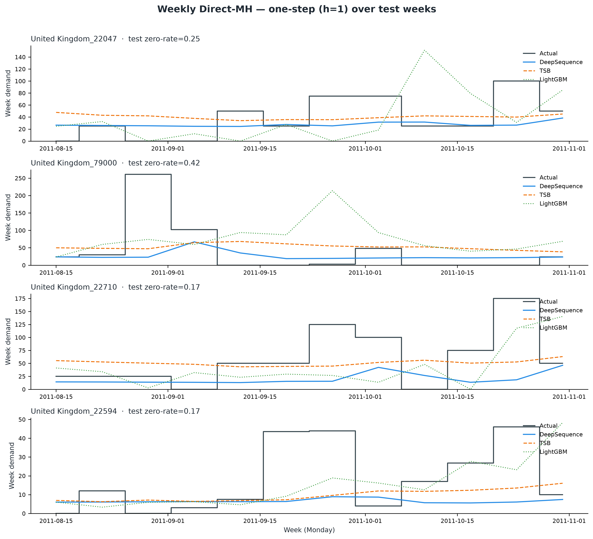

[Open PNG](paper_figures/fig_forecast_weekly_onestep.png) · [GitHub](https://github.com/mkuma93/DeepSequence/blob/main/paper_figures/fig_forecast_weekly_onestep.png)

*Figure W4. Locked weekly panel, seed 42: per-SKU actual vs DeepSequence / TSB / LightGBM one-step (\(h=1\) head of Direct-MH) over the test weeks. Exemplars chosen for mid intermittency and visible week-to-week variation (not max sparsity): `United Kingdom_22047`, `United Kingdom_79000`, `United Kingdom_22710`, `United Kingdom_22594`. Test zero-rates on these series are \(\approx 0.17\)–\(0.42\), well below the daily panel’s \(\approx 0.90\) (pooled weekly locked-800 zero-rate \(\approx 0.65\); Figure W1). DeepSequence tracks a planning rate \(p\cdot b\) with mild week-to-week movement; TSB is smoother; LightGBM is more volatile and can overshoot spikes.*

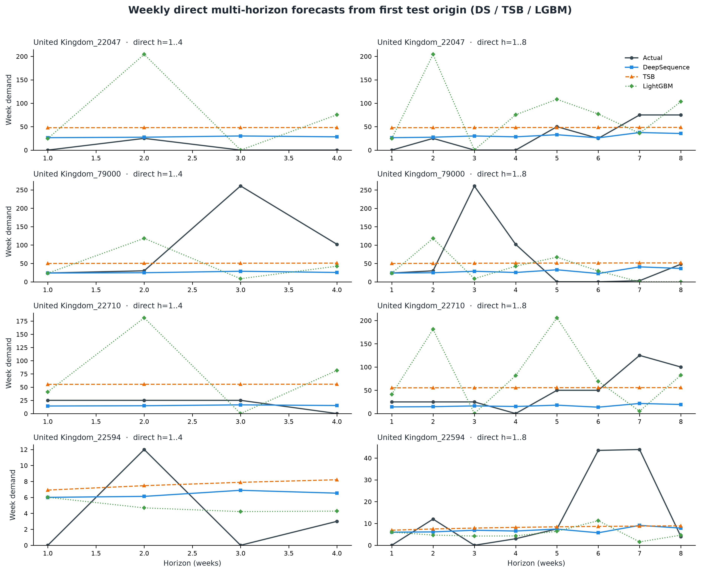

[Open PNG](paper_figures/fig_forecast_weekly_direct.png) · [GitHub](https://github.com/mkuma93/DeepSequence/blob/main/paper_figures/fig_forecast_weekly_direct.png)

*Figure W5. Same SKUs and protocol: Direct-MH forecasts from the first test origin with \(\ge 8\) future weeks (\(h=1..4\) and \(h=1..8\)). DeepSequence / LightGBM are direct multi-horizon; TSB is classical recursive. Spikes remain largely unmatched—consistent with the planning-rate reading in Section 5.2—while weekly grain still shows non-constant DS levels across horizons on several series.*

**Reading.** Under **matched Direct-MH protocol**, DeepSequence leads within-grain **IWMAE and CumMAE** at weekly \(h=1/4/8\) and at daily \(h\ge 7\) (seed 42); daily \(h=1\) still favors TSB slightly. Weekly flatness at \(h=1\): DeepSequence \(\mathrm{corr}(y,\hat y)\approx 0.48\), \(\mathrm{CV}(\hat y)\approx 2.55\), only \(\approx 2\%\) of forecasts within 10% of mean \(\hat y\), and 41 distinct rounded levels—**not** a constant mean-rate, but a planning-rate trajectory rather than spike matching. Daily Direct-MH flatness at \(h=1\): \(\mathrm{CV}(\hat y)\approx 1.91\). Absolute weekly vs daily IWMAE must not be ranked against each other (different units).

**Weekly strata (train mean-demand + zero-rate terciles).** Same locked 800 / seed-42 Direct-MH run, scored by SKU bands from **train** only. Primary: terciles of train **mean** demand (low / mid / high volume). Secondary: terciles of train **zero rate** (high-zero / mid / low-zero; high-zero = most intermittent). Artifacts: `ab_runs/weekly/weekly_mh8_locked800_s42.json` (`strata_mean_demand`, `strata_zero_rate`); `ab_runs/weekly/strata_weekly_direct_s42.json`.

**Table W-S1.** Weekly Direct-MH IWMAE by train mean-demand zone (seed 42).

| Horizon | Zone | DeepSequence | TSB | LightGBM | Best |
|--------:|:-----|-------------:|----:|---------:|:-----|
| \(h=1\) | Low | 4.575 | **4.486** | 4.852 | TSB |
| \(h=1\) | Mid | **5.907** | 5.927 | 6.784 | **DS** |
| \(h=1\) | High | **13.703** | 16.045 | 17.586 | **DS** |
| \(h=4\) | Low | **1.990** | 2.150 | 2.472 | **DS** |
| \(h=4\) | Mid | **5.646** | 6.658 | 6.455 | **DS** |
| \(h=4\) | High | **12.878** | 17.842 | 16.803 | **DS** |
| \(h=8\) | Low | **2.046** | 2.380 | 2.953 | **DS** |
| \(h=8\) | Mid | **5.401** | 7.228 | 8.105 | **DS** |
| \(h=8\) | High | **11.158** | 18.494 | 25.266 | **DS** |

**Table W-S2.** Weekly Direct-MH IWMAE by train zero-rate zone (seed 42).

| Horizon | Zone | DeepSequence | TSB | LightGBM | Best |
|--------:|:---------|-------------:|----:|---------:|:-----|
| \(h=1\) | High-zero | 5.946 | **5.877** | 6.385 | TSB |
| \(h=1\) | Mid | 13.280 | **12.034** | 12.582 | TSB |
| \(h=1\) | Low-zero | **10.472** | 12.021 | 13.037 | **DS** |
| \(h=4\) | High-zero | 6.934 | 7.075 | **6.741** | LightGBM |
| \(h=4\) | Mid | 11.029 | 10.072 | **9.969** | LightGBM |
| \(h=4\) | Low-zero | **9.444** | 11.848 | 13.231 | **DS** |
| \(h=8\) | High-zero | **9.385** | 9.505 | 10.867 | **DS** |
| \(h=8\) | Mid | **8.969** | 11.163 | 12.271 | **DS** |
| \(h=8\) | Low-zero | **8.536** | 11.295 | 16.765 | **DS** |

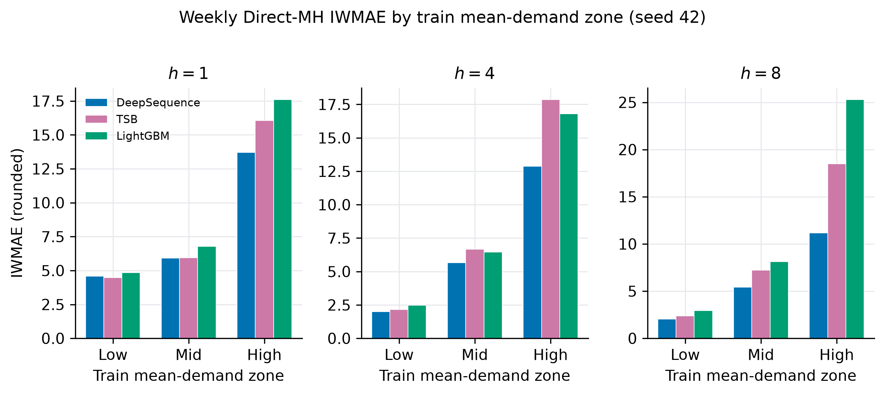

[Open PNG](paper_figures/fig_weekly_direct_strata_iwmae.png) · [GitHub](https://github.com/mkuma93/DeepSequence/blob/main/paper_figures/fig_weekly_direct_strata_iwmae.png)

*Figure W6. Weekly Direct-MH IWMAE by train mean-demand zone at \(h=1/4/8\) (seed 42).*

**Reading (weekly zones).** On milder weekly zeros, DeepSequence’s Direct-MH lead is **broad across volume**: mid/high mean-demand at all reported \(h\), and low volume once \(h\ge 4\). TSB still edges sparse one-step cells (low volume; high-zero / mid intermittency at \(h=1\)). Smoother SKUs (low-zero) favor DeepSequence at every reported horizon; longer \(H\) consolidates DS wins even in high-zero bands. Together with daily Table D-S1, zone strata are part of the **primary Direct-MH** story—not only the recursive Appendix E volume table.

### 5.3 Public Car Parts (monthly; domain mismatch)

**Table 5.** Car Parts all-model bake-off, seed 42 (locked stack) plus per-series Prophet.

| Horizon | TSB | DeepSequence | Prophet | TST | LightGBM | Best |
|--------:|----:|-------------:|--------:|----:|---------:|:-----|
| \(h=1\) | **0.850** | 0.882 | 0.916 | 0.887 | 0.889 | TSB |
| \(h=2\) | **0.767** | 0.778 | 0.836 | 0.789 | 0.832 | TSB |
| \(h=6\) | 0.834 | 0.834 | **0.827** | 0.866 | 0.890 | Prophet (≈DS/TSB) |

Prophet is competitive at \(h=6\) but loses short horizons to TSB and DeepSequence—as expected for a local additive model on short intermittent monthly history without shared pooling.

**Table 6.** Car Parts multi-seed IWMAE (seeds \(42\)–\(46\); DeepSequence / TSB / LightGBM).

| Horizon | DeepSequence | TSB | LightGBM |
|--------:|-------------:|----:|---------:|
| \(h=1\) | \(0.842\pm0.012\) | \(\mathbf{0.815\pm0}\) | \(0.874\pm0.005\) |
| \(h=2\) | \(0.733\pm0.009\) | \(\mathbf{0.703\pm0}\) | \(0.838\pm0.005\) |
| \(h=6\) | \(\mathbf{0.769\pm0.004}\) | \(0.787\pm0\) | \(0.877\pm0.012\) |

**Protocol note.** Table 5 (seed-42 bake-off; DeepSequence/TSB \(h=6\) ≈ 0.834) and Table 6 (multi-seed; DeepSequence \(0.769\pm0.004\) vs TSB 0.787) use **different reporting conventions** (raw IWMAE versus primary rounded IWMAE in the multi-seed orchestrator). Rankings within each table are self-consistent; do not mix absolute levels across tables.

TSB is seed-invariant (classical). DeepSequence’s long-horizon (\(h=6\)) IWMAE edge over TSB is stable across seeds on the multi-seed (rounded) table, but mid-margin \(\pi\) with \(C_{\mathrm{loyalty}}=0.25\) still favors **TSB** on all horizons (\(0/5\) DeepSequence mid-\(\pi\) wins at \(h=6\))—reinforcing domain mismatch versus covariate-rich daily retail. Prefer TSB (then SBA/Croston) as the short-horizon monthly default; treat DeepSequence as a structural long-horizon IWMAE competitor when a neural panel model is required. Prophet confirms that a structural baseline is present but does not overturn TSB on this panel. Figure 8 summarizes Tables 5–6.

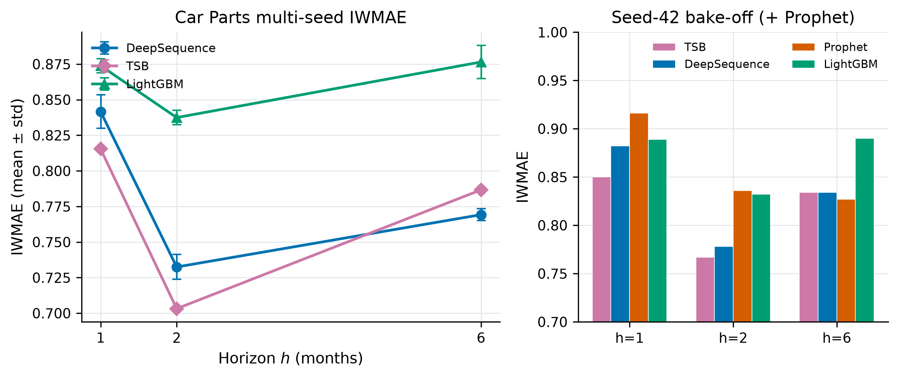

[Open PNG](paper_figures/fig2_carparts_iwmae_horizon.png) · [GitHub](https://github.com/mkuma93/DeepSequence/blob/main/paper_figures/fig2_carparts_iwmae_horizon.png)

*Figure 8. Left: Car Parts multi-seed IWMAE (mean ± std; DeepSequence / TSB / LightGBM). Right: seed-42 bake-off including per-series Prophet. Do not mix absolute levels across panels (Section 5.3 protocol note).*

**Table 5b.** Car Parts CumMAE (seed 42; same MH origins as Table 5; additive reporting). \(\mathrm{CumMAE}(H)=\mathrm{mean}|\sum_{h=1}^{H}\hat y-\sum y|\). Artifact: `ab_runs/reclaim/cummae_carparts_s42.json`.

| Horizon | LightGBM | DeepSequence | TSB | TST | Best CumMAE |
|--------:|---------:|-------------:|----:|----:|:------------|
| \(h=1\) | **0.419** | 0.573 | 0.524 | 0.558 | LightGBM |
| \(h=2\) | **0.715** | 0.860 | 0.904 | 0.953 | LightGBM |
| \(h=6\) | **1.615** | 2.068 | 2.416 | 2.595 | LightGBM |

Pointwise IWMAE ranking (TSB short / DS competitive at \(h=6\)) and CumMAE ranking diverge: LightGBM’s under-forecasting can look strong on cumulative absolute error even when IWMAE does not prefer it. Lead-time claims on this panel emphasize IWMAE + loyalty \(\pi\); CumMAE remains a planning-sum diagnostic (and here does not overturn TSB’s short-horizon / mid-\(\pi\) role).

### 5.4 Daily Prophet subset (protocol note)

On a **150-SKU** evenly spaced subset of the locked daily list (at most four origins per SKU), per-series Prophet reports IWMAE \(h=1/28/60\) = **2.68 / 4.90 / 3.34**. These are **not** comparable to the 800-SKU global Direct-MH table (different panel slice and origin density). The run documents that a tractable daily Prophet protocol is available; a full 800-SKU daily Prophet bake-off remains future work.

### 5.5 Novelty ablations

**Table 7.** Daily one-step IWMAE, tabular DeepSequence-only, seed 42. Gate is the dominant intermittent novelty at one step; other factors sit inside single-seed noise.

| Arm | IWMAE | \(\Delta\) vs Full |
|-----|------:|-------------------:|
| Full (Level-1 + mixer + mono + gate; cross off) | 4.156 | — |
| −context mixer | 4.081 | −0.075 |
| −Level-1 selection attn | 4.113 | −0.043 |
| −mono | 4.191 | +0.036 |
| −gate | **4.578** | **+0.422** |
| +cross | 4.097 | −0.059 |

Recursive multi-horizon DeepSequence-only ablations (Full wins long \(h\) under that optional protocol) are in Appendix E (Table E8). One-step Table 7 motivates the locked stack for primary Direct-MH runs; ablations are single-seed and do not replace multi-seed appendix tables.

**What each novelty buys (one-step / appendix recursive long horizons, single seed).**

| Novelty | Evidence |
|---------|----------|
| Occurrence gate | One-step \(\Delta\) ≈ +0.42 IWMAE when removed (Table 7) |
| Level-1 selection attention | Appendix E recursive: removing it raises \(h=28/60\) by ≈0.21 / 0.18 |
| Context mixer | Appendix E recursive: removing it raises \(h=28/60\) by ≈0.11 / 0.08 |
| Softplus mono maps | Appendix E recursive: removing them raises \(h=28/60\) by ≈0.08 / 0.07 |
| Cross-network layers | Enabling them hurts long recursive \(h\); keep off |

Ablations are single-seed; they motivate the locked stack. Figure 9 visualizes Table 7 (gate at one step) and the appendix recursive long-horizon arms.

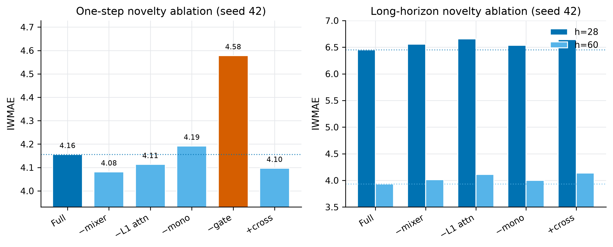

[Open PNG](paper_figures/fig4_novelty_ablation.png) · [GitHub](https://github.com/mkuma93/DeepSequence/blob/main/paper_figures/fig4_novelty_ablation.png)

*Figure 9. Left: one-step DeepSequence novelty ablation (seed 42); −gate dominates the IWMAE gap. Right: recursive \(h=28/60\) ablations under the optional Appendix E protocol (gate omitted; MH arms without gate). Full wins both long horizons on that protocol.*

### 5.6 Qualitative forecasts

To illustrate intermittent shape (long zero runs, sparse spikes), we dump actual vs forecast traces for three locked intermittent SKUs on each panel after a dedicated small-panel retrain (seed 42; 40 SKUs drawn from the locked lists with the plot SKUs forced in; 8 epochs). These figures are **qualitative**—not a substitute for the locked 800-SKU Direct-MH tables above.

**Daily (DeepSequence vs TST).** Figure 10 shows one-step test-window forecasts; Figure 11 shows an optional recursive rollout from a locked test origin for short (\(h{=}1..7\)) and longer (\(h{=}1..28\)) horizons (illustrative only—not the primary Direct-MH protocol).

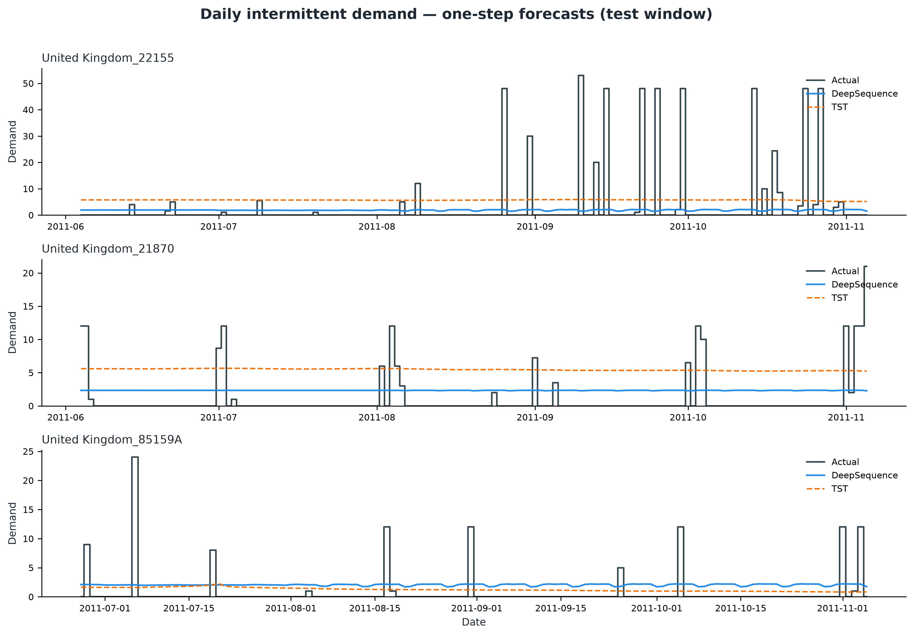

[Open PNG](paper_figures/fig_forecast_daily_onestep.png) · [GitHub](https://github.com/mkuma93/DeepSequence/blob/main/paper_figures/fig_forecast_daily_onestep.png)

*Figure 10. Daily enterprise panel: actual vs DeepSequence vs TST on the test window for three intermittent locked SKUs.*

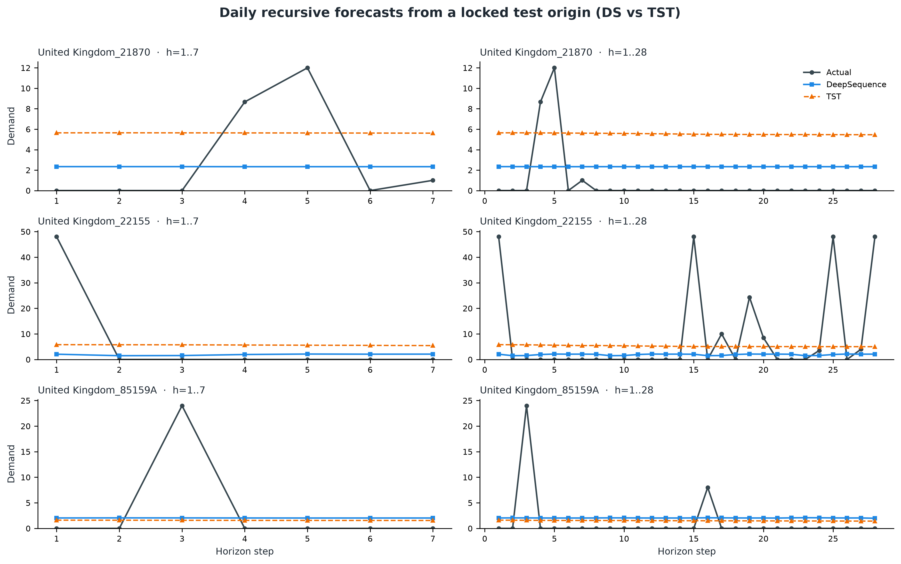

[Open PNG](paper_figures/fig_forecast_daily_recursive.png) · [GitHub](https://github.com/mkuma93/DeepSequence/blob/main/paper_figures/fig_forecast_daily_recursive.png)

*Figure 11. Optional recursive daily forecasts from one test origin per SKU (\(h{=}1..7\) and \(h{=}1..28\)). Primary quantitative claims use Direct-MH (Table 1).*

**Car Parts (DeepSequence vs TSB).** Figure 12 shows one-step monthly test forecasts; Figure 13 shows recursive \(h{=}1..2\) and \(h{=}1..6\) from the pre-test origin (same origin convention as the Car Parts MH bake-off).

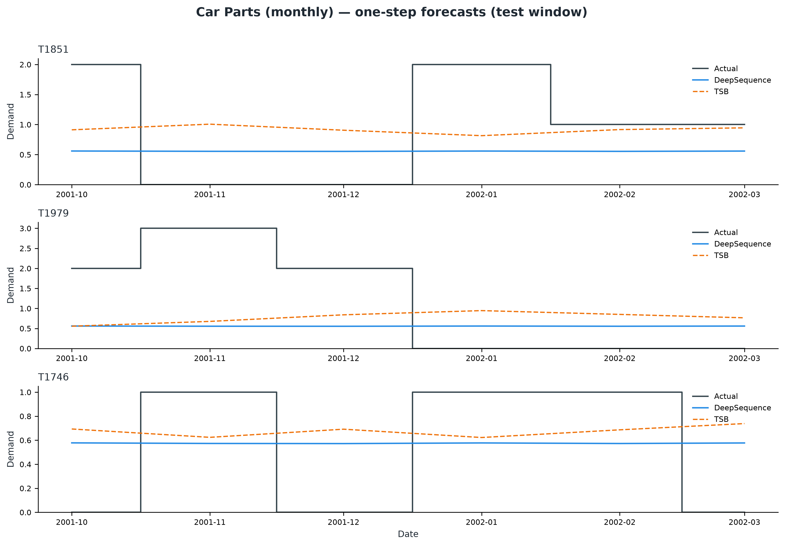

[Open PNG](paper_figures/fig_forecast_carparts_onestep.png) · [GitHub](https://github.com/mkuma93/DeepSequence/blob/main/paper_figures/fig_forecast_carparts_onestep.png)

*Figure 12. Monash Car Parts: actual vs DeepSequence vs TSB on the six-month test window.*

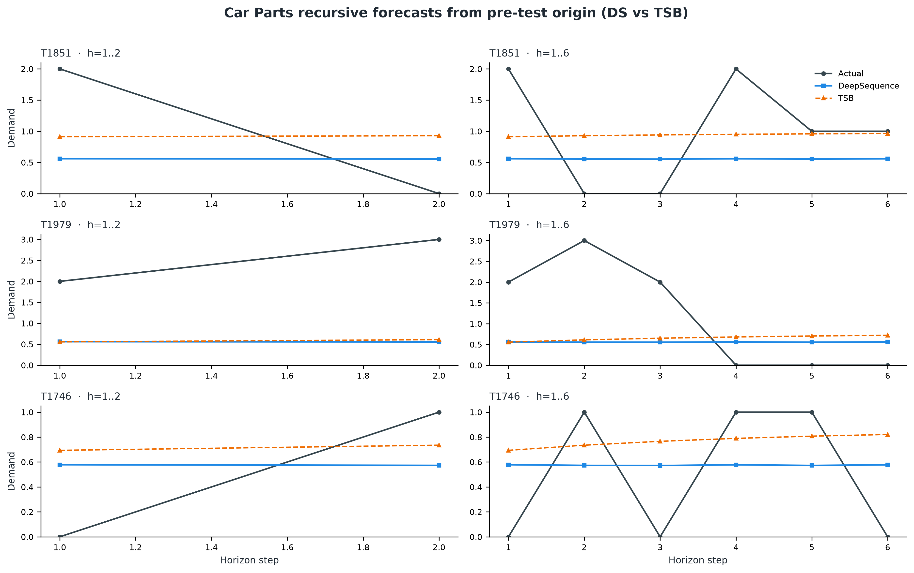

[Open PNG](paper_figures/fig_forecast_carparts_recursive.png) · [GitHub](https://github.com/mkuma93/DeepSequence/blob/main/paper_figures/fig_forecast_carparts_recursive.png)

*Figure 13. Car Parts recursive forecasts from the pre-test origin (\(h{=}1..2\) and \(h{=}1..6\)).*

### 5.7 Holiday-binary qualitative (daily)

Locked bake-off features remain **distance-only** (`days_from_*`; v1.6). Separately, we re-ran the daily qualitative dump with a **forecast-only** config (`feature_config_daily_binary_holiday.yaml`) that keeps all 15 distances and adds 16 binary channels (`is_*` on-day for every calendar event; \(\pm 1\) day window for Valentine / Easter / Halloween / Thanksgiving / Black Friday / Christmas; plus `is_any_holiday`). Both distance and binary channels feed the HolidayComponent. Training used the same three intermittent plot SKUs (plus 37 fillers from the locked list), seed 42, **30 epochs**. Red vertical markers on the one-step plot flag binary-on days.

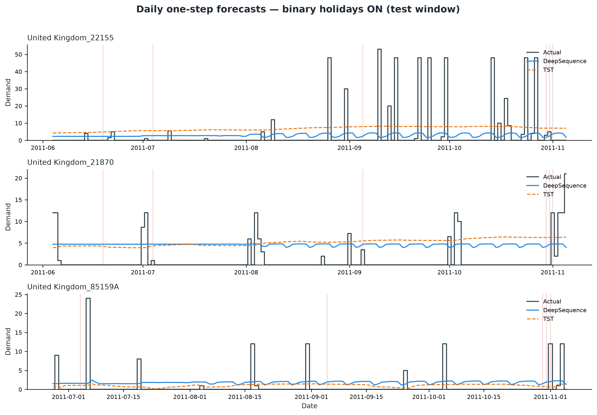

[Open PNG](paper_figures/fig_forecast_daily_binary_hol_onestep.png) · [GitHub](https://github.com/mkuma93/DeepSequence/blob/main/paper_figures/fig_forecast_daily_binary_hol_onestep.png)

*Figure 14. Same intermittent SKUs as Figure 10, with binary holiday features on and holiday markers. DeepSequence shows a weekly-scale oscillation (not a pure flat mean), but **no clear holiday bumps** at marker dates; correlation of \(\hat{y}\) with the binary holiday flag is near zero on these UK series under a **US** calendar (\(\mathrm{corr}\approx -0.08\) to \(0.00\)). TST remains near mean-rate.*

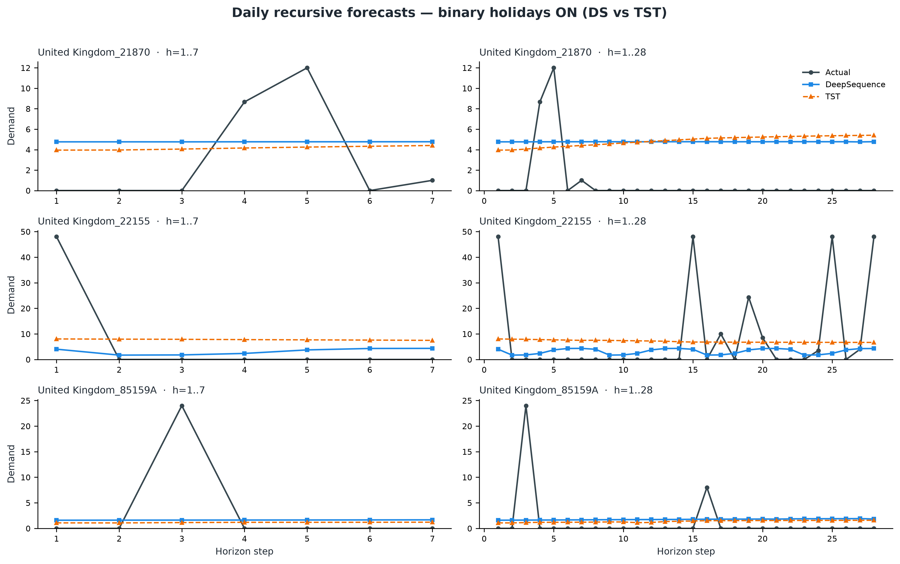

[Open PNG](paper_figures/fig_forecast_daily_binary_hol_recursive.png) · [GitHub](https://github.com/mkuma93/DeepSequence/blob/main/paper_figures/fig_forecast_daily_binary_hol_recursive.png)

*Figure 15. Optional recursive \(h{=}1..7\) / \(h{=}1..28\) under the binary-holiday config. Forecasts stay near a constant mean rate and do not track sparse sale spikes or calendar events.*

**Country calendars + year-scoped distances.** The locked panel’s `id_var` prefixes are multi-country (locked 800: UK 563, EIRE 73, France 59, Germany 49, Netherlands 25; full panel also has Australia 20 and a single USA SKU). Precomputed `holiday_features_*.csv` files are US-only. A gated forecast-only config (`feature_config_daily_country_holiday.yaml`) keeps the **same 15 shared holiday keys** (and binaries) but rebuilds `days_from_*` from per-country calendars parsed from the SKU prefix (UK bank holidays, AU public holidays, IE/FR/DE/NL, plus an EU retail fallback). N/A keys (e.g. US Thanksgiving on UK rows) use a large sentinel distance so `is_*` stays off.

**Supersedes earlier nearest-scope country-holiday qualitative.** Commit `4e2ec63` made rebuilt calendars default to `distance_scope='year'` (signed distance to the holiday occurrence *in the observation’s calendar year*, so early-January dates are not measured from the prior December). Figures 16–17 and the correlations below are from a **year-scope retest** (seed 42, 30 epochs, additive Level-2, same three UK plot SKUs). Prior country-holiday qualitative dumps under nearest-across-years distances are **invalidated** for holiday-response claims. Locked bake-off US `days_from_*` CSVs already match year-scope regeneration (max abs 0); a full locked 800 seed-42 MH retest (`ab_runs/reclaim/year_scope_800/`) confirms Appendix E recursive DeepSequence / LightGBM IWMAE unchanged and TST within TF noise (Section 5.1 audit note).

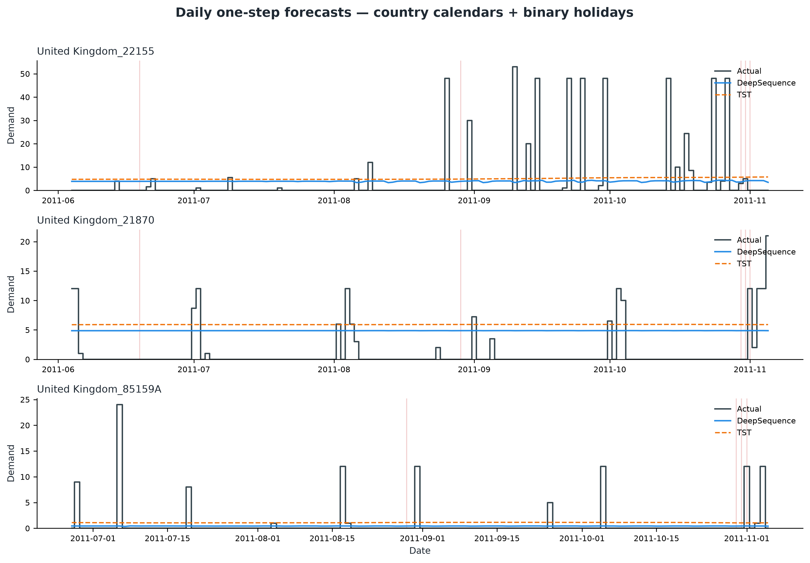

[Open PNG](paper_figures/fig_forecast_daily_country_hol_onestep.png) · [GitHub](https://github.com/mkuma93/DeepSequence/blob/main/paper_figures/fig_forecast_daily_country_hol_onestep.png)

*Figure 16. Year-scoped country calendars + binaries (retest). Markers still land on UK events. Forecasts remain mean-rate-like with mild week-scale variation—**still no clear holiday-driven spikes**. Correlation of \(\hat{y}\) with the binary holiday flag stays near zero (\(\mathrm{corr}\approx -0.05\) to \(0.01\); prior nearest-scope country run was \(\approx 0.01\)–\(0.06\)).*

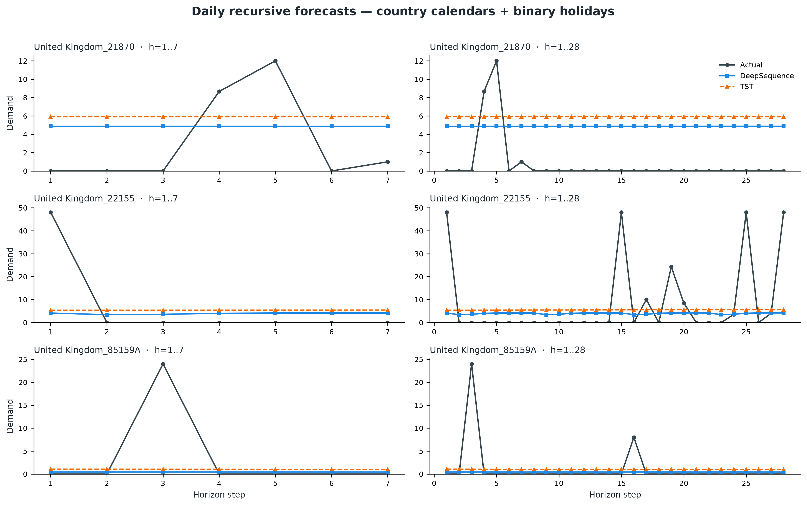

[Open PNG](paper_figures/fig_forecast_daily_country_hol_recursive.png) · [GitHub](https://github.com/mkuma93/DeepSequence/blob/main/paper_figures/fig_forecast_daily_country_hol_recursive.png)

*Figure 17. Optional recursive rollouts under year-scoped country calendars; qualitative conclusion unchanged vs Figure 15.*

**Takeaway (year-scope retest).** Enabling binary holiday indicators with **country-correct, year-scoped** distances still does **not**, on this qualitative panel, produce visible holiday-driven forecast spikes. Remaining limits: (i) intermittency dominated by lag/gate rather than calendar; (ii) HolidayComponent still maps channels through absolute-distance-style monotone hinges, so \(0/1\) binaries are a weak inductive fit; (iii) small qualitative SKU pool. Locked holiday CSVs are unchanged under the US year-scope audit (Section 5.1).

**Monthly Car Parts (`months_from` + `month_has`).** Locked bake-off keeps `feature_config_monthly.yaml` with `holiday_encoding: none`. A gated forecast-only config (`feature_config_monthly_country_holiday.yaml`) now adds **year-scoped** `months_from_*` **and** `month_has_*` (30 holiday channels) rebuilt from the same country calendars as daily. Monash Car Parts `id_var`s are bare `T####` with **no country prefix**, so the run uses **`holiday_country_default: US`** (documented; configurable). Qualitative dump: same three plot SKUs, seed 42, 20 epochs. Compared with the prior **month_has-only** run on the same pool, one-step \(\hat{y}\) and IWMAE are essentially unchanged (still flat \(\hat{y}\approx 0.4\)–\(0.6\); `corr(\hat{y},\,\mathrm{month\_has\_any})` undefined because every month in the test window has ≥1 US holiday).

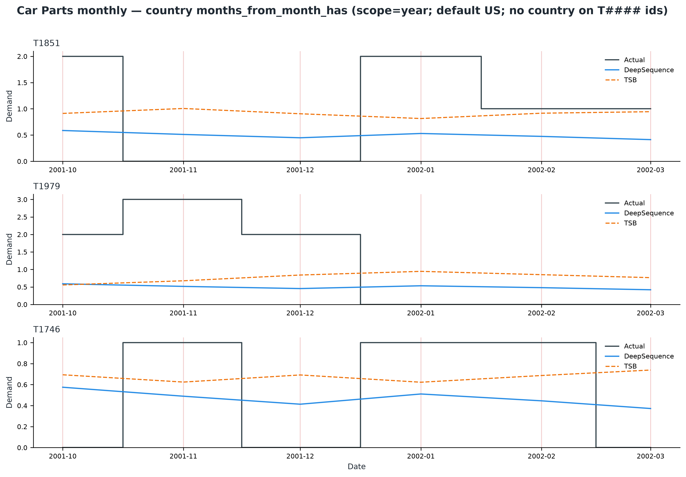

[Open PNG](paper_figures/fig_forecast_carparts_country_hol_onestep.png) · [GitHub](https://github.com/mkuma93/DeepSequence/blob/main/paper_figures/fig_forecast_carparts_country_hol_onestep.png)

*Figure 22. Monthly one-step under year-scoped `months_from_*` + `month_has_*` (US default). DeepSequence stays near a flat mean rate; red markers fire on nearly every month. Adding year-scoped month distances does **not** recover holiday-matched spikes vs the prior month_has-only qualitative.*

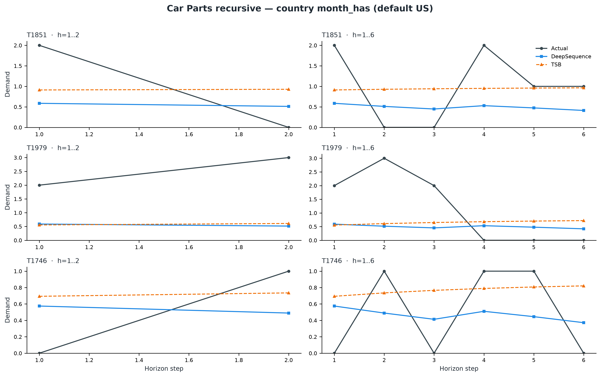

[Open PNG](paper_figures/fig_forecast_carparts_country_hol_recursive.png) · [GitHub](https://github.com/mkuma93/DeepSequence/blob/main/paper_figures/fig_forecast_carparts_country_hol_recursive.png)

*Figure 23. Recursive \(h{=}1..2\) / \(h{=}1..6\) under the same monthly holiday config. Rollouts remain mean-rate-like. Locked Car Parts IWMAE bake-off is unchanged.*

### 5.8 Spike-aware loss diagnostics (daily, qualitative)

Locked bake-off training remains ``three_term``. Separately, we ran an opt-in **spike-aware** recipe on a small daily panel (seed 42; additive Level-2 combine; country-holiday features): heavier positive-class BCE on the occurrence head \(p\) (default boost \(2\times \pi_0/(1-\pi_0)\), optional focal \(\gamma\)), magnitude loss primarily on sale days against \(b\), and a small zero-day magnitude weight (\(0.05\)) so \(b\) does not drift. The product \(\hat{y}=p\cdot b\) is unchanged.

We selected **8 locked SKUs** with visible lumps in the test window (nonzero days × spike height—not max-sparsity only), trained \(\approx 30\) epochs, and plotted \(y\), \(\hat{y}\), \(p\), and \(b\) with country-holiday markers (Figures 20–21).

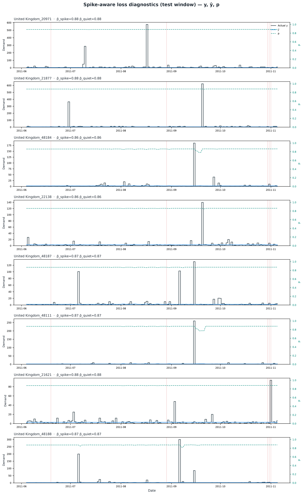

[Open PNG](paper_figures/fig_spike_diag_panel.png) · [GitHub](https://github.com/mkuma93/DeepSequence/blob/main/paper_figures/fig_spike_diag_panel.png)

*Figure 20. Daily test-window traces under spike-aware loss for lumpy locked SKUs. Secondary axis shows occurrence probability \(p\); red markers are country-calendar holiday days.*

**What \(p\) vs \(b\) shows.** On this run, mean \(p\) on sale days is essentially flat vs quiet days (\(\bar p_{\mathrm{spike}}\approx 0.87\approx\bar p_{\mathrm{quiet}}\); \(\Delta p\approx 0\); \(\mathrm{corr}(p,z)\approx 0\)). The gate stays hot and does **not** peak on lump days; residual under-forecast of spikes lives in \(b\) / the product \(\hat{y}\). Spike-aware loss is therefore a useful **diagnostic / training-pressure** tool—not a claimed bake-off IWMAE win. Locked Direct-MH tables are unchanged.

## 6. Discussion

**Framing: structured multi-series planning rates under Direct-MH.** DeepSequence is a **structured planning-rate model for multi-series intermittent demand**—lead-time planning, not a universal intermittent solver or spike model. Given replenishment horizon \(H\), the evaluation centers on Direct-MH paths, CumMAE (lead-time demand), and IWMAE. Main novelty is Prophet-like experts + gating + context-aware mixing (hierarchical Level-1 and monotone maps support the stack). Ablations corroborate the locked defaults; they do not redefine the claim. The per-series Prophet control (Section 5.3–5.4) makes the structural framing falsifiable.

**Why / when / why lead-time metrics.** Architecture → planning rates \(\hat{y}=p\cdot b\) → Direct-MH paths → CumMAE/IWMAE as co-primary metrics. Empirically, DeepSequence wins at **longer leads** and in **mid/high weekly / smoother** zones; sparse one-step cells and spike hitting remain classical-friendly. Weekly vs daily compares grain under the **same Direct-MH protocol**.

**When to use what (planning portfolio by lead time and segment).**

| Setting | Prefer |
|---------|--------|
| Daily Direct-MH, \(h=1\) | **TSB** (slight edge on IWMAE / CumMAE); mid/high zones also TSB |
| Daily Direct-MH, \(h\ge 7\) | **DeepSequence** (IWMAE + CumMAE); mid/high zones from \(h=7\), all zones by \(h\ge 28\) |
| Weekly Direct-MH (milder zeros) | **DeepSequence** leads IWMAE+CumMAE at \(h=1/4/8\) |
| Weekly mid/high volume / smoother SKUs | **DeepSequence** edge clearest (zone strata; Figure W6) |
| Daily / weekly sparse one-step cells | Often **TSB** (or LightGBM in a few daily low/mid short-\(h\) cells) |
| Monthly short spare-parts, weak covariates | **TSB** (then SBA/Croston); Prophet alone is not enough |
| Monthly longer horizon (\(h=6\)) path accuracy | DeepSequence competitive / best IWMAE; mid-\(\pi\) may still favor TSB |
| Ranking protocol | IWMAE + CumMAE + underforecast (+ loyalty \(\pi\) where available); do not rank on all-day MAE alone |
| Optional recursive daily rollout | Appendix E only (multi-seed IWMAE / \(\pi\) were measured under that protocol) |

**Why Direct-MH as the primary story.** Weekly vs daily compares grain under the **same Direct-MH protocol**, so tables are commensurate in method (not in units). Recursive one-step rollout remains useful software and an optional stress test, but mixing recursive DS-vs-TST headlines with Direct weekly/daily tables confused the planning narrative—hence Appendix E.

**Structural inductive bias.** The Direct-MH long-lead pattern is consistent with Prophet-like experts helping when a multi-horizon path must support a planning window, whereas one-step intermittent accuracy often reduces to recent occurrence dynamics that classical methods already capture well.

### 6.1 Planning rates, spikes, and holidays (honest scope)

**Planning rates, not “hit every spike.”** DeepSequence’s gated product \(\hat{y}=p\cdot b\) is designed for intermittent **planning rates**—expected demand for replenishment over \(H\)—not for reproducing sparse high-amplitude **spikes** on these panels. Qualitative dumps (Section 5.6–5.8) show forecasts that track a near-constant or mildly weekly mean rate while sale spikes remain largely unmatched; spike-aware loss diagnostics improve \(p\) pressure in places but do not turn the model into a spike detector. That miss is **by design scope** given the available features, not a silent failure of the architecture claim.

**Holidays ≠ spikes on these panels.** Year-scope US holiday retests on the locked 800 (`ab_runs/reclaim/year_scope_800/`) leave recursive Appendix E DeepSequence / LightGBM IWMAE unchanged (TST within train noise). Country+binary daily qualitative and monthly `month_has` / `months_from` country retests (Section 5.7; Figures 14–17, 22–23) likewise show **near-zero** correlation between \(\hat{y}\) and holiday flags and no visible holiday-driven bumps. Holidays remain useful structural covariates for *level* in Prophet-style models, but here they do not explain spike timing.

**When covariates arrive (regressor expert intent).** The **regressor** expert—softplus-monotone maps plus Level-1 selection attention over lag / state (and, by design, promo / price / traffic / availability channels)—is the intended home for event-driven demand shifters. Current enterprise and Car Parts panels largely lack those covariates, so day-level spike timing remains **future work** once promo calendars, price, and related drivers are wired into the same causal feature contract. Until then, attributing residual spike error to missing hierarchical attention would overclaim; attributing unmatched spikes to missing regressors is the honest reading.

**Features ≠ annual signal.** Monthly Car Parts includes lag-12 and Fourier-12 (calendar-month / year harmonics), yet series often show **weak annual ACF**. Presence of year-ish features does not imply a recoverable annual cycle in the data—another reason calendar structure alone under-delivers for spike timing.

---

## 7. Limitations and future work

**Limitations.** Enterprise results are panel-specific and cannot be released as raw data. Novelty ablations are single-seed and support the locked stack; they are not the headline claim. Daily Prophet is a 150-SKU subset, not the locked 800-SKU panel. Sequence baselines are lite adaptations sharing the gated head where applicable. Car Parts is short monthly history without a rich retail calendar; mid-margin \(\pi\) remains TSB. Decision economics use error proxies, not full inventory simulation; daily loyalty \(\pi\) and five-seed daily IWMAE stability were measured under **recursive** rollout (Appendix E), not under primary Direct-MH. Hierarchical product-tree reconciliation is out of scope. Prophet versus DeepSequence also differs in protocol (local per-series fit versus global multi-series training). Seed-42 bake-off tables and multi-seed summary tables may use different IWMAE field conventions on Car Parts (Section 5.3); rankings should be read within table. DeepSequence is a **structured planning-rate model for multi-series intermittent demand** (lead-time planning) and **does not** claim to be a universal intermittent solver or spike model; holiday / calendar covariates show **no material relation** to spikes in year-scope and monthly retests (Section 6.1). Weekly vs daily compares grain under the **same Direct-MH protocol** (Tables 1/W/L). Absolute weekly IWMAE is not comparable to daily levels (different demand units); daily Direct-MH uses 696 origins with \(\ge 60\) test days (vs 793 weekly origins with \(\ge 8\) weeks).

**Future work.** (i) Wire promo / price / traffic covariates into the regressor expert and re-test spike timing (“when covariates arrive”). (ii) Fuller daily Prophet on the locked 800-SKU panel under comparable origin density. (iii) Optional monthly evaluation at \(h=12\) where series length permits. (iv) Multi-seed novelty ablations and **multi-seed Direct-MH** (daily and weekly) plus Direct-MH decision \(\pi\). (v) Stronger inventory simulation and empirically calibrated loyalty costs. (vi) Hierarchical reconciliation across product trees. (vii) Multi-seed CumMAE summaries under Direct-MH. (viii) Optional recursive weekly analogue for Appendix E completeness.

---

## 8. Conclusion

We introduce **DeepSequence** as a **structured multi-series planning-rate** model for lead-time intermittent demand—evaluated under one clear protocol: **all primary results use Direct multi-horizon forecasts**. Main novelty is Prophet-like experts + occurrence–magnitude gating + context-aware mixing (hierarchical Level-1 and monotone maps support the stack). The claim is lead-time planning rates, not a universal intermittent solver or spike model. Versus Croston/TSB, Prophet, and TFT/DeepAR/PatchTST-class models, the contrast is shared structured experts and planning-rate Direct-MH paths—not local smoothing alone, not per-series Prophet, and not generic sequence SOTA.

Empirically, DeepSequence occupies a stable **Direct-MH planning** role: daily IWMAE+CumMAE leadership at \(h\ge 7\); weekly IWMAE+CumMAE at \(h=1/4/8\), compared to daily under the **same Direct-MH protocol**; and zone strata favoring longer leads in mid/high / smoother bands. Wins are not spike hitting. Short monthly / Car Parts lead times often favor TSB. Recursive rollout remains appendix-only. We recommend a **lead-time and segment portfolio**—structured multi-series planning rates for replenishment windows under Direct-MH, classical methods for sparse one-step cells—with IWMAE and CumMAE as co-primary metrics.

---

## References

Boylan, J. E., & Syntetos, A. A. (2021). *Intermittent Demand Forecasting: Context, Methods and Applications*. Wiley.

Challu, C., Olivares, K. G., Oreshkin, B. N., Garza, F., Mergenthaler-Canseco, M., & Dubrawski, A. (2023). N-HiTS: Neural hierarchical interpolation for time series forecasting. *Proceedings of the AAAI Conference on Artificial Intelligence*, 37(6), 6989–6997.

Croston, J. D. (1972). Forecasting and stock control for intermittent demands. *Operational Research Quarterly*, 23(3), 289–303.

Godahewa, R., Bergmeir, C., Webb, G. I., Hyndman, R. J., & Montero-Manso, P. (2021). Monash Time Series Forecasting Archive. *NeurIPS Datasets and Benchmarks*. (Car Parts: Zenodo 4656021.)

Hyndman, R. J., & Koehler, A. B. (2006). Another look at measures of forecast accuracy. *International Journal of Forecasting*, 22(4), 679–688.

Januschowski, T., Gasthaus, J., Wang, Y., Salinas, D., Flunkert, V., Bohlke-Schneider, M., & Callot, L. (2020). Criteria for classifying forecasting methods. *International Journal of Forecasting*, 36(1), 167–177.

Ke, G., Meng, Q., Finley, T., Wang, T., Chen, W., Ma, W., Ye, Q., & Liu, T.-Y. (2017). LightGBM: A highly efficient gradient boosting decision tree. *Advances in Neural Information Processing Systems*, 30.

Kendall, A., Gal, Y., & Cipolla, R. (2018). Multi-task learning using uncertainty to weigh losses. *Proceedings of the IEEE Conference on Computer Vision and Pattern Recognition*, 7482–7491.

Kolassa, S. (2016). Evaluating predictive count data distributions in retail sales forecasting. *International Journal of Forecasting*, 32(3), 788–803.

Kourentzes, N. (2013). Intermittent demand forecasts with neural networks. *International Journal of Production Economics*, 143(1), 198–206.

Lim, B., Arık, S. Ö., Loeff, N., & Pfister, T. (2021). Temporal Fusion Transformers for interpretable multi-horizon time series forecasting. *International Journal of Forecasting*, 37(4), 1748–1764.

Makridakis, S., Spiliotis, E., & Assimakopoulos, V. (2022). M5 accuracy competition: Results, findings, and conclusions. *International Journal of Forecasting*, 38(4), 1346–1364.

Montero-Manso, P., & Hyndman, R. J. (2021). Principles and algorithms for forecasting groups of time series: Locality and globality. *International Journal of Forecasting*, 37(4), 1632–1653.

Nie, Y., Nguyen, N. H., Sinthong, P., & Kalagnanam, J. (2023). A time series is worth 64 words: Long-term forecasting with transformers. *International Conference on Learning Representations (ICLR)*.

Oreshkin, B. N., Carpov, D., Chapados, N., & Bengio, Y. (2020). N-BEATS: Neural basis expansion analysis for interpretable time series forecasting. *International Conference on Learning Representations (ICLR)*.

Prestwich, S., Rossi, R., Armagan Tarim, S., & Hnich, B. (2014). Mean-based error measures for intermittent demand forecasting. *International Journal of Production Research*, 52(22), 6782–6791.

Salinas, D., Flunkert, V., Gasthaus, J., & Januschowski, T. (2020). DeepAR: Probabilistic forecasting with autoregressive recurrent networks. *International Journal of Forecasting*, 36(3), 1181–1191.

Scott, S. L., & Varian, H. R. (2014). Predicting the present with Bayesian structural time series. *International Journal of Mathematical Modelling and Numerical Optimisation*, 5(1–2), 4–23.

Syntetos, A. A., & Boylan, J. E. (2001). On the bias of intermittent demand estimates. *International Journal of Production Economics*, 71(1–3), 457–466.

Syntetos, A. A., & Boylan, J. E. (2005). The accuracy of intermittent demand estimates. *International Journal of Forecasting*, 21(2), 303–314.

Syntetos, A. A., Babai, Z., & Gardner, E. S., Jr. (2015). Forecasting intermittent inventory demands: Simple parametric methods vs. bootstrapping. *Journal of Business Research*, 68(8), 1746–1752.

Taylor, S. J., & Letham, B. (2018). Forecasting at scale. *The American Statistician*, 72(1), 37–45.

Teunter, R. H., Syntetos, A. A., & Babai, M. Z. (2011). Intermittent demand: Linking forecasting to inventory obsolescence. *European Journal of Operational Research*, 214(3), 606–615.

Turkmen, A. C., Januschowski, T., Wang, Y., & Smola, A. J. (2021). Forecasting intermittent and sparse time series: A unified generative modeling approach. *Proceedings of the AAAI Conference on Artificial Intelligence*, 35(11), 9905–9913.

Wallström, P., & Segerstedt, A. (2010). Evaluation of forecasting error measurements and techniques for intermittent demand. *International Journal of Production Economics*, 128(2), 625–636.

---

## Appendix A. Software and reproducibility

Implementation and locked evaluation artifacts accompany this preprint:

| Artifact | Location |
|----------|----------|
| Package | `deepsequence_hierarchical_attention/` |
| Feature configuration (daily) | `feature_config.yaml` |
| Feature configuration (weekly) | `feature_config_weekly.yaml` |
| Weekly panel prepare | `deepsequence_hierarchical_attention.data.prepare_weekly_panel` → `ab_runs/weekly/panel_locked800/` |
| Weekly zero-rate audit | `ab_runs/weekly/zero_rate_daily_vs_weekly_locked800.json` |
| Weekly MH bake-off (seed 42; direct MH) | `python -m deepsequence_hierarchical_attention.eval.weekly_mh` → `ab_runs/weekly/weekly_mh8_locked800_s42.json` |
| Daily Direct-MH bake-off (seed 42; like-for-like) | same runner `--dataset daily_direct_mh` → `ab_runs/weekly/daily_direct_mh60_locked800_s42.json` |
| Weekly forecast plots (W4–W5) | `paper_figures/make_forecast_weekly_plots.py` → `fig_forecast_weekly_{onestep,direct}.*` |
| Reproduce notebook | `examples/reproduce_paper_findings.ipynb` |
| Synthetic demo | `examples/v16_deepsequence_example.ipynb` |
| Training config sample | `deepsequence_hierarchical_attention/training/training_config.sample.json` |
| Locked daily multi-horizon (all models; optional recursive) | `ab_runs/reclaim/daily_mh_1_60_level1_cross_off_all_models.json` (Appendix E) |
| CumMAE tables (seed 42) | `ab_runs/reclaim/cummae_daily_s42.json`, `ab_runs/reclaim/cummae_carparts_s42.json` |
| Component readout sample | `ab_runs/reclaim/component_readout_sample.json` |
| Prophet Car Parts (monthly) | `ab_runs/reclaim/prophet_carparts/carparts_mh_1_2_6.json` |
| Prophet daily subset | `ab_runs/reclaim/prophet_daily/daily_subset150_h1_28_60.json` |
| Novelty ablations | `ab_runs/reclaim/ablate_novelty/` |
| Daily loyalty economics | `ab_runs/reclaim/daily_decision_economics_level1_cross_off_loyalty.json` |
| Car Parts multi-horizon (+ LightGBM) | `ab_runs/reclaim/carparts_mh_1_2_6_level1_cross_off_lgbm.json` |
| Car Parts loyalty economics | `ab_runs/reclaim/carparts_decision_economics_level1_cross_off_loyalty.json` |
| Daily multi-seed summary | `ab_runs/reclaim/multiseed/daily_multiseed_long_loyalty_summary.json` |
| Car Parts multi-seed summary | `ab_runs/reclaim/multiseed/carparts_multiseed_long_loyalty_summary.json` |
| Year-scope holiday retest | `ab_runs/reclaim/year_scope_800/` |
| Figures | `paper_figures/` |

Repository: [https://github.com/mkuma93/DeepSequence](https://github.com/mkuma93/DeepSequence)

**Reproduction sketch.**

```bash
pip install -e ".[dev]"
export DEEPSEQUENCE_DATA_DIR=/path/to/local/panel

# Primary: locked daily Direct-MH + weekly Direct-MH
python -m deepsequence_hierarchical_attention.eval.weekly_mh \
  --dataset daily_direct_mh --max_skus 800 --epochs 10 --seed 42 --horizon 60
python -m deepsequence_hierarchical_attention.eval.weekly_mh \
  --dataset weekly --max_skus 800 --epochs 10 --seed 42 --horizon 8

# Public Car Parts
python -m deepsequence_hierarchical_attention.data.prepare_carparts
python -m deepsequence_hierarchical_attention.eval.public_carparts_mh_all --max_skus 800 --epochs 10 --seed 42

# Optional: recursive daily multi-horizon (Appendix E)
python -m deepsequence_hierarchical_attention.eval.multihorizon_compare \
  --data_dir "$DEEPSEQUENCE_DATA_DIR" \
  --max_skus 800 --epochs 10 --seed 42 --horizon 60
```

Exact locked-stack settings (softsign outputs, monotone maps, context mixer, cross-layers off) match the `ds_stack` fields in the JSON artifacts above.

---

## Appendix B. Notation

| Symbol | Meaning |
|--------|---------|
| \(y\) | Demand |
| \(z=\mathbf{1}[y>0]\) | Occurrence |
| \(b\) | Magnitude (softplus) |
| \(p\) | Occurrence probability |
| \(\hat{y}=p\cdot b\) | Final forecast |
| \(e_i\) | SKU embedding (optional) |
| \(c_{i,t}\) | Lag / intermittent context for Level-2 mixer |
| \(U, H\) | Underage / holding proxies in \(\pi\) (holding proxy \(H\); not lead time) |
| \(C_{\mathrm{loyalty}}\) | Scenario switching / loyalty cost |
| \(h\) | Forecast / replenishment lead-time index (primary: Direct-MH steps; optional recursive in Appendix E) |
| \(\mathrm{CumMAE}(h)\) | MAE on cumulative lead-time demand \(\sum_{k=1}^{h} y\) |

---

## Appendix C. Figure index

For reliable local viewing when markdown preview fails: open [`paper_figures/VIEW.html`](paper_figures/VIEW.html) or see [`PAPER_figures.md`](PAPER_figures.md).

| File | Role in this preprint |
|------|------------------------|
| `paper_figures/VIEW.html` | Browser gallery of architecture + **primary Direct-MH** + appendix recursive figures |
| `PAPER_figures.md` | Markdown figure gallery with open / GitHub links |
| `paper_figures/fig_m1_changepoint_selection.png` | Figure 1 — changepoint selection (`ChangepointReLU`) |
| `paper_figures/fig_m2_monotone_softplus.png` | Figure 2 — softplus-PWL monotone maps |
| `paper_figures/fig_m3_level1_attention.png` | Figure 3 — Level-1 selection attention |
| `paper_figures/fig_m4_context_mixer.png` | Figure 4 — context-aware Level-2 mixer |
| `paper_figures/fig_m5_architecture.png` | Figure 5 — end-to-end architecture (shared \(e_i\); DCN off; \(\hat{y}=p\cdot b\)) |
| `paper_figures/fig_daily_direct_iwmae_horizon.png` | **Figure D1** — daily Direct-MH IWMAE vs horizon (**primary**; Table 1) |
| `paper_figures/fig_daily_direct_cummae_horizon.png` | **Figure D2** — daily Direct-MH CumMAE vs horizon (**primary**) |
| `paper_figures/fig_daily_direct_strata_iwmae.png` | **Figure D3** — daily Direct-MH IWMAE by train mean-demand zone |
| `paper_figures/fig1_daily_iwmae_horizon.png` | Appendix E Figure E6 — daily multi-seed IWMAE vs horizon (**recursive**; optional protocol) |
| `paper_figures/fig_zero_rate_daily_vs_weekly.png` | Figure W1 — zero rate daily vs weekly |
| `paper_figures/fig_weekly_daily_direct_iwmae.png` | Figure W2 — **primary** Direct-MH IWMAE weekly vs daily |
| `paper_figures/fig_weekly_daily_direct_cummae.png` | Figure W3 — **primary** Direct-MH CumMAE weekly vs daily |
| `paper_figures/fig_forecast_weekly_onestep.png` | Figure W4 — weekly Direct-MH one-step per-SKU forecasts |
| `paper_figures/fig_forecast_weekly_direct.png` | Figure W5 — weekly Direct-MH \(h=1..4/8\) per-SKU forecasts |
| `paper_figures/fig_weekly_direct_strata_iwmae.png` | Figure W6 — weekly Direct-MH IWMAE by train mean-demand zone |
| `paper_figures/fig3_daily_decision_pi_horizon.png` | Appendix E Figure E7 — daily multi-seed mid-\(\pi\) vs horizon (**recursive**; optional protocol) |
| `paper_figures/fig2_carparts_iwmae_horizon.png` | Figure 8 — Car Parts IWMAE (+ Prophet bake-off panel) |
| `paper_figures/fig4_novelty_ablation.png` | Figure 9 — novelty ablations |
| `paper_figures/fig_forecast_daily_onestep.png` | Figure 10 — daily qualitative one-step forecasts |
| `paper_figures/fig_forecast_daily_recursive.png` | Figure 11 — daily qualitative recursive forecasts (optional protocol) |
| `paper_figures/fig_forecast_carparts_onestep.png` | Figure 12 — Car Parts qualitative one-step forecasts |
| `paper_figures/fig_forecast_carparts_recursive.png` | Figure 13 — Car Parts qualitative recursive forecasts |
| `paper_figures/make_method_diagrams.py` | Regenerates Figures 1–5 |
| `paper_figures/make_daily_direct_horizon_figures.py` | Regenerates Figures D1–D2 from daily Direct-MH JSON |
| `paper_figures/make_direct_strata_figures.py` | Regenerates Figures D3 / W6 from strata JSON |
| `paper_figures/make_results_figures.py` | Regenerates Appendix E Figures E6–E7 and Figure 9 from locked JSON |
| `paper_figures/make_forecast_line_plots.py` | Regenerates Figures 10–13 (+ JSON dumps) |
| `paper_figures/make_forecast_weekly_plots.py` | Regenerates Figures W4–W5 (weekly Direct-MH forecast dumps) |
| `paper_figures/fig_architecture_ds.png` | Alias of Figure 5 |
| `paper_figures/fig_hierarchical_attention_internals.png` | Prior combined L1/L2 schematic |
| `paper_figures/fig_changepoint_monotone.png` | Prior combined changepoint/mono schematic |
| `paper_figures/fig_decision_economics_by_lead_time.png` | Prior / partial economics (no loyalty lock) |
| `paper_figures/fig_decision_economics_cost_vs_r.png` | Prior economics vs critical ratio |
| `paper_figures/fig7_public_carparts_iwmae.png` | Prior one-step Car Parts figure |
| `paper_figures/fig0_architecture.png` … `fig6_*.png` | Prior-protocol figures (Appendix D) |

---

## Appendix D. Prior protocol (not primary claims)

Earlier drafts emphasized **one-step DeepSequence IWMAE ≈ 4.004 as a headline #1 result** and **direct multi-horizon DeepSequence best at \(h=7/14\)** under a previous feature and model protocol, and/or treated **recursive daily DS-vs-TST** tables as the main long-lead claim. Those results remain in repository JSON artifacts and older `paper_figures/fig1`–`fig6` plots but are **not** primary claims of this preprint. The locked hierarchical-attention / cross-off **Direct-MH** tables in Section 5 supersede them for the **lead-time planning** narrative (IWMAE + CumMAE; portfolio by lead time and segment). Recursive rollout details that remain useful as an optional protocol are collected in Appendix E (not as competing headlines).

---

## Appendix E. Optional recursive rollout protocol (not primary)

This appendix reports **one-step models with recursive rollout** on the locked daily panel. It is an optional evaluation path for software and stability checks. **It is not the primary forecasting protocol of this preprint** (Section 3.10; Section 5). In particular, the five-seed IWMAE and loyalty mid-\(\pi\) stability numbers below were measured under **recursive** rollout—not under Direct-MH.

### E.1 Daily recursive lead-time accuracy (IWMAE + CumMAE)

Recursive rollout after origin \(t\); known-future calendar and holidays; demand predictions fed into lags and intermittent state. Seed-42 full bake-off: \(n=5538\) origins, 800 SKUs.

**Table E1.** Daily recursive IWMAE, seed 42 (locked stack). Bold = best in row.

| Horizon | DeepSequence | TST | TFT | DeepAR | LightGBM | Best |
|--------:|-------------:|----:|----:|-------:|---------:|:-----|
| \(h=1\) | 4.035 | **3.860** | 4.010 | 4.154 | 4.451 | TST |
| \(h=7\) | 4.381 | **4.323** | 4.566 | 5.169 | 4.688 | TST |
| \(h=14\) | 4.211 | **4.177** | 4.589 | 5.006 | 4.615 | TST |
| \(h=28\) | **6.417** | 6.877 | 6.891 | 7.212 | 6.866 | **DS** |
| \(h=60\) | **3.891** | 4.495 | 4.308 | 4.696 | 4.375 | **DS** |
| mean \(1..60\) | **4.374** | 4.666 | 4.736 | 5.103 | 4.790 | **DS** |

**Table E2.** Daily multi-seed IWMAE (mean \(\pm\) std over training seeds \(42\)–\(46\); locked SKU panel; DeepSequence / TST / LightGBM). **Recursive protocol.**

| Horizon | DeepSequence | TST | LightGBM |
|--------:|-------------:|----:|---------:|
| \(h=1\) | \(4.023\pm0.257\) | \(\mathbf{3.912\pm0.273}\) | \(4.483\pm0.324\) |
| \(h=7\) | \(4.299\pm0.500\) | \(\mathbf{4.139\pm0.523}\) | \(4.549\pm0.531\) |
| \(h=14\) | \(5.494\pm0.935\) | \(\mathbf{5.454\pm0.890}\) | \(5.828\pm0.883\) |
| \(h=28\) | \(\mathbf{4.823\pm0.970}\) | \(5.290\pm0.991\) | \(5.194\pm1.031\) |
| \(h=60\) | \(\mathbf{4.345\pm0.619}\) | \(5.055\pm0.417\) | \(4.710\pm0.550\) |

Under this optional protocol, short lead times favor the temporal transformer on path IWMAE; DeepSequence leads at \(h=28/60\) and beats TST IWMAE at those horizons in **\(5/5\)** seeds. Do not mix these levels with primary Direct-MH Table 1.

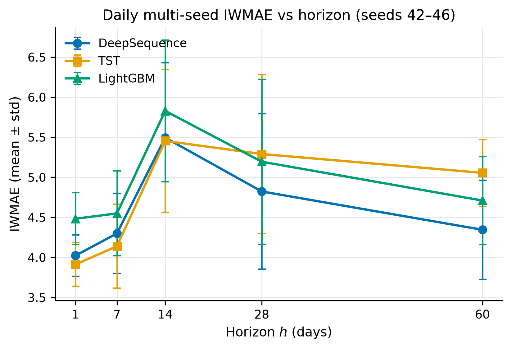

[Open PNG](paper_figures/fig1_daily_iwmae_horizon.png) · [GitHub](https://github.com/mkuma93/DeepSequence/blob/main/paper_figures/fig1_daily_iwmae_horizon.png)

*Figure E6. Daily **recursive** IWMAE (mean ± std over training seeds \(42\)–\(46\)) for DeepSequence, TST, and LightGBM. Optional protocol only.*

**Table E1b.** Daily CumMAE (lead-time demand error), seed 42 (same locked MH origins as Table E1). Artifact: `ab_runs/reclaim/cummae_daily_s42.json`.

| Horizon | DeepSequence | TST | TFT | DeepAR | LightGBM | Best CumMAE |
|--------:|-------------:|----:|----:|-------:|---------:|:------------|
| \(h=1\) | 1.685 | **1.433** | 1.753 | 2.050 | 1.639 | TST |
| \(h=7\) | 9.866 | **8.621** | 12.079 | 17.152 | 9.085 | TST |
| \(h=14\) | 18.529 | **17.037** | 26.151 | 35.603 | 17.439 | TST |
| \(h=28\) | 35.954 | 42.505 | 56.119 | 71.642 | **34.262** | LightGBM |
| \(h=60\) | **70.627** | 111.863 | 119.387 | 149.586 | 70.791 | **DS** |

**Table E1c.** Daily recursive IWMAE by train volume zone, seed 42.

| Horizon | Zone | DeepSequence | TST | LightGBM | Best |
|--------:|:-----|-------------:|----:|---------:|:-----|
| \(h=1\) | Low | **1.326** | 1.443 | 1.503 | **DS** |
| \(h=1\) | Mid | 2.811 | **2.746** | 2.948 | TST |
| \(h=1\) | High | 5.355 | **5.010** | 5.223 | TST |
| \(h=28\) | Low | 2.517 | **2.469** | 2.610 | TST |
| \(h=28\) | Mid | **4.564** | 4.886 | 4.659 | **DS** |
| \(h=28\) | High | 8.095 | 9.155 | **7.983** | LightGBM |
| \(h=60\) | Low | **2.596** | 2.673 | 2.744 | **DS** |
| \(h=60\) | Mid | **4.328** | 4.763 | 4.459 | **DS** |
| \(h=60\) | High | 4.581 | 5.970 | **4.528** | LightGBM |

Under recursive rollout, the long-lead story is zone-heterogeneous: DeepSequence’s edge is clearest in mid volume; high volume often prefers LightGBM. **Primary** daily Direct-MH zone strata (train mean-demand terciles; Table D-S1 / Figure D3) tell a different story—DeepSequence wins mid/high from \(h=7\) and all zones by \(h\ge 28\)—and should not be mixed with this recursive volume-sum table.

### E.2 Decision economics \(\pi\) (recursive daily)

Loyalty-aware \(\pi\) below uses the same recursive forecast paths as Section E.1. **Direct-MH decision \(\pi\) was not run for the primary tables**; treat these as optional-protocol economics only.

**Table E3.** Seed-42 \(\pi\) winners by lead time and loyalty (low / mid / high margin); recursive.

| Lead time | \(C_{\mathrm{loyalty}}=0\) | \(C_{\mathrm{loyalty}}=0.25\) |
|-----------|--------------------------|-------------------------------|
| 7 days | LGBM / TST / TST | **TST / TST / TST** |
| 14 days | LGBM / DS / TST | DS / TST / TST |
| 28 days | LGBM / DS / DS | **DS / DS / DS** |
| 60 days | LGBM / DS / DS | **DS / DS / DS** |

**Table E4.** Multi-seed mid-margin \(\pi\) at \(C_{\mathrm{loyalty}}=0.25\) (seeds \(42\)–\(46\); higher is better). **Recursive protocol.**

| Horizon | DeepSequence | TST | LightGBM | Mid-\(\pi\) winner |
|--------:|-------------:|----:|---------:|:-------------------|
| \(h=7\) | \(-0.243\pm0.022\) | \(\mathbf{-0.218\pm0.024}\) | \(-0.262\pm0.023\) | TST \(4/5\) |
| \(h=14\) | \(-0.291\pm0.046\) | \(-0.291\pm0.040\) | \(-0.313\pm0.034\) | TST \(3/5\), DS \(2/5\) |
| \(h=28\) | \(\mathbf{-0.273\pm0.045}\) | \(-0.353\pm0.068\) | \(-0.308\pm0.051\) | **DS \(5/5\)** |
| \(h=60\) | \(\mathbf{-0.255\pm0.042}\) | \(-0.373\pm0.046\) | \(-0.301\pm0.031\) | **DS \(5/5\)** |

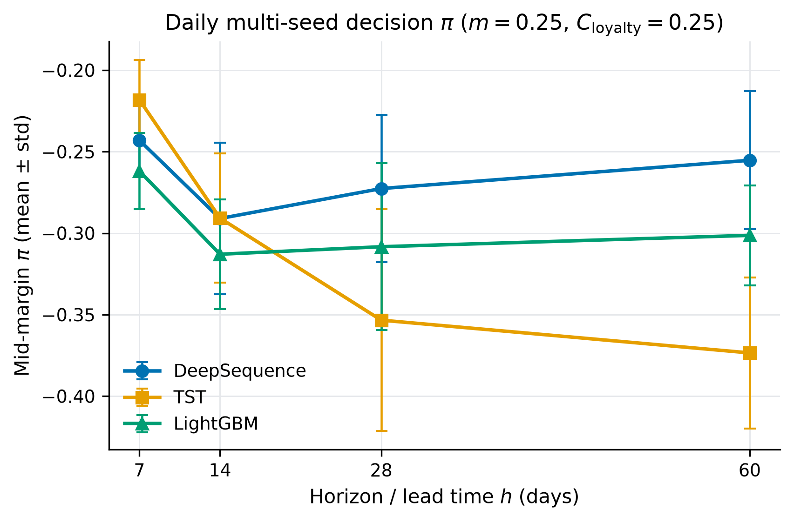

[Open PNG](paper_figures/fig3_daily_decision_pi_horizon.png) · [GitHub](https://github.com/mkuma93/DeepSequence/blob/main/paper_figures/fig3_daily_decision_pi_horizon.png)

*Figure E7. Daily multi-seed mid-margin decision \(\pi\) at \(C_{\mathrm{loyalty}}=0.25\) under **recursive** rollout (optional protocol).*

### E.3 Recursive novelty ablations (DeepSequence-only)

**Table E8.** Daily recursive multi-horizon IWMAE, DeepSequence-only, seed 42. Long horizons isolate the claimed novelties; Full wins \(h=28/60\).

| Arm | \(h=1\) | \(h=28\) | \(h=60\) |
|-----|--------:|---------:|---------:|
| **Full** | 4.088 | **6.451** | **3.930** |
| −context mixer | **4.012** | 6.556 | 4.014 |
| −Level-1 selection attn | 4.142 | 6.657 | 4.113 |
| −mono | 4.046 | 6.535 | 3.999 |
| +cross | 4.049 | 6.642 | 4.137 |

---

## Citation notes (author check before arXiv)

Classic references above (Croston, 1972; Syntetos and Boylan, 2001/2005; Teunter et al., 2011; Taylor and Letham, 2018; Salinas et al., 2020; Lim et al., 2021; Oreshkin et al., 2020; Challu et al., 2023; Nie et al., 2023; Ke et al., 2017; Godahewa et al., 2021; Boylan and Syntetos, 2021) are standard. Before arXiv / IJF submission, verify volume/page details against publisher records and convert to IJF house style. Optional additions an author may wish to insert after local library check: further intermittent neural surveys post-2021, and any preferred citation for IWMAE as used in the accompanying codebase if a prior published definition exists.
