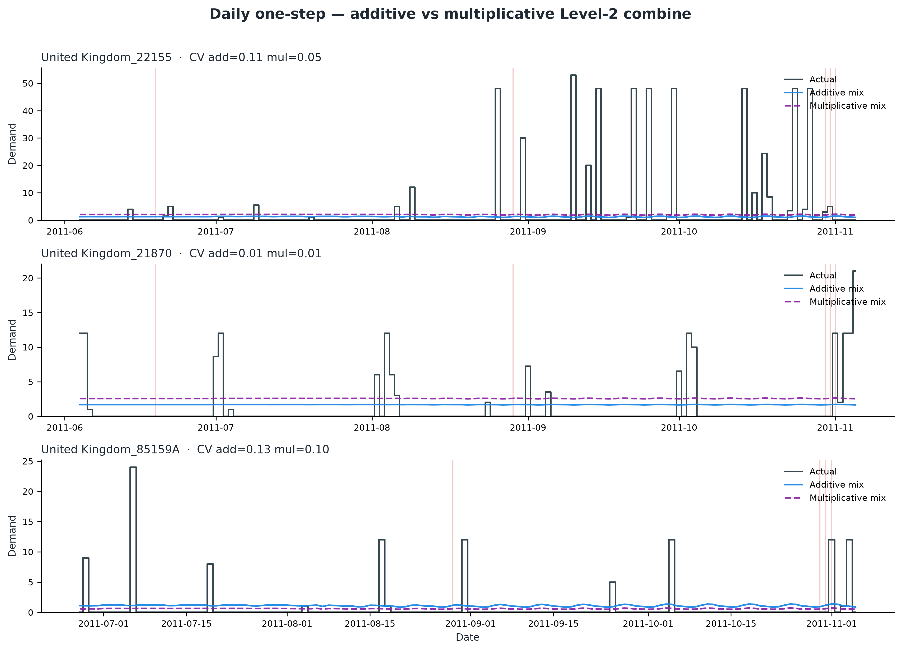
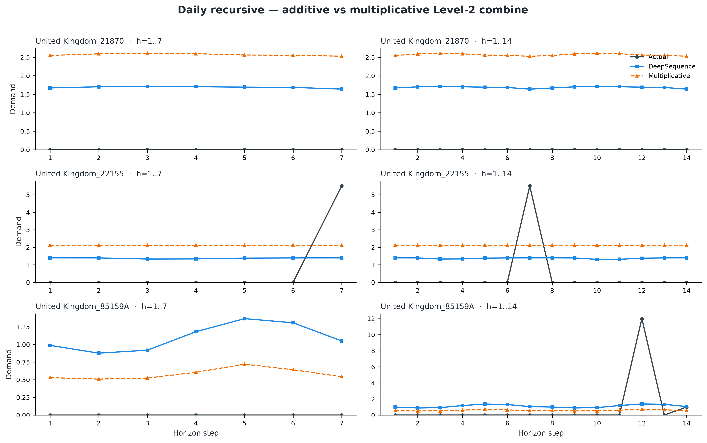

# DeepSequence paper figures

If images do not render in Cursor’s markdown preview (common with Google Drive paths that contain spaces), use:

1. **Browser gallery (most reliable locally):** open [`paper_figures/VIEW.html`](paper_figures/VIEW.html) — `open paper_figures/VIEW.html`
2. **Click a link below** to open the PNG in the editor / Finder
3. **GitHub:** [paper_figures/](https://github.com/mkuma93/DeepSequence/tree/main/paper_figures)

---

## Figure 1. Changepoint selection (Trend)

[Open PNG](paper_figures/fig_m1_changepoint_selection.png) · [GitHub](https://github.com/mkuma93/DeepSequence/blob/main/paper_figures/fig_m1_changepoint_selection.png) · [raw](https://raw.githubusercontent.com/mkuma93/DeepSequence/main/paper_figures/fig_m1_changepoint_selection.png)

## Figure 2. Monotone softplus–PWL maps

[Open PNG](paper_figures/fig_m2_monotone_softplus.png) · [GitHub](https://github.com/mkuma93/DeepSequence/blob/main/paper_figures/fig_m2_monotone_softplus.png) · [raw](https://raw.githubusercontent.com/mkuma93/DeepSequence/main/paper_figures/fig_m2_monotone_softplus.png)

## Figure 3. Level-1 selection attention

[Open PNG](paper_figures/fig_m3_level1_attention.png) · [GitHub](https://github.com/mkuma93/DeepSequence/blob/main/paper_figures/fig_m3_level1_attention.png) · [raw](https://raw.githubusercontent.com/mkuma93/DeepSequence/main/paper_figures/fig_m3_level1_attention.png)

## Figure 4. Context-aware component mixer

[Open PNG](paper_figures/fig_m4_context_mixer.png) · [GitHub](https://github.com/mkuma93/DeepSequence/blob/main/paper_figures/fig_m4_context_mixer.png) · [raw](https://raw.githubusercontent.com/mkuma93/DeepSequence/main/paper_figures/fig_m4_context_mixer.png)

## Figure 5. End-to-end architecture

Trend time index; fixed Fourier (learnable \(\omega\) optional); four experts (Trend, Seasonal, Holiday, Regressor with lags+state); shared \(e_i\) → FiLM / mixer / gate; Level-1 + context mixer \(q=\mathrm{SKU}\oplus\mathrm{Dense}(\mathrm{context})\); DCN cross default OFF; \(\hat{y}=p\cdot b\).

[Open PNG](paper_figures/fig_m5_architecture.png) · [GitHub](https://github.com/mkuma93/DeepSequence/blob/main/paper_figures/fig_m5_architecture.png) · [raw](https://raw.githubusercontent.com/mkuma93/DeepSequence/main/paper_figures/fig_m5_architecture.png)

## Figure D1. Daily Direct-MH IWMAE vs horizon (PRIMARY)

Seed-42 locked 800 — primary Results figure for Table 1 (not the recursive multi-seed plot).

[Open PNG](paper_figures/fig_daily_direct_iwmae_horizon.png) · [GitHub](https://github.com/mkuma93/DeepSequence/blob/main/paper_figures/fig_daily_direct_iwmae_horizon.png) · [raw](https://raw.githubusercontent.com/mkuma93/DeepSequence/main/paper_figures/fig_daily_direct_iwmae_horizon.png)

## Figure D2. Daily Direct-MH CumMAE vs horizon (PRIMARY)

[Open PNG](paper_figures/fig_daily_direct_cummae_horizon.png) · [GitHub](https://github.com/mkuma93/DeepSequence/blob/main/paper_figures/fig_daily_direct_cummae_horizon.png) · [raw](https://raw.githubusercontent.com/mkuma93/DeepSequence/main/paper_figures/fig_daily_direct_cummae_horizon.png)

## Figure D3. Daily Direct-MH IWMAE by train mean-demand zone (PRIMARY)

[Open PNG](paper_figures/fig_daily_direct_strata_iwmae.png) · [GitHub](https://github.com/mkuma93/DeepSequence/blob/main/paper_figures/fig_daily_direct_strata_iwmae.png) · [raw](https://raw.githubusercontent.com/mkuma93/DeepSequence/main/paper_figures/fig_daily_direct_strata_iwmae.png)

## Figure E6. Daily multi-seed IWMAE vs horizon (APPENDIX E — recursive)

**Not primary.** Optional recursive protocol; file still named `fig1_daily_iwmae_horizon.png`.

[Open PNG](paper_figures/fig1_daily_iwmae_horizon.png) · [GitHub](https://github.com/mkuma93/DeepSequence/blob/main/paper_figures/fig1_daily_iwmae_horizon.png) · [raw](https://raw.githubusercontent.com/mkuma93/DeepSequence/main/paper_figures/fig1_daily_iwmae_horizon.png)

## Figure E7. Daily multi-seed mid-margin π vs horizon (APPENDIX E — recursive)

[Open PNG](paper_figures/fig3_daily_decision_pi_horizon.png) · [GitHub](https://github.com/mkuma93/DeepSequence/blob/main/paper_figures/fig3_daily_decision_pi_horizon.png) · [raw](https://raw.githubusercontent.com/mkuma93/DeepSequence/main/paper_figures/fig3_daily_decision_pi_horizon.png)

## Figure 8. Car Parts IWMAE vs horizon

[Open PNG](paper_figures/fig2_carparts_iwmae_horizon.png) · [GitHub](https://github.com/mkuma93/DeepSequence/blob/main/paper_figures/fig2_carparts_iwmae_horizon.png) · [raw](https://raw.githubusercontent.com/mkuma93/DeepSequence/main/paper_figures/fig2_carparts_iwmae_horizon.png)

## Figure 9. Novelty ablation IWMAE

[Open PNG](paper_figures/fig4_novelty_ablation.png) · [GitHub](https://github.com/mkuma93/DeepSequence/blob/main/paper_figures/fig4_novelty_ablation.png) · [raw](https://raw.githubusercontent.com/mkuma93/DeepSequence/main/paper_figures/fig4_novelty_ablation.png)

## Figure 10. Daily one-step forecasts

[Open PNG](paper_figures/fig_forecast_daily_onestep.png) · [GitHub](https://github.com/mkuma93/DeepSequence/blob/main/paper_figures/fig_forecast_daily_onestep.png) · [raw](https://raw.githubusercontent.com/mkuma93/DeepSequence/main/paper_figures/fig_forecast_daily_onestep.png)

## Figure 11. Daily recursive forecasts

[Open PNG](paper_figures/fig_forecast_daily_recursive.png) · [GitHub](https://github.com/mkuma93/DeepSequence/blob/main/paper_figures/fig_forecast_daily_recursive.png) · [raw](https://raw.githubusercontent.com/mkuma93/DeepSequence/main/paper_figures/fig_forecast_daily_recursive.png)

## Figure 12. Car Parts one-step forecasts

[Open PNG](paper_figures/fig_forecast_carparts_onestep.png) · [GitHub](https://github.com/mkuma93/DeepSequence/blob/main/paper_figures/fig_forecast_carparts_onestep.png) · [raw](https://raw.githubusercontent.com/mkuma93/DeepSequence/main/paper_figures/fig_forecast_carparts_onestep.png)

## Figure 13. Car Parts recursive forecasts

[Open PNG](paper_figures/fig_forecast_carparts_recursive.png) · [GitHub](https://github.com/mkuma93/DeepSequence/blob/main/paper_figures/fig_forecast_carparts_recursive.png) · [raw](https://raw.githubusercontent.com/mkuma93/DeepSequence/main/paper_figures/fig_forecast_carparts_recursive.png)

## Figure 14. Daily one-step forecasts (binary holidays ON)

[Open PNG](paper_figures/fig_forecast_daily_binary_hol_onestep.png) · [GitHub](https://github.com/mkuma93/DeepSequence/blob/main/paper_figures/fig_forecast_daily_binary_hol_onestep.png) · [raw](https://raw.githubusercontent.com/mkuma93/DeepSequence/main/paper_figures/fig_forecast_daily_binary_hol_onestep.png)

## Figure 15. Daily recursive forecasts (binary holidays ON)

[Open PNG](paper_figures/fig_forecast_daily_binary_hol_recursive.png) · [GitHub](https://github.com/mkuma93/DeepSequence/blob/main/paper_figures/fig_forecast_daily_binary_hol_recursive.png) · [raw](https://raw.githubusercontent.com/mkuma93/DeepSequence/main/paper_figures/fig_forecast_daily_binary_hol_recursive.png)

## Figure 16. Daily one-step forecasts (country calendars + binary)

[Open PNG](paper_figures/fig_forecast_daily_country_hol_onestep.png) · [GitHub](https://github.com/mkuma93/DeepSequence/blob/main/paper_figures/fig_forecast_daily_country_hol_onestep.png) · [raw](https://raw.githubusercontent.com/mkuma93/DeepSequence/main/paper_figures/fig_forecast_daily_country_hol_onestep.png)

## Figure 17. Daily recursive forecasts (country calendars + binary)

[Open PNG](paper_figures/fig_forecast_daily_country_hol_recursive.png) · [GitHub](https://github.com/mkuma93/DeepSequence/blob/main/paper_figures/fig_forecast_daily_country_hol_recursive.png) · [raw](https://raw.githubusercontent.com/mkuma93/DeepSequence/main/paper_figures/fig_forecast_daily_country_hol_recursive.png)

## Figure 22. Car Parts one-step (country month_has, default US)

Qualitative only (seed 42; 20 epochs). Car Parts `T####` ids have no country → US calendar. Locked monthly bake-off stays `holiday_encoding: none`.

[Open PNG](paper_figures/fig_forecast_carparts_country_hol_onestep.png) · [GitHub](https://github.com/mkuma93/DeepSequence/blob/main/paper_figures/fig_forecast_carparts_country_hol_onestep.png) · [raw](https://raw.githubusercontent.com/mkuma93/DeepSequence/main/paper_figures/fig_forecast_carparts_country_hol_onestep.png)

## Figure 23. Car Parts recursive (country month_has, default US)

[Open PNG](paper_figures/fig_forecast_carparts_country_hol_recursive.png) · [GitHub](https://github.com/mkuma93/DeepSequence/blob/main/paper_figures/fig_forecast_carparts_country_hol_recursive.png) · [raw](https://raw.githubusercontent.com/mkuma93/DeepSequence/main/paper_figures/fig_forecast_carparts_country_hol_recursive.png)

## Figure 18. Additive vs multiplicative Level-2 combine (one-step)

Qualitative only (same SKUs/seed; country-holiday feature config). Default bake-off remains additive \(\sum \alpha_k e_k\); multiplicative is \(\mathrm{softplus}(e_T)\prod \max(\varepsilon,1+\alpha_k e_k)\). **Not** a claimed bake-off win.

[Open PNG](paper_figures/fig_forecast_daily_mult_onestep.png) · [GitHub](https://github.com/mkuma93/DeepSequence/blob/main/paper_figures/fig_forecast_daily_mult_onestep.png)

## Figure 19. Additive vs multiplicative Level-2 combine (recursive)

[Open PNG](paper_figures/fig_forecast_daily_mult_recursive.png) · [GitHub](https://github.com/mkuma93/DeepSequence/blob/main/paper_figures/fig_forecast_daily_mult_recursive.png)

## Figure 20. Spike-aware loss diagnostics (panel)

Qualitative only (seed 42; additive stack; country holidays; ~30 epochs). Opt-in `spike_aware` loss: heavy positive BCE + positive-only magnitude. **Not** a claimed bake-off win.

[Open PNG](paper_figures/fig_spike_diag_panel.png) · [GitHub](https://github.com/mkuma93/DeepSequence/blob/main/paper_figures/fig_spike_diag_panel.png) · [raw](https://raw.githubusercontent.com/mkuma93/DeepSequence/main/paper_figures/fig_spike_diag_panel.png)

## Figure W1. Zero rate daily vs weekly (PRIMARY)

[Open PNG](paper_figures/fig_zero_rate_daily_vs_weekly.png) · [GitHub](https://github.com/mkuma93/DeepSequence/blob/main/paper_figures/fig_zero_rate_daily_vs_weekly.png)

## Figure W2. Direct-MH IWMAE weekly vs daily (PRIMARY)

[Open PNG](paper_figures/fig_weekly_daily_direct_iwmae.png) · [GitHub](https://github.com/mkuma93/DeepSequence/blob/main/paper_figures/fig_weekly_daily_direct_iwmae.png)

## Figure W3. Direct-MH CumMAE weekly vs daily (PRIMARY)

[Open PNG](paper_figures/fig_weekly_daily_direct_cummae.png) · [GitHub](https://github.com/mkuma93/DeepSequence/blob/main/paper_figures/fig_weekly_daily_direct_cummae.png)

## Figure W4. Weekly Direct-MH one-step forecasts (PRIMARY)

[Open PNG](paper_figures/fig_forecast_weekly_onestep.png) · [GitHub](https://github.com/mkuma93/DeepSequence/blob/main/paper_figures/fig_forecast_weekly_onestep.png)

## Figure W5. Weekly Direct-MH horizon forecasts (PRIMARY)

[Open PNG](paper_figures/fig_forecast_weekly_direct.png) · [GitHub](https://github.com/mkuma93/DeepSequence/blob/main/paper_figures/fig_forecast_weekly_direct.png)

## Figure W6. Weekly Direct-MH IWMAE by train mean-demand zone (PRIMARY)

[Open PNG](paper_figures/fig_weekly_direct_strata_iwmae.png) · [GitHub](https://github.com/mkuma93/DeepSequence/blob/main/paper_figures/fig_weekly_direct_strata_iwmae.png)
