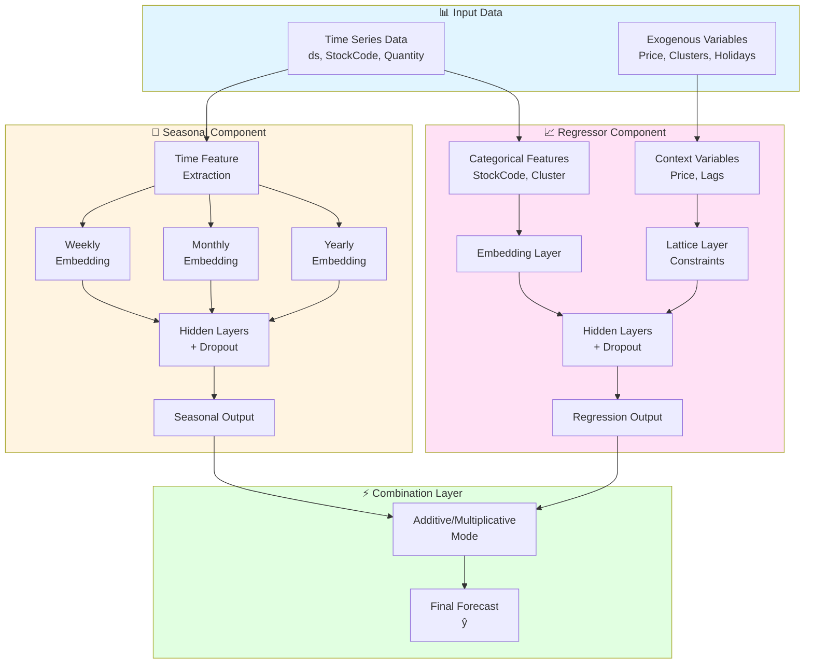
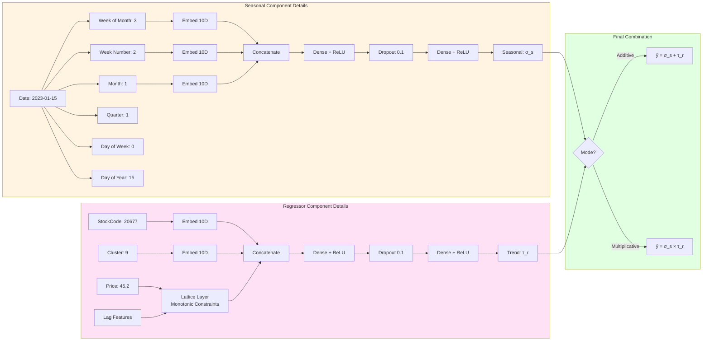
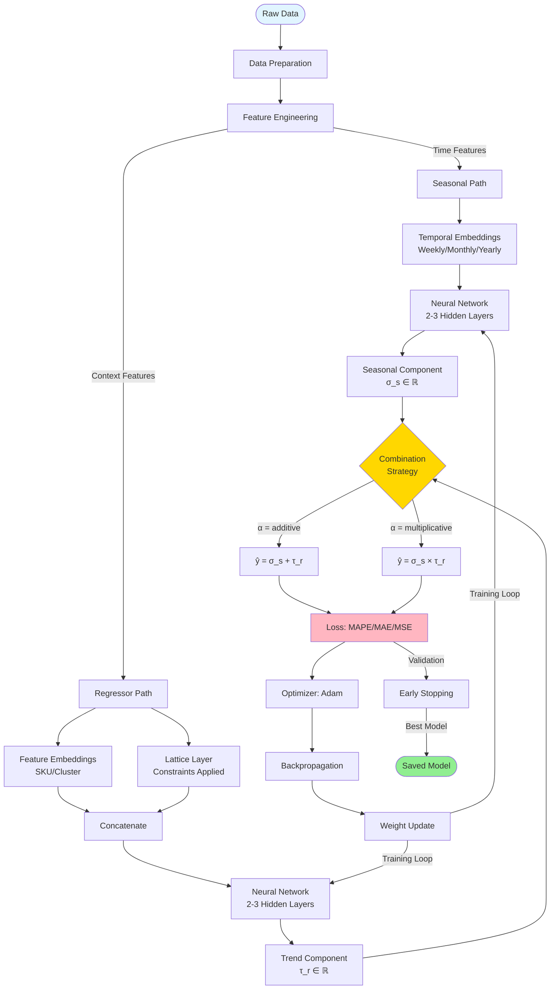
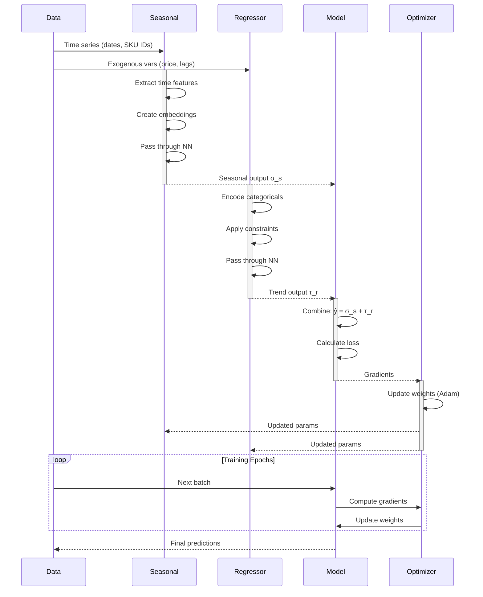
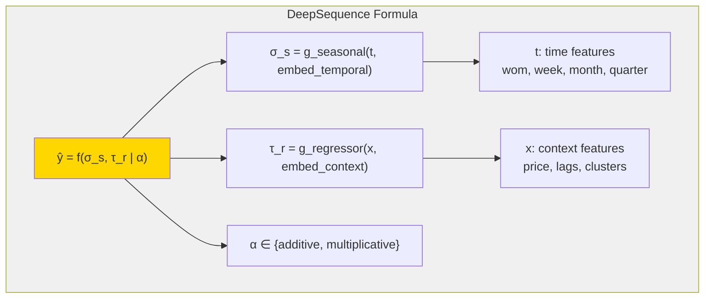
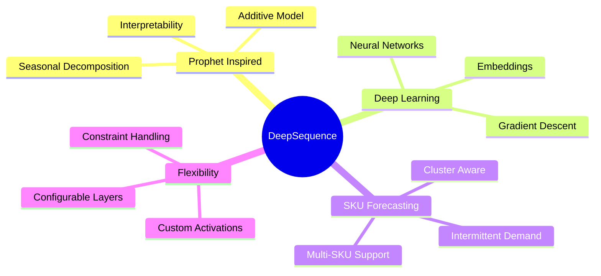

# DeepSequence Architecture Diagram

## High-Level Architecture

## Detailed Component Architecture

## Data Flow Through Network

## Training Pipeline

## Mathematical Formulation

## Model Characteristics

| Component | Description | Key Features |
|-----------|-------------|--------------|
| **Seasonal** | Captures periodic patterns | • Weekly/Monthly/Yearly cycles • Temporal embeddings • Flexible architecture |
| **Regressor** | Models trends & external factors | • Exogenous variables • Constraint handling • Feature interactions |
| **Combination** | Merges components | • Additive (linear) • Multiplicative (non-linear) • Mode selection |
| **Training** | Optimization strategy | • MAPE/MAE/MSE loss • Adam optimizer • Early stopping |

## Key Innovations

