# DeepSequence Architecture Diagram

## High-Level Architecture

## Detailed Component Architecture

```mermaid
graph LR
    subgraph SeasonalDetail["Seasonal Component Details"]
        direction TB
        D[Date: 2023-01-15]
        D --> WOM[Week of Month: 3]
        D --> WEEK[Week Number: 2]
        D --> MONTH[Month: 1]
        D --> QUARTER[Quarter: 1]
        D --> DOW[Day of Week: 0]
        D --> DOY[Day of Year: 15]
        
        WOM --> E1[Embed 10D]
        WEEK --> E2[Embed 10D]
        MONTH --> E3[Embed 10D]
        
        E1 --> CONCAT[Concatenate]
        E2 --> CONCAT
        E3 --> CONCAT
        
        CONCAT --> FC1[Dense + ReLU]
        FC1 --> DROP1[Dropout 0.1]
        DROP1 --> FC2[Dense + ReLU]
        FC2 --> S_OUT[Seasonal: σ_s]
    end
    
    subgraph RegressorDetail["Regressor Component Details"]
        direction TB
        SKU[StockCode: 20677]
        CLUST[Cluster: 9]
        PRICE[Price: 45.2]
        LAG[Lag Features]
        
        SKU --> ESKU[Embed 10D]
        CLUST --> ECLUST[Embed 10D]
        
        ESKU --> CONCAT2[Concatenate]
        ECLUST --> CONCAT2
        PRICE --> LAT[Lattice Layer<br/>Monotonic Constraints]
        LAG --> LAT
        
        LAT --> CONCAT2
        CONCAT2 --> FC3[Dense + ReLU]
        FC3 --> DROP2[Dropout 0.1]
        DROP2 --> FC4[Dense + ReLU]
        FC4 --> R_OUT[Trend: τ_r]
    end
    
    subgraph CombineDetail["Final Combination"]
        S_OUT --> COMBINER{Mode?}
        R_OUT --> COMBINER
        COMBINER -->|Additive| ADD_OUT[ŷ = σ_s + τ_r]
        COMBINER -->|Multiplicative| MULT_OUT[ŷ = σ_s × τ_r]
    end
    
    style SeasonalDetail fill:#fff4e1
    style RegressorDetail fill:#ffe1f5
    style CombineDetail fill:#e1ffe1
```

## Data Flow Through Network

```mermaid
flowchart TD
    START([Raw Data]) --> PREP[Data Preparation]
    
    PREP --> FEAT[Feature Engineering]
    FEAT --> |Time Features| SEAS_PATH[Seasonal Path]
    FEAT --> |Context Features| REG_PATH[Regressor Path]
    
    SEAS_PATH --> SEAS_EMBED[Temporal Embeddings<br/>Weekly/Monthly/Yearly]
    SEAS_EMBED --> SEAS_NN[Neural Network<br/>2-3 Hidden Layers]
    SEAS_NN --> SEAS_OUT[Seasonal Component<br/>σ_s ∈ ℝ]
    
    REG_PATH --> REG_EMBED[Feature Embeddings<br/>SKU/Cluster]
    REG_PATH --> REG_LAT[Lattice Layer<br/>Constraints Applied]
    REG_EMBED --> REG_CONCAT[Concatenate]
    REG_LAT --> REG_CONCAT
    REG_CONCAT --> REG_NN[Neural Network<br/>2-3 Hidden Layers]
    REG_NN --> REG_OUT[Trend Component<br/>τ_r ∈ ℝ]
    
    SEAS_OUT --> COMBINE{Combination<br/>Strategy}
    REG_OUT --> COMBINE
    
    COMBINE -->|α = additive| ADD[ŷ = σ_s + τ_r]
    COMBINE -->|α = multiplicative| MULT[ŷ = σ_s × τ_r]
    
    ADD --> LOSS[Loss: MAPE/MAE/MSE]
    MULT --> LOSS
    
    LOSS --> OPT[Optimizer: Adam]
    OPT --> BACK[Backpropagation]
    BACK --> UPDATE[Weight Update]
    UPDATE --> |Training Loop| SEAS_NN
    UPDATE --> |Training Loop| REG_NN
    
    LOSS --> |Validation| EARLY[Early Stopping]
    EARLY --> |Best Model| SAVE([Saved Model])
    
    style START fill:#e1f5ff
    style SAVE fill:#90EE90
    style LOSS fill:#FFB6C1
    style COMBINE fill:#FFD700
```

## Training Pipeline

## Mathematical Formulation

```mermaid
graph TD
    subgraph Formula["DeepSequence Formula"]
        EQ1["ŷ = f(σ_s, τ_r | α)"]
        EQ2["σ_s = g_seasonal(t, embed_temporal)"]
        EQ3["τ_r = g_regressor(x, embed_context)"]
        EQ4["α ∈ {additive, multiplicative}"]
        
        EQ1 --> EQ2
        EQ1 --> EQ3
        EQ1 --> EQ4
        
        EQ2 --> T1["t: time features<br/>wom, week, month, quarter"]
        EQ3 --> X1["x: context features<br/>price, lags, clusters"]
    end
    
    style Formula fill:#f0f0f0
    style EQ1 fill:#FFD700
```

## Model Characteristics

| Component | Description | Key Features |
|-----------|-------------|--------------|
| **Seasonal** | Captures periodic patterns | • Weekly/Monthly/Yearly cycles • Temporal embeddings • Flexible architecture |
| **Regressor** | Models trends & external factors | • Exogenous variables • Constraint handling • Feature interactions |
| **Combination** | Merges components | • Additive (linear) • Multiplicative (non-linear) • Mode selection |
| **Training** | Optimization strategy | • MAPE/MAE/MSE loss • Adam optimizer • Early stopping |

## Key Innovations

